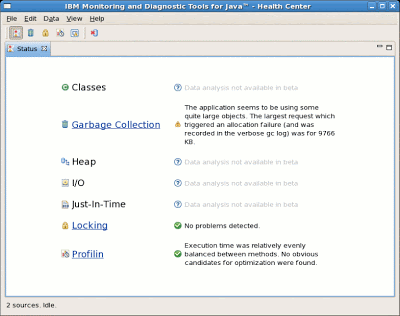
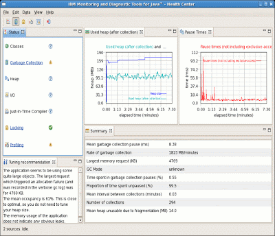
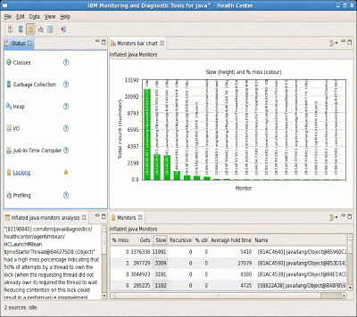
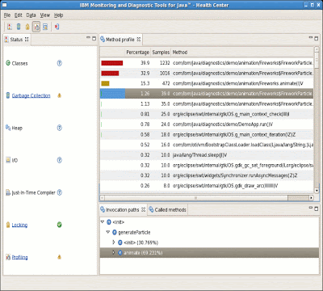

I'm part of a team in IBM's Java Technology Centre which develops diagnostic tools, and we've just released a brand new tool. It's called IBM Monitoring and Diagnostic Tools for Java™ - Health Center™ and it's available as an early access beta [download](https://www14.software.ibm.com/iwm/web/cc/earlyprograms/ibm/ibmmdtjhc/) from developerWorks. We're really excited about the diagnostic insights it can offer. It allows running JVMs to be observed, health-checked, and tuned. At the moment it gives insight into general system health, application activity, and garbage collection activity. There are visualizations and also recommendations, so you don't have to be an expert to improve the performance of your application.

One of the nice things about the Health Center is that it presents different kinds of information in one place. There's a status page which shows at a glance what's going well and what might need attention:

Garbage collection is one of the first and easiest things to check when tuning an application. Sometimes garbage collection can benefit from a bit of tuning, and sometimes looking at what the garbage collection is doing can highlight application problems. Is your application using more memory than seems reasonable? Is it leaking memory? The Health Center will suggest a command line, diagnose when garbage collection is causing performance problems, and point out memory leaks:

Synchronization can be a big performance bottleneck for applications on multi-CPU systems, and it can be difficult to identify hot locks or even assess the impact of locking. The Health Center has always-on lock monitoring which identifies the objects which are most contended and provides guidance about whether synchronization is hurting performance:

Last, but not least, the Health Center includes a nice sampling method profiler. This can be really valuable in diagnosing applications which are using high CPU. Because it's low overhead, there's no need to specify in advance which parts of the application should be profiled. It works without recompilation or byte code instrumentation. It shows where the application is spending its time and gives full call stacks for all sampled methods. Because of the call stacks, this kind of profiling isn't just for performance problems - sometimes it can give surprising functional insight:

The way the Health Center is able to get so much information without much overhead is that it's closely linked to the JVM, so there are minimum system requirements. The absolute minimum requirement is an IBM JVM, version 5.0 or higher. This will give locking information and some GC information. To get profiling Java 5 SR8 or Java 6 SR1 is required. The fullest GC information is available in Java 6 service refresh 2. IBM JVMs can be downloaded from [developerWorks](https://www.ibm.com/support/pages/java-sdk).
