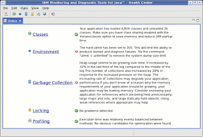

I was talking to a friend today about a performance problem he was seeing, and he explained that he wasn't entirely sure how to fix it. Performance tuning can be very skilled, but the basic principles are straightforward and should be accessible to every Java developer.

This is the methodology I recommend.

All performance problems are caused by a limited resource. Your job as a performance analyst (or developer who's suddenly required to be a performance analyst) is to identify what resource is limited - what's the bottleneck for this application? Often after fixing the first bottleneck, a second bottleneck will become apparent - the process of performance tuning is the process of eliminating bottlenecks, one by one, until the performance is good enough for you and your stakeholders.

Computational resources fall into a few basic categories. Different people count them differently, but I like to think of four types of resource: the CPU, memory, I/O, and locks.

A CPU-bound application can't get enough processor time to complete its work. A memory-bound application needs more memory than is available. An I/O-bound application is trying to do I/O faster than the system can handle. Finally, a lock-bound application is being held up by the fact that multiple threads are contending on the same locks. 'Lock-bound' isn't a terribly common term, but I think it's really important to consider lock contention when analyzing performance problems. As systems become more and more parallel, synchronization are increasingly a limiting factor in the scalability of the system.

So how do you identify which of these resources is the cause of the hold-up? Some heuristics can help as a first step. If the CPU is at or near 100%, the CPU is likely to be the culprit. If the CPU isn't near 100%, it's probably locking or I/O. The rule of thumb becomes a bit muddier when it comes to memory. Sometimes memory problems can show up as low CPU usage, because the system is waiting on a heap lock (which is properly locking) or physical memory access - paging in the worst case (technically, I/O). However, in a garbage collected system, excessive memory consumption will often manifest as lots of processing time being spent in the garbage collector (CPU).

Tools can help turn these fairly fuzzy heuristics into a more precise diagnosis. There are lots of tools available, both free and not-free. My favourite tool is [IBM's Health Center](https://www.ibm.com/support/pages/java-health-center-client-low-overhead-monitoring-tool). This is probably because I'm the technical lead for the Health Center, so I think what it does is pretty sensible and cool. :) The Health Center is free, but it can only monitor IBM JVMs. I do think it's one of the best ways to investigate garbage collection, locking, and collect method profiles from an IBM JVM.

The Health Center tries to automate the process of identifying the root cause of a performance problem. The front page shows a dashboard with a bunch of status indicators. If one of them is red or orange, that's a pretty good indicator of where to start tweaking the performance. The one area the Health Center doesn't cover at the moment is I/O. It can identify garbage collection and locking bottlenecks pretty accurately, and the method profiler can identify the root cause of much excessive CPU usage.

So let's say you've used the Health Center (or your tool of choice) and you're seeing some red crosses. What next? In the Health Center, clicking on the link next to a red cross will bring up more information and more detailed recommendations about how to fix the problem. In later posts I'll give a bit more background about how to go about fixing locking issues, memory issues, and CPU issues.

Forward links:

- [How to interpret a method profile](/how-interpre-method-profile/)
