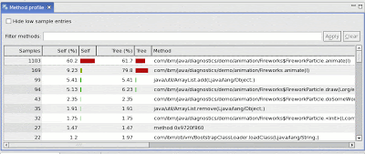
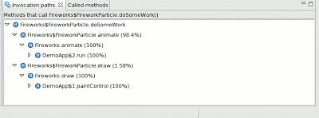

In a [previous post](/how-do-you-solve-performance-problem/), I described the general methodology I use to diagnose performance problems.

Once an application has been identified as CPU-bound, either by using the [Health Center](https://www14.software.ibm.com/iwm/web/cc/earlyprograms/ibm/ibmmdtjhc/) or CPU monitoring, the next step is to figure out _what_ is eating CPU. In a Java application, this will usually be Java code, but it could be native code. Profiling native code usually requires platform specific tools; on linux, I use [tprof](http://perfinsp.sourceforge.net/tprof.html). Profiling Java code is a lot easier, and is more likely to yield big performance improvements, so I usually start with a Java profile and only profile native code if I didn't get anywhere with the Java profile. For Java profiling, I use the Health Center. It's got a few advantages, one of which is that there's no bytecode instrumentation needed, there's no need to specify only a few packages to profile, and the overhead is very low, so it won't affect the performance characteristics of what you're trying to profile.

So what does a method profile tell you? Simply put, it tells you what your application is spending its time doing. More precisely, it tells you what code your application is spending its time running - it doesn't tell you when your application is waiting on a lock instead of running your code, and it doesn't tell you when the JVM is collecting garbage instead of running your code. Assuming locking and GC aren't the cause of the performance problem (see [triaging a performance problem](/how-do-you-solve-performance-problem/)), the method profile will give you the information you need to make your application go faster.

The application is doing too much work, and that's slowing it down. Your aim in performance tuning is to make the application do less work. There are lots of ways to make code more efficient. Sometimes people start performance tuning by code inspection - they read through the code base looking for obvious inefficiencies. I've done this myself lots of times, but it's not a particularly efficient technique. Say I find a method which is pretty carelessly implemented, and I double its speed with a bit of refactoring. Then I triumphantly re-run my application, only to discover nothing's changed. What's going on? The problem is that a big performance improvement on a method which is rarely called isn't going to change much of anything. For example, if I double the speed of a method which uses 0.5% of my CPU time, I've sped my application up by an imperceptible 0.25%. If, on the other hand, I shave 10% of the time of a method which is using 20% of my CPU, my application will go 2% faster. So the first rule of performance tuning is to optimise the methods at the top of the profile and ignore the ones near the bottom.

This is example from a method profiler, in this case the one in the Health Center. One method is clearly using more CPU than the rest, and so it's coloured red. In this case, 60% of the time the JVM checked what the application was doing, it was executing the FireworkParticle.animate() method. This is what's shown by the left-hand 'Self' column. The 'Tree' column on the right shows how much time the application spent in both the animate() method and its descendants. Some profilers call this column 'descendants' instead. Usually the Self figures are more useful for optimising an application.

What makes a method appear near the top of a method profile? It's taking up a lot of CPU time, but why? There are two reasons; either the method is being called too often, or the method is doing too much work when it's called. Sometimes it happens that a method really is doing the right amount of work the right number of times, but this is usually only the case after a fair amount of work. In their natural state, most programs can - and should - contain inefficiencies. (Remember that [premature optimisation is the root of all evil](http://fresh.homeunix.net/~luke/misc/knuth-turingaward.pdf).)

Some profilers can distinguish between a method which is called several times, and one which is called once and then spends a long time executing, but many cannot. The reason is that some profilers operate by _tracing_ - that is, recording every entry and exit of a method. This gives very precise information, but usually carries a fairly heavy performance cost. The IBM JVM can be [configured with launch parameters](http://www.ibm.com/developerworks/java/library/j-ibmjava5/) to count or time method executions, but it's only advisable to do this for a restricted subset of methods. An alternate method of collecting profiling information is to _sample_ - that is, check periodically what method is executing. This is much less expensive but doesn't give as much detail as tracing profilers. The Health Center uses method sampling already built into the JVM to allow profiling with extremely low overhead.

Often it will be obvious when inspecting a hot method if it's being called frequently or is slow to run. Code with loops, particularly nested loops, is probably expensive to run. Code which doesn't seem to do much but which is at the top of a profile is probably being called a lot. This leads neatly to the next steps in optimization: eliminate loops and do less work inside loops for expensive methods, and call inexpensive method less frequently.

How do you go about making sure a method is called less? Method profilers which also record stack traces can make calling method less pretty easy. For example, this is the output of the Health Center, showing where calls to one of the top methods in the profile have come from:

In this case, 98% of the time the `doSomeWork()` method was sampled, it was `animate()` that called it. 2% of the time, it was `draw()` that called it. In this case, the next step is to inspect the `animate()` method and see why it's calling `doSomeWork()`. Often, at least in the first passes of optimisation, most of the calls to the top method are totally unnecessary and can be trivially eliminated.
