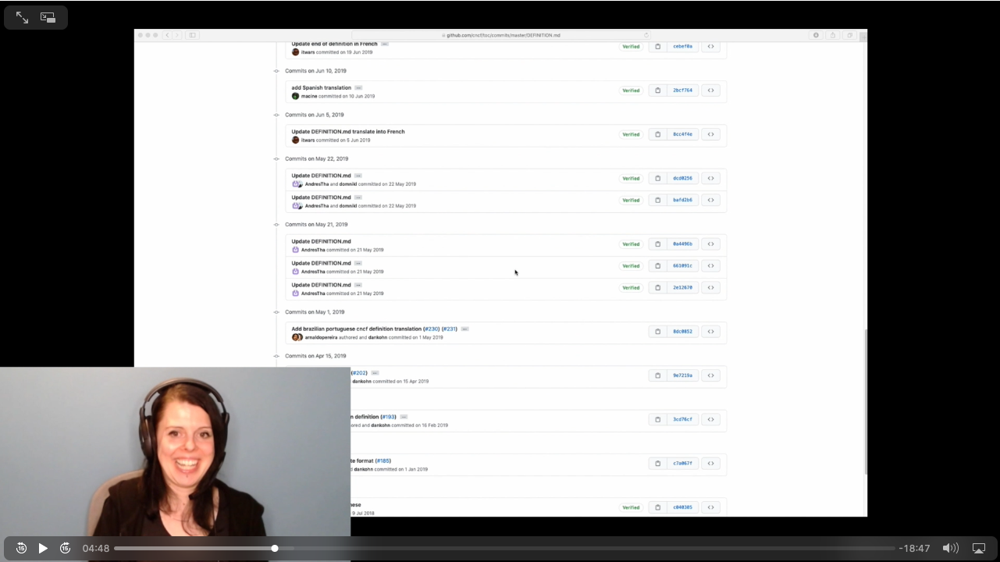
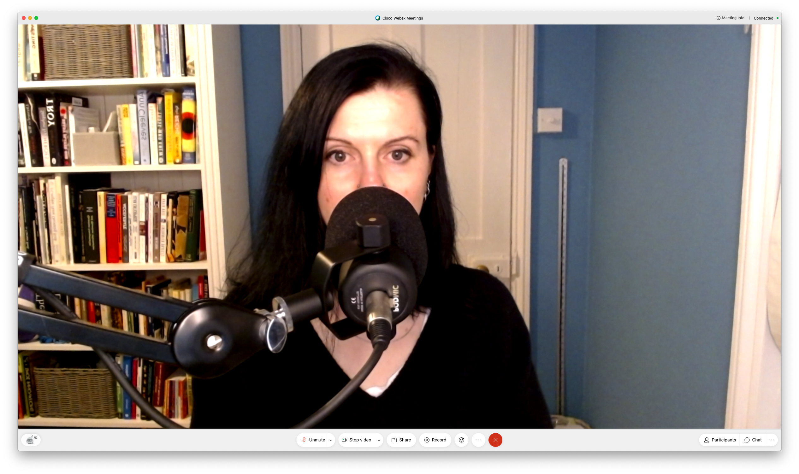
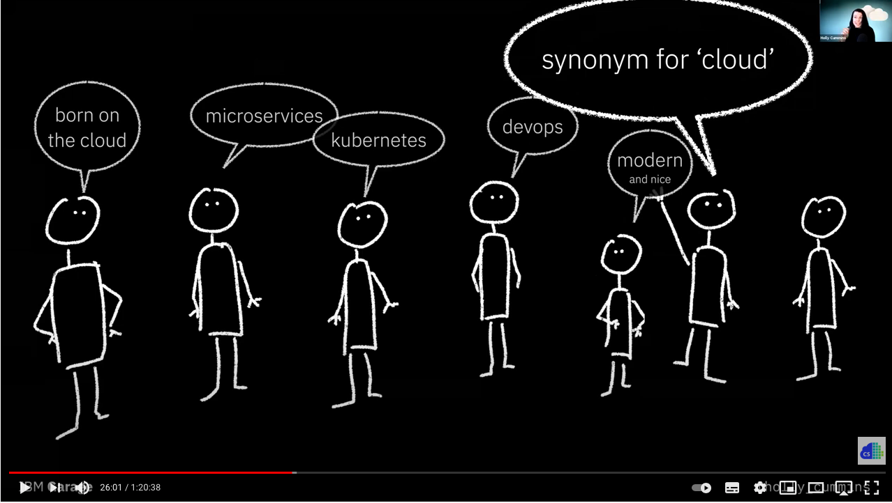

The past year saw an unprecedented flourishing of "photos of home offices," "recommendation threads for microphones," and "microphone review videos with huge numbers of views."
I've experimented with a few different setups for talks, and I've been having to watch my own videos more than I usually do.

The usual "cringeing at myself" was compounded by "cringeing at my bad sound." Since I've had a chance to accidentally-compare different microphones, here is an accidental-review.

## The tests

Here's what I've tried this year:

### Sennheiser Game One

We use these headsets in the IBM Garage for [remote pair-programming](https://www.ibm.com/garage/method/practices/code/remote-pair-programming/). Because the headset mic only picks up noise right near the microphone, typing is almost inaudible. This is a must for pairing, where people need to type and talk simultaneously and definitely don't want to be always fussing around with mute buttons. These headphones also very comfortable, even for long periods (another must for pairing). One of my favourite features is a mechanical mute, so to mute you can just lift the mic boom. This is usually way easier to activate and de-activate than an on-screen control, and it's way more obvious when you're muted. When I listen back to recordings of me talking on conference calls, the sound is rich and natural.

All in all, I love this headset ... or at least I did, until I started listening back to my presentations. If I get animated and start projecting my voice, having the mic right next to the mouth becomes a liability. All the 'p's and 't's turn into big _PPPBOOM_ sounds, known as plosives. Even breathing sounds can become intrusive.

You can hear the badness in my InfoQ Live talk, starting around :16. It's even worse in some other talks where I was standing, but they're not published online yet, so I can't share them.

An IBM Fellow told me the headset look dorky, but I'm ignoring him. I think the big over-ear headphones and mouthpiece have got a kind of helicopter-pilot-cool to them.
If you're also into helicopter-chic, you're not doing formal presentations or speaking while standing, and if you're willing to make a bit of an investment (at the time of writing, £158), I'd totally recommend this headset.

## Fifine 669B

At the other end of the spectrum, this is a relatively economical desk-top microphone. It's plug and play, looks quite pretty, and will pick you up from some distance away, so there's no awkward hunching over the mic. At around £48, it's good value for money. However, of the three mics I tried, it's got the worst sound. There's a coldness to the sound, which might be caused by ambient echo from the room.

You can hear this mic in my [Software Circus Hallowe'en talk](https://youtu.be/ZMnTXFDBcQM?t=150). (Please excuse the costume, it made total sense at the end of October.)

Although I liked the price of the Fifine, I wasn't happy with the sound. Judging from my twitter feed, absolutely everyone had already bought themselves a fancy boom mic, so I decided to Invest.

## Røde PodMic

My current set up is [Røde Podmic](https://www.rode.com/microphones/podmic). At £99, it would be the mid-priced option of these three, except that it needs a _lot_ of supporting equipment. There's no stand, so I got a [boom arm](http://www.rode.com/accessories/psa1) to allow me to move it around. The Podmic uses XLR connections, so I had to buy XLR cables. I imagine sound engineers just have them lying around, but I certainly didn't. It needs a [preamp](https://focusrite.com/en/usb-audio-interface/scarlett/scarlett-solo) to convert the analog XLR signal into a computer-friendly USB-signal. Because I wanted to make _sure_ there wouldn't be any plosives, I bought a [windshield](http://www.rode.com/accessories/ws2). Oh, and I needed separate headphones to make sure I couldn't causing echo for anyone else on a call.

At this point, I thought I was done, but I wasn't. It turns out I speak quietly. My sophisticated semi-pro sound setup meant ... I couldn't be heard on calls. The only way to be loud enough was to put myself an inch away from the microphone. I didn't want to be right up against the microphone while I was talking, because that looks ridiculous on a video call.

Another £40 or so later, I had a [booster amp](https://www.klarkteknik.com/product.html?modelCode=P0DPA) and a second XLR cable, and I could be heard. I can even be heard with the mic fully off camera, although the sound is better if it's a bit closer. So was it worth it? Well, you can decide, but I think there's a clear difference between the sound in my [WTFinar](https://youtu.be/ltsoNNTkd_g?t=1444) and Software Circus a month earlier.

In hindsight, the [Røde Podcaster](http://www.rode.com/microphones/podcaster) would probably have been more plug and play, with comparable sound. I'm not going to buy one to find out, though!

## But what about you?

Clearly, not everyone needs an ostentatious boom-arm mic with weird specialty cables. Arguably, even _I_ don't need one. Nonetheless, if you're doing video calls with other people, [good equipment](https://enterprisersproject.com/article/2021/1/remote-working-10-lessons-leaders-2021), and _especially_ a good microphone is important. Like headphones, having a good mic just makes life nicer for others on the call.

A good mic doesn't need to be expensive, or even a special purchase. Most things will be better than the built-in mic on your laptop. If you have to take notes, the built-in mic will make the typing noises will be a _huge booming nuisance_. "Could whoever is doing the angry typing please stop?" was the most common phrase on my 2019 calls (in 2020, in desperation, we finally worked out the 'mute all' button, leading to "you're on mute" taking the number one spot).

Airpods seem to have good sound pick-up, if you can tolerate in-ear buds for long periods. Be aware, though, some other bluetooth headsets are pretty awful. It took me a while to work out why no one could understand me on one of mine.

## Test

Most of us wouldn't dream of writing code without testing it, but we'll cheerfully broadcast ourselves without testing first. It's easy to do some quick experiments to see what works best. If you're using a Mac, use Quicktime to record yourself, either audio-only or full video. Experiment with a few different positions, see what happens if you get excited or hushed, and try typing. Then watch it back. (I know, it feels awful, but it's the right thing to do.)

Once you're happy, double-check by doing a recording on zoom or webex or whatever you use most often, and then (sorry!) watch that back too. Your colleagues will thank you.
