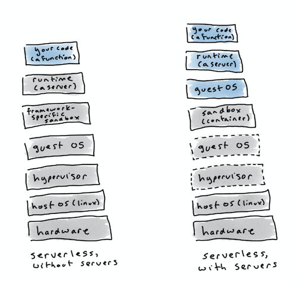
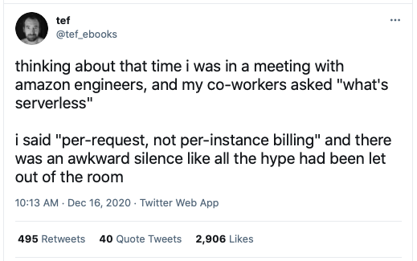

_There are only two hard things in Computer Science: cache invalidation and naming things._

&nbsp;&nbsp;&nbsp;&nbsp;&nbsp;&nbsp;&nbsp;&nbsp;&nbsp;&nbsp;&nbsp;&nbsp;&nbsp;&nbsp;&nbsp;&nbsp;&nbsp;&nbsp;&nbsp;&nbsp;&nbsp;&nbsp;&nbsp;&nbsp;-- Phil Karlton&nbsp;&nbsp;&nbsp;&nbsp;&nbsp;&nbsp;&nbsp;&nbsp;&nbsp;&nbsp;&nbsp;&nbsp;

Photo by Boba Jovanovic on [Unsplash](https://unsplash.com/photos/FtRkRespN24).

Naming things is [hard](https://martinfowler.com/bliki/TwoHardThings.html), and bad names make developers unhappy.

Some things are easier to mis-name than others. Let’s talk about the naming challenges around serverless. For a while, we stopped calling it ‘serverless’ and started calling it ‘functions as a service’, or FaaS. I don’t have evidence, but I assume that everyone just got tired of people piping up with “but actually serverless does have servers, you know” every time anyone said "serverless".

But there was a problem. For some use cases, running a function is fine. There's still a server, of course, but the cloud provider takes care of defining it and provisioning it. But these free-floating functions aren’t so great for running locally. They're always going to be tied to some execution framework, like Amazon Lambda or OpenWhisk. On the cloud, the user experience is frictionless. But to run the function on your machine, you either need to run the whole framework, or you need to roll your own lightweight harness to stand your little functions up and drive them. If your code has dependencies, that also gets awkward. Most FaaS frameworks have some packaging syntax for expressing dependencies and other metadata, but there's usually a limit on how big those dependencies can be, and if you want to switch framework, you may need to rewrite all your metadata.

Managing free-standing functions just starts to feel like a lot of work. Why insist on trying to make functions, when we have containers? They’re light, portable, totally encapsulated, and ubiquitous. Containers were so great for this use case, some FaaS frameworks retrofitted the ability to run code in containers as well as loose functions. Then Knative appeared on the scene, and it could _only_ run containers.

The problem? What do we name our new way of doing things? Every container file explicitly declares and manages a server. For example, I've just written this in a Dockerfile for a demo
I'm doing on [Code Engine](https://cloud.ibm.com/docs/codeengine?topic=codeengine-about), a managed Knative:

`CMD [ "node", "server.js" ]`

That's a server! And I decide what it looks like and how it runs, so I own it. Serverless is a ridiculous name for something which has a server, if the user is the one managing the server. Serverless-but-with-a-server doesn’t roll off the tongue. Function as a service makes no sense, because it’s _not a function_.

In this layer diagram, grey parts of the stack are controlled by the provider, and blue parts are controlled by the developer. In both cases, there are servers
in the stack, but in the model where containers are the units of deployment, the user controls them.

One name which got floated for this model was [‘funtainer’](https://thenewstack.io/funtainers-beauty-running-containers-functions/). This was pre-Knative, and waaay before last year’s Amazon Lambda container-support news. At the time, it was OpenWhisk, Spotinst, and OpenFaaS. Funtainer isn’t ‘a container which is lots of fun’, it’s a mash-up of ‘function’ and ‘container’.

But there’s a new problem. SEO.

Try googling for ‘funtainer’. You’ll get a lot of cheerful-looking Thermoses, and nothing about the cloud architectures. Apparently ‘funtainer’ is Thermos’s fun-container (as in, actual fun, or as much actual fun as you can have with an insulated drink container).

No problem, you can refine the search. What about ‘cloud funtainer’? You get a Thermos with a picture of a cloud on it.

And this is why Knative describes itself as ‘serverless’.

Another way of describing serverless, which involves less head-warping ‘there are no servers visible to the developer, but there are servers underneath, and actually the developer sees and defines those servers’, is this: [“Billing per request rather than per instance”](https://twitter.com/tef_ebooks/status/1339151538917355520).

But there’s still a problem, even with that name. Well, the first problem is that it's a bit of a mouthful (BPRRPI, anyone?), and the second problem is that it's not even accurate. A managed [Knative](https://knative.dev), like Code Engine, has billing, and it’s per request. So we're good there. But if you run Knative in your own cluster, what you're paying for is the cluster instance. Unless you’re really really good at FinOps, requests won't be billed. Knative itself doesn’t ship with any billing support, so any name involving 'billing' is a non-starter.

What about 'Container as a Service'? It's a good name -- but it's been taken. Container as a Service describes a general managed container platform with per-instance billing. For example, Kubernetes could be described as CaaS-ish. (OpenFaas, which is all about running containers, not loose functions, is still a FaaS, not a CaaS. Did I mention all this naming stuff was hard?)

And this is why Knative still describes itself as ‘serverless’.
