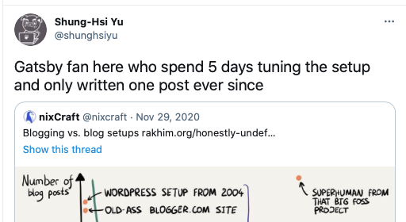
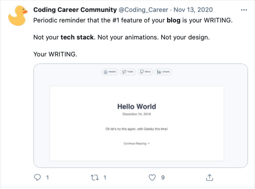
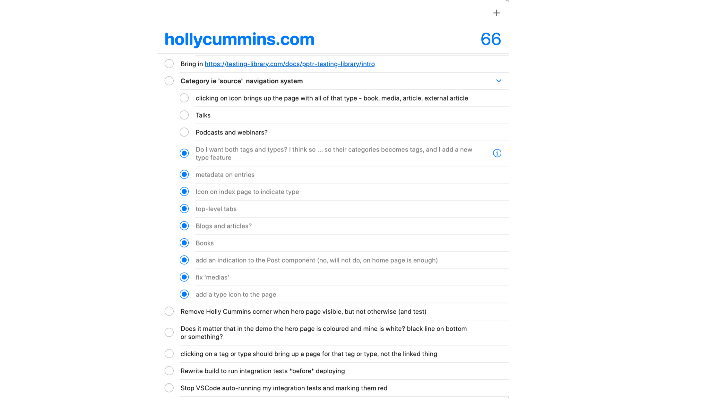

A long time ago, I used to write semi-regularly on Blogger. But then I stopped. What was up? Was it that
I wasn't making time to write? Was it that I needed to form better habits? No. Clearly, the problem was
that I needed a newer, _shinier_ blogging platform.

I'd been inspired to think about self-hosting by Trisha Gee's switch from [Blogger to Hugo](https://trishagee.com/2014/03/20/atom-to-hugo/). But of course I couldn't just create a Hugo site. Instead, I had to investigate lots and lots of various tech stack
options.

In my defence, there was a seven year gap between when I read Trisha's post in 2014 and when I actually took the idea to action. I'm slow. So it wasn't unreasonable to assume that the static site world might have moved on while I was busy being slow. (It turns even [Trisha](https://trishagee.com)'s moved on from Hugo, to Wordpress.) Trisha's site rebuild notwithstanding, Hugo is still a popular static site framework. But [not the only one](https://mtm.dev/static):

I'm a coder. _Of course_ I wasn't going to use an antiquated, simple setup, even if it was actually very productive. I needed continuous integration! And complex dynamic behaviour! The leading static site generators were Hugo, written in Go, and Gatsby, written in React. I need to improve my Go, and building a Go blog would have been a great way to do that. I resisted temptation and decided to (sort of) prioritise productivity by going for Gatsby.

It took me a while to settle on a platform, and then a while to find the right starter, and then I spent several weeks adjusting the starter to support unit tests, and setting up a CI/CD pipeline with integration tests. I didn't quite get to the point of setting up a Kubernetes cluster to run my static blog, but I wasn't far off.

Once I had a unit test skeleton in place I felt able to start adding new capabilities to the platform. A lot of my writing is published elsewhere, and some of my content isn't even writing, it's slides and podcasts and external media. (I got profiled in [Forbes](https://www.forbes.com/sites/adrianbridgwater/2021/02/18/ibm-developer-lead-what-software-does-next/)! That has to go in somewhere!) So I needed a hybrid between a blog and a portfolio site. I wasn't just looking for an excuse to code, honest.

## The tech black hole

Now that things are up and running, I'm trying to balance time spent on writing and time spent on improvements to
the base platform. I wasn't going to be That Developer:

I was also determined that the things I wrote about were going to be things _other_ than my blog tech setup.

No no, no snake-eating-its-tail blogging for me!

And I was going to write actual posts about actual things!

If anything, I've probably done too good a job of focussing on content in the past year, at the expense of sorting out the platform capabilities. I still need to figure out the right solution for slides. At the moment they're hosted separately, and I pay for that. They're not even cross-linked into the main content feed. (I like Notist, but the price of Notist Pro pains me, because I am a cheapskate.) Several people have asked for RSS feeds, so I need to sort that out. And my search is a bit busted for external links, so I need to change what gets fed to the indexer.

So if I wasn't going to write about my tech stack, why have I just written an article about my tech stack? Well, um,
people asked. And, you know, I worked hard on it and wanted to share.

## Ok but what is the stack?

The source code for this platform lives at https://github.com/holly-cummins/gatsby-platform.

This blog is a [GatsbyJS](https://www.gatsbyjs.org/) blog, based on Greg Lobinski's [HeroBlog starter](https://gatsby-starter-hero-blog.greglobinski.com/). I've extended it to make it easy to embed external content and to add
different forms of content. There are [microanalytics.io](http://microanalytics.io) Analytics and Algolia search integrations. The [README](https://github.com/holly-cummins/holly-cummins.github.io/tree/platform-source/README.md) has getting started instructions and more technical details.

I pull some graphics from [unsplash](https://unsplash.com) and draw others. A lot of the visual design is the same as in the starter.

### Testing

I've got the TDD habit, so it made me feel a bit itchy that all the gatsby code I was looking at was test-free. I added some Jest unit tests, and also some puppeteer integration tests. It would benefit from more tests, but at least it has some now.

### Hosting

I use [namecheap.com](https://www.namecheap.com) for my domain. For a while I had hollycummins.fun redirecting to this site, although I never publicised that awesome URL, so I let it lapse. (Remember, fun in the workplace is [important](http://hollycummins.com/category/fun/).)

I use [GitHub Pages](https://pages.github.com) for the hosting and [GitHub Actions](https://github.com/features/actions) for the CI/CD. It's free, and I am a cheapskate.

### Work tracking

I'm using Apple Reminders as my work tracking system, but I should probably switch to GitHub issues.

## Ok but can I re-use it?

The [platform code](https://github.com/holly-cummins/gatsby-platform/) for this blog shares the [MIT license](https://github.com/holly-cummins/holly-cummins.github.io/blob/platform-source/LICENSE) of the source [starter](https://gatsby-starter-hero-blog.greglobinski.com/). If you use my fork I'd love to know about it.
You can see what the starter looks like without my content at [gatsby-platform.hollycummins.com](http://gatsby-platform.hollycummins.com).

Most of the personalisation is in the `content` folder, but there are a few bits and pieces elsewhere, like `avatar.jpg` and `src/images/jpg`.

The content itself is not open source.
