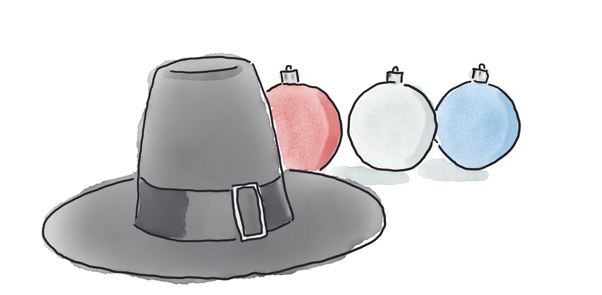
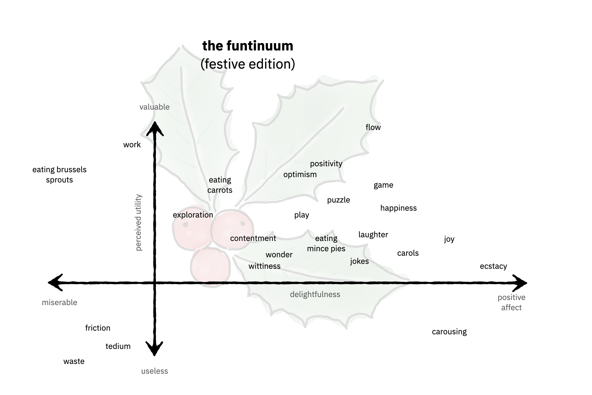

I love this time of year. There are [so many celebrations](https://www.shondaland.com/live/family/a34874979/a-look-at-the-most-widely-celebrated-winter-holidays), both new (Kwanzaa) and ancient (Winter Solstice).
My friends' timelines become a happy jumble of Christmas, Hanukkah, and the New Year. Imprinted in our modern
traditions we can still see the shadow of older holidays, such as [Yule](https://theconversation.com/the-holly-and-the-ivy-how-pagan-practices-found-their-way-into-christmas-52343) and [Saturnalia](https://www.historytoday.com/archive/did-romans-invent-christmas). The appeal of celebration is so strong that even countries with no religious connection to Christmas get in on the Yule fun with showpiece trees and (slightly baffling) [Kentucky Fried Chicken rituals](https://www.bbc.com/worklife/article/20161216-why-japan-celebrates-christmas-with-kfc).

As the lights go up and I fill my house with fir, holly, and mincemeat, I feel fulfilled and content. Mostly. There are some useful lessons for software development from our approach to the winter holidays.
Or maybe it's the other way round, and we can get better at the holidays by importing some software development practices.

## Enabling constraints

Why do so many joyous holidays happen in what is, arguably, the worst time of year? December is cold, wet, and dark.
In my part of England the damp gets into your bones and the sun sets at three in the afternoon. Celebrating in this miserable environment isn't a 'despite', it's a _'because'_.

Many of our Christmastide customs are imported from northerly countries, where if anything it's even colder and darker.
Our winter traditions are about the joy of light in the darkness; fairy lights, candles, and illuminated garden displays.
We bring the light not just into our houses but into public spaces, so it can be shared. On my run this morning, I noticed that someone had done some joyful civic-minded guerilla decorating and hung baubles on the trees in my local arboretum. No one does that in the summer.

The dark and cold is an example of an [enabling constraint](https://hbr.org/2019/11/why-constraints-are-good-for-innovation).
Our response is to turn a defect (cold, dark, brr) into a feature (twinkling lights everywhere! mulled wine! thick socks! hygge!)
The apparently unpleasant external conditions allow a
flourishing of creativity.

## Why we misunderstand efficiency

Every December, I go through the same cycle. In the run-up to Christmas, I get more and more excited.
I start making lists of [all the things](https://daily.jstor.org/the-gendering-of-holiday-labor/) I'm going to fit in this year - Christmas cards for all my acquaintances with long, detailed, personalised messages!
Homemade Christmas cakes with homemade marzipan! From-scratch mince pies! Cranberry and pistachio florentines and vanillekipferl for all my office-mates and neighbours! Carefully selected, thoughtful, touching gifts for everyone on my list! Carol services! Skating! A well-architected gingerbread house! This will be the year I really master Christmas floristry! Meaningful family moments!

And then there's the house. Who doesn't want an insta-worthy home at the holidays? Yesterday I spent £130 on LED pillar candles to try and
make my staircase look like a photo I saw in a magazine. (Spoiler: it's still not going to look
like that picture and no one in the household is quite sure where these candles are going to be stored the rest of the year.)

Sometime around mid-December my partner finds me in tears on the kitchen floor because I haven't sent a single card, I've missed the last posting date for Canada, my attempt at a hand-crafted fir garland looks like a rat king, I don't have any gift ideas for anyone which means everyone will be disappointed with me on Christmas morning, and it took me a whole evening to half-finish one small batch of cookies and there's six more batches to go and I don't even know how to make Turtles.
Oh, and I'm still catching up on the bulb-planting I should have done in the autumn and also trying to do some coding in the evening and I have a work deadline. [Sustainable pace](https://www.agilealliance.org/glossary/sustainable/) got abandoned somewhere in November. The ritual Christmas meltdown is as drearily predictable as [schedule over-runs](https://erikbern.com/2019/04/15/why-software-projects-take-longer-than-you-think-a-statistical-model.html) on software projects.

Every year I tell myself that if I'm properly efficient, I can fit it all in. But efficiency isn't doing more with less,
efficiency is just doing less. This is the principle behind lean software development and the MVP.

But doing less is hard. It's really hard. Somehow, I haven't learned the lessons from my annual Christmas [meltdown](https://www.irishtimes.com/life-and-style/health-family/parenting/why-do-some-women-feel-a-murderous-rage-at-christmas-1.3322999). Doing less means giving up on perfection. It means living with defects and missing features. Organisations find this really hard, too. When I was a consultant in the IBM Garage, de-scoping MVPs to be genuinely-minimal was one of the [hardest parts](https://www.digit.fyi/comment-why-i-never-want-to-build-another-mvp/) of my job. As an industry we haven't really
got the hang of success metrics that aren't focussed on doing as much as possible.

## The value of rest

This is a shame, because a growing body of evidence suggests that long hours and piling on the pressure
actually _hurts_ productivity. In _A Christmas Carol_, Bob Cratchit famously worked [sixty hour weeks](https://warnerbros.fandom.com/wiki/Bob_Cratchit) (the standard at the time) in miserable conditions. Working hours have been steadily [reducing](https://ourworldindata.org/working-hours) since the end of the nineteenth century, as employers figured out that if their employees worked shorter hours, they would be more productive. This was empirically validated by [British wartime research](https://ftp.iza.org/dp8129.pdf) in munitions factories, which found productivity declined sharply above 50 hours a week. Above 55 hours, productivity dropped so much that the extra hours were effectively wasted.

Of course, most of us don't work in industrial settings, and our output is harder to measure. But knowledge worker's hours have been steadily
creeping up. That trend is now at least partially reversing, with some companies adopting a four day week. Paying staff the same for
working fewer hours seems bonkers, but the evidence seems to be that [productivity stays the same or even goes up.](https://www.bbc.co.uk/news/business-57724779)

## The value of joy

A crushing grind hurts employee morale, and that affects outcomes. If a work environment is [positive](https://hbr.org/2015/12/proof-that-positive-work-cultures-are-more-productive), on the other hand, there will be fewer sick days, fewer costly errors, and staff will actually work _harder_. The business will do better. The same principles apply even to [individuals](https://hbr.org/2012/01/positive-intelligence); one researcher found people with a positive mindset are [31% more productive](https://www.ted.com/talks/shawn_achor_the_happy_secret_to_better_work/transcript) than those with a negative mindset – or even a neutral one.

I've [written](https://www.ibm.com/cloud/blog) and [spoken](https://www.youtube.com/watch?v=Ob7PxkPCY8s) about this a lot, arguing for [fun in the workplace](https://www.onrec.com/news/statistics-and-trends/new-study-reveals-fun-at-work-can-boost-productivity-and-reduce-sick-days). I chose to talk about fun rather than happiness or positivity because it's less obvious
that fun at work is good; our natural Calvinist assumption is that happiness might maybe be a bit ok but fun is morally dubious and certainly not the sort of thing we should indulge in at work. Incidentally, the same sort of Calvinist thinking led to Christmas being [outlawed](https://web.archive.org/web/20230318041714/http://www.uwyo.edu/uw/news/2015/12/uw-religion-today-who-was-against-christmas.html) in Scotland in 1583, England in 1647, and Boston in 1659. Christmas wasn't recognised as an official public holiday in Oklahoma until 1907. Scotland waited until [1958](https://www.christiantoday.com/article/a-merry-calvinist-christmas-to-one-and-all/122087.htm). The root of the objection was just that people had too much fun on Christmas.

At Christmas, actually, we go beyond mere fun, and we strive for [joy](https://www.ted.com/talks/ingrid_fetell_lee_where_joy_hides_and_how_to_find_it). Just like fun, joy at work is _good_. Think about that amazing feeling of
finally finally _finally_ figuring out a thorny bug: what you're feeling is joy. Some businesses place so much emphasis on employee
joy as a strategic advantage they've [encoded it](https://www.forbes.com/sites/kevinkruse/2015/02/05/richard-sheridan-menlo-innovations/?sh=3611b5195144) into their corporate identity.

There are a lot of words for 'good feelings'. I sometimes use them interchangeably, but there are nuances and a range of 'exactly how good do we feel?' and 'how much would Calvin object?' values. I've tried to untangle some of them below. My categorisation of 'perceived utility'
is pretty unscientific, but the important thing here is that there are two axes, not just one. Being useful and feeling good is a (possible)
_and_, not an _or_. I did include the opposites, but not too many of them, because it's Christmas, and who wants to look at a big list of miserable things?

Joy and fun are good in corporate cultures, and they're also good in products. I loved seeing IBM's Code Engine introduced with
an article inviting developers to ["enjoy your cloud again"](https://www.ibm.com/cloud/blog/ibm-cloud-code-engine-enjoy-your-cloud-again).
Quarkus have [developer joy](https://quarkus.io/developer-joy/) as a core requirement. James Governor has been pointing out for a while that prioritising developer experience (DX) is [good business sense](https://redmonk.com/jgovernor/2021/03/18/the-developer-experience-multiple/). Frankly, some of the tools we have to use every day are definitely not
frictionless, so I'm not sure everyone is listening - but it's good to see momentum picking up in this area.

I hope you have a wonderful holiday, however you celebrate; and I hope you find light in
the darkness and joy in your middleware.
