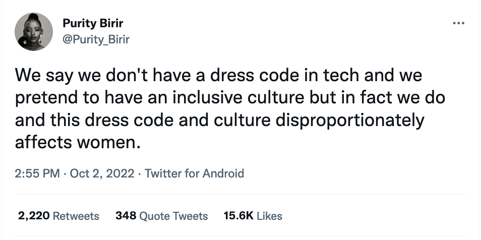
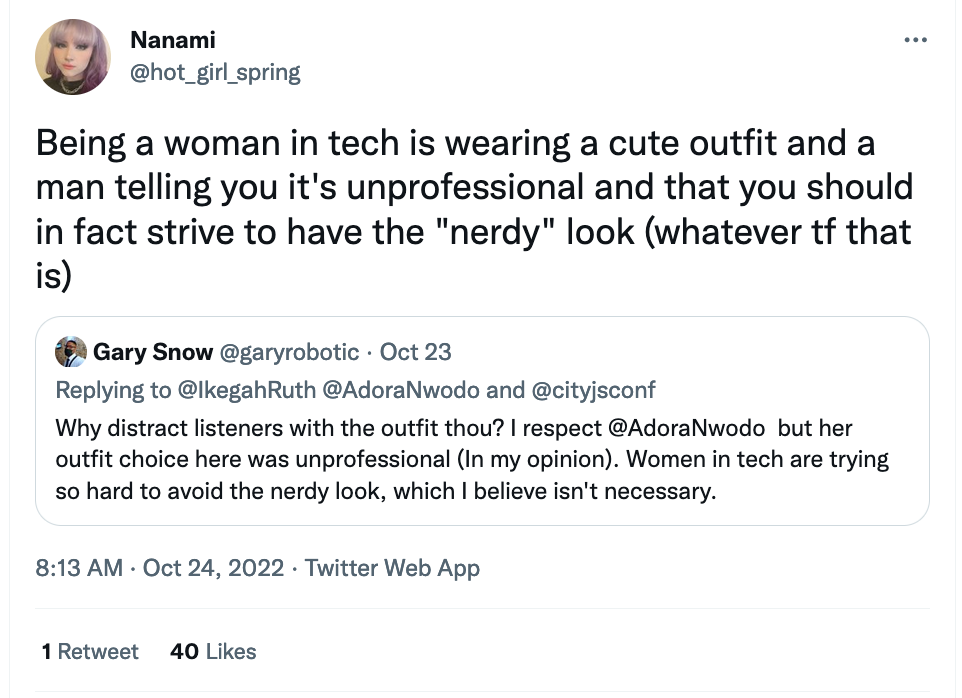

A year or two ago, I wrote about [the connection between fashion and programming](/programming-and-fashion/). 
For reasons I don't totally understand, it's my second most popular blog post, after my [leaving IBM](/leaving-ibm/) announcement. 
Apparently, people do searches for 'fashion coding' and 'coding in fashion'. There's 
not many results for that kind of search, so my site is the top result. A coding school has even linked to the article. 

When I was writing that article, I almost deleted it several times, because it was so personal, and frivolous, and resentful. 
This one has almost been deleted too, for the same reasons. 

I started thinking about fashion and developers again because I saw [Purity Birir](https://twitter.com/Purity_Birir)'s tweet. It said in 240 characters what 
I took a whole blog to try to say:

This isn't just about clothes; 
RedMonk have written about the [Developer Aesthetic](https://redmonk.com/jgovernor/2022/06/09/some-thoughts-on-stock-photos-on-tech-websites-and-the-developer-aesthetic/) without a single mention of hoodies. 
It's about how communities create their own visual codes, and how that the design choices we make as individuals communicate that we belong in a group. 
Or, if we're unlucky, the choices give an impression we _don't_ belong. (Light mode user here, hi!)

But back to clothes. 

Purity is right that as a woman in tech, there is definitely a 'wrong' outfit. (Too short, too shiny, too frilly, too female, basically.)
Women who wear the wrong outfit will be Told. 

... but it's worse than that. There definitely is a wrong outfit, but there _isn't even a 'right' outfit_. No matter what we wear, someone might get distracted. 

I've been thinking about this for a while, but I had a reminder this week. Eric Deandrea and I spoke about contract testing at Devoxx Belgium a few 
weeks ago. This week, Eric spotted this comment on [our talk video](https://www.youtube.com/watch?v=vYwkDPrzqV8):

So far, there have been no comments about Eric's outfit, even though we were wearing almost identical clothes. 

_Photo by [Devoxx Belgium](https://flickr.com/photos/bejug/52455349336/in/album-72177720303177725/)_

The comment was moderated out as soon as Eric reported it, but heads are harder to moderate. 
I'm still sad, and mad, because I try very hard to choose innocuous outfits that let me blend in with the tech herd. 
It's disappointing to be reminded how totally I am not-succeeding at blending in. 

Ok, if I'm totally honest, I could try a _bit_ harder to blend my shoes in. Here's a still of the 
"high heels" I'm wearing in the video:

 
I usually wear block-heeled boots,
 unlike most of my tech colleagues. On the other hand, my experiments with 
 flatter shoes have not been particularly successful. I clomped around in Doc Martens for half of Devoxx, in an attempt to blend in.
I was uncomfortably short and the heavy Docs shredded my feet so thoroughly I still have blisters several weeks later.

I do agree with the commentator about one thing: I'm not sure the Quarkus t-shirt I'm wearing 
is my best look. 

I have a conflicted relationship with tech-product t-shirts. Branded t-shirts are a standard 
speaker uniform at conferences. 
I wear them because my male colleagues do, and because I want to fit in, and because I'm proud of my product. 
But branded t-shirts look very different on women than they do on-men. 

The first issue is even finding one that's an appropriate fit. As Kathy Sierra [pointed out](https://headrush.typepad.com/creating_passionate_users/2006/12/tech_tshirts_ar.html), many tech t-shirts are only 
printed for men. A small version of a straight-cut men's fit t-shirt will usually be too small in the neck (aurgh, strangled!),
too small in the hips, and too small in the bust. A medium version of a men's t-shirt will be a [tent](https://geekfeminismdotorg.wordpress.com/2011/10/18/t-shirts-yet-again/). 

Even when branded t-shirts physically fit, they can be uncomfortable. 
GeekFeminism did a great analysis of the [hazards of having a bust](https://geekfeminism.fandom.com/wiki/T-shirts).
T-shirts with a picture over the chest area, by definition, draw attention to the wearer's chest. 
That's not a problem for men, but it is for women. 
Because women tend to have bumps on their chest, logos sometimes deform in weird ways, and _really_ draw attention to the breasts.
That's the exact opposite of the "blending in" that I'm hoping for.

There's a more subtle problem, too. Tech t-shirts just aren't my natural style. I find them hard
 to make into an outfit. 
 That matters, because "borrowed someone else's t-shirt for the day" is not a look which says "expert on the subject". 
Tech t-shirts look ridiculous with most of the trousers I own, apart from one or two pairs of jeans.

Why can't I just wear what I want? Well, it means I'm not representing. And if I wear the clothes I feel _most_ comfortable in, I get told I look corporate. 
This isn't a hypothetical; it happened a few weeks ago while I was in a conference hotel wearing my comfy home clothes, on an 'off day' between events.
No malice was intended, I just ... did look kind of corporate.

What's the solution? I don't really know. 
We need to focus on what women speakers say, not their shoes or t-shirts.
We need to embrace the [#ilooklikeadeveloper](https://twitter.com/search?q=%23ilooklikeadeveloper) hashtag. 
We need to let our clothes out of the closet.
And we need to normalise diversity in tech - not just of people, but of outfits. 

