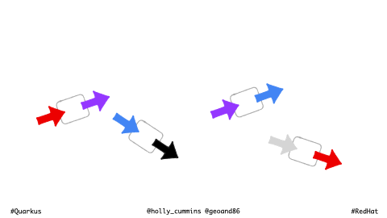

I'm sometimes asked for a list of resources for writing Quarkus extensions. 
It's a topic I've been meaning to write more about, but I haven't yet, because as Emmanuel Bernard says, the todo list is infinite.
Every time someone asks me, I re-assemble my list of favourite links. To save redoing that step each time, I'm writing the list down in a permanent place. 

The Quarkus Team have two guides about writing extensions, a simple one, and a deeper one. 

- [My first extension](https://quarkus.io/guides/building-my-first-extension)
- [Deeper guide](https://quarkus.io/guides/writing-extensions)

The deeper guide is now linked from the top menu bar of [quarkus.io](http://quarkus.io) as “Create Extensions” to make it easier to find. 

As of autumn 2024, there are also now two companion guides:
- [A maturity matrix for extensions](https://quarkus.io/guides/extension-maturity-matrix)
- [Extension FAQs](https://quarkus.io/guides/extension-faq)

I wrote them, so I think they're useful. :) 

I sometimes think we could also use a “my second extension” guide, but we haven’t written one yet. (Remember, the todo list is infinite.) However, there are some great community blogs/instructions that fill in that gap:

- [A walkthrough of writing an extension to log to Amazon cloud watch](https://quarkus.io/blog/quarkus-aws-cloudwatch_extension/), which is an excellent general tutorial about writing an extension. This is the tutorial I followed when writing my first extension.
- [A thorough walk through of writing an extension, including a dev service](https://dev.to/onepoint/quarkus-greener-better-faster-stronger-55ea). This is relatively recent, and it's great.
- If you prefer video, Sebastian Daschner has a [nice walkthrough of creating a simple extension](https://blog.sebastian-daschner.com/entries/creating-a-quarkus-extension) which integrates to a LED light to show application health
- How extensions can help with byte-code rewriting and other similar use cases:
    - [Stripping out methods which have a problematic annotation](https://quarkus.io/blog/solving-problems-with-extensions/) 
    - [Resolving an annotation conflict by transforming breaking annotations into happy ones](https://quarkus.io/blog/solving-problems-with-extensions-2/)
- [My and Georgios Andrianakis's talk about writing extensions](https://hollycummins.com/why-youre-missing-out-quarkus-extensions/) with an introduction to writing extensions. The demo is using minecraft for logging. I'm hoping to keep the [source code](https://github.com/holly-cummins/quarkus-minecraft-observability-extension) for that extension up to date as a bit of a reference for some extension scenarios.
Apart from the chicken-proliferation-jokes, this is my favourite bit of that talk, and it's not in other resources, so I've included it here as an animation. 

One of the most important resources is [the list of all build items](https://quarkus.io/guides/all-builditems), the guide which lists all build items. 
The build items are a bit like the SPI for extensions. 
Almost everything that an extension might want to do can be handled by an existing build item or chain of build items. The trick is knowing which one!
It’s a good idea to browse the list of build items to see if there’s one which meets your needs when you get started. 
I also re-review the list every now and then to make sure there's nothing I've forgotten or missed.
