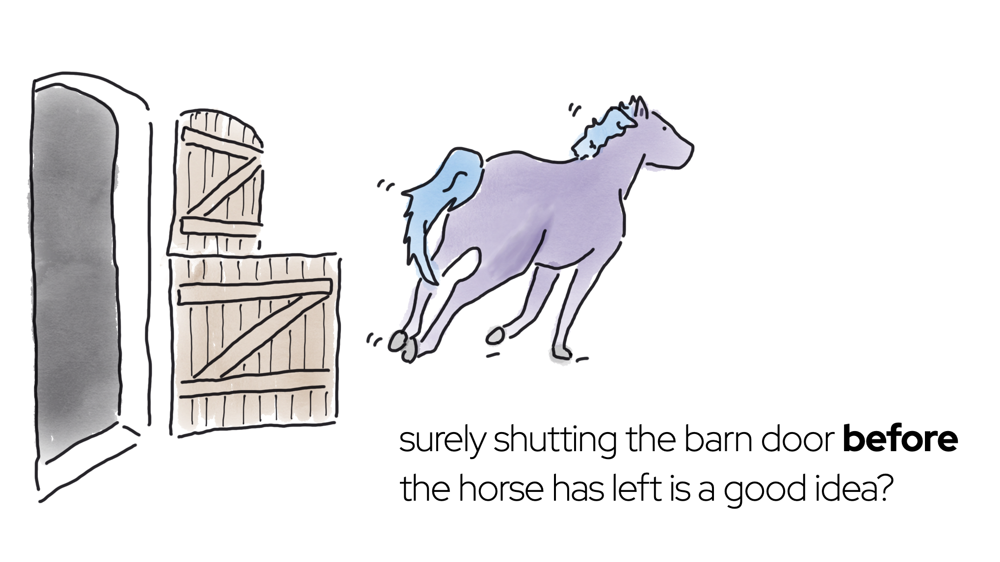

Should your talk have images? Yes! Lots! 

Before going further, stop reading this and go read [the Noun Project primer on visual design for presentations](https://blog.thenounproject.com/the-golden-rules-of-presentation-design/). 
It's got great general advice about visual design for presentations, and also some great 'before and after' examples showing how to replace bullet points with images.

## What is the purpose of images?

Images in presentations are valuable in several different ways, and the best part is they can _bring all the value all at once_. Here are some of the different functions of images:

- Aesthetic pleasure for the audience
- Reinforce your message via visual channel
- Improve audience retention, because of the [picture superiority effect](https://en.wikipedia.org/wiki/Picture_superiority_effect)
- Hold an audience’s attention by having something change on screen
- Cue for the presenter (me) about what I should be saying

## Sourcing images

Images are great, but there’s a problem. For most of us, making new words is easy, but making new pictures is hard. Like, really hard.

The good news is, this doesn't need to stop you having lots of pictures in your talks. You have three kinds of visual content available: 

- Icons
- Drawings
- Photos

Here's how I source them, along with some of their advantages and disadvantages.

### Icons

Don’t underestimate the effectiveness of a single over-sized icon or emoji on a slide. Here are some options:
-  Your operating system’s built-in emojis (free, but limited)
-  [The Noun Project](https://thenounproject.com/) (icons need to be paid for, or attributed in really big text; but a subscription can be worth it, because there’s a huge selection)
-  [FontAwesome](https://fontawesome.com/search?m=free&o=r) (free, if you stick to the free set)
-  IBM’s [Carbon design icons](https://carbondesignsystem.com/guidelines/icons/library/) (free, but limited selection)

### Drawings

Drawing it yourself is a great way of generating images for a presentation. “But I can’t draw,” I hear you wail. I can’t draw either, but [practice](https://hollycummins.com/how-to-draw-part-i/) and a [series of cheat’s techniques](https://hollycummins.com/how-to-draw-part-ii/) have helped me a lot. I've written up my tips for getting started with drawing in ["How to Draw When You Can't Draw".](https://hollycummins.com/how-to-draw-part-i/)

_A 2022 slide about the impact of heavy governance on IT provisioning behaviour, illustrated by me. Being able to draw something was useful, because it would have been pretty hard to find a photo of a horse running away from an open barn door. The fact that I could sneakily make the escaping horse look a bit like a Charity-Majors-approved My Little Pony was a bonus._

But honestly, drawing skill isn’t necessary. Some of the most effective presentation’s I’ve seen are Felienne Hermans’s. I don’t think she’d mind me saying that her drawings are not especially skilled. 

_Felienne Hermans at GOTO Amsterdam, June 2022_

### Photos

I used to use a lot of photos in my presentations, but I’m now slightly cautious with them, for three reasons. The first is fashion; around ten years ago the best speakers discovered what a good idea images are, and then the rest of us started copying them. At this point in the trend cycle, photo-heavy slide decks risk looking a little dated. 

The second reason is that photos have a lot of detail, and detail can distract the audience. A purer, more abstracted, visual communication can make the message clearer (Scott McCloud explains this really well in his book, by the way.) Photos with white backgrounds avoid some of the detail problem. Unfortunately, they’re expensive to produce, and so it’s hard to find people giving away these kinds of photo.

The final argument against photos is that they’re pretty static. I like to use lots of animations and builds in my decks. You can’t build up layers or use animations to tell a story with photos. Well, you can’t do that unless you’re a photoshop wizard, which I am not.

Those cautions aside, photos are still good! Remember, [I can’t draw](https://hollycummins.com/how-to-draw-part-i/), so some things are just too hard to represent in a drawing. Icons lack _all_ detail (by design), so they’re no good for representing  complex things. 

_It would be almost impossible to communicate what piano stairs look like without a photo._

I usually get my photos from [Unsplash](http://unsplash.com). It’s also worth considering stock images, which can be pretty affordable. Be cautious with other sources, which are vulnerable to [copyright predators](https://pluralistic.net/2023/04/01/pixsynnussija/#pilkunnussija) or the opposite, image theft. Also be cautious of also Unsplash images with identifiable people in them (where a model release might be needed).    

I sometimes also use Flickr, but check the license carefully. It’s best to search by license, and then search by “Commercial Use Allowed”. That should bring up images with Creative Commons Attributions >4  licenses; but be careful to attribute correctly. 

## Visual consistency

Aim for consistent visual style, or a limited mix. Having icons on one slide and drawings on another can look sloppy and unpolished. 
One of the first things I think about when starting a talk is whether a topic is best suited to icons, or drawings, or photos. 
That ensures I don't spend time making drawings which I later have to rip out and replace with photos, or the other way around.

### AI Image Generation

What happens if you’re trying to stick to a style, but you can’t find what you need? I’ve started experimenting with tools such as [DALL-E](https://labs.openai.com/) or Stable Diffusion for generating images. Sometimes the results are astonishingly great, and sometimes they’re entertainingly awful. 

I think we can all agree this is *not* the [Duke, the Java mascot](https://wiki.openjdk.org/display/duke/Gallery) with grey hair and a beard:

_DALL-E output for "A version of the Java Duke Mascot, but with grey hair and a beard". Yes, the text appears to say JAJAAVVE._

On the other hand, if you need a photo of a duck wearing a fedora, you won’t do better than this unless you’re a skilled photographer with access to well-trained ducks:

_DALL-E output for "photo of a duck wearing a red fedora white background"_

Although image generation is cool, be aware that generating images is energy intensive, and most generators were trained by scraping copyrighted artists' work without compensation. That’s less cool. 

### Hybrid styles 

Sometimes it just doesn’t work to stick to only-photos or only-drawings. It can be quite effective to layer line drawings or icons over photos. It can also look fresher and more modern than plain photos.
For an example, take a look at [the first image in this Noun Project article](https://blog.thenounproject.com/explore-the-unusual-april-fools/), or this slide, where the fire icon reinforces the meaning of the fire photo:

_A slide from a 2019 talk. The icon and image reinforce each other._

On the other hand, in this slide the photo and icon are complementary. The photo contributes one piece of information (what a Bramble Cay melomys looks like, because people are unlikely to know), and
the icon adds extra context (uh oh, it's extinct). 

_Another slide from the same talk. The icon and image each tell a different part of the story._

## Image selection 

We’ve talked a lot about how stuff looks. But what about the actual *content* of the pictures?

Figuring out what image goes with what concept is hard! Sometimes I have a good idea when drafting out the talk, but more often I draw a blank (do you see what I did there?!). When I'm stuck, I just leave a ‘TODO graphic here’ and then go running until inspiration hits. When choosing an image, think about the purposes of the image; does it need to convey extra meaning, or is it just there to entertain the audience?

Some topic-and-image associations have become clichéed. Instead of choosing a predictable image, can you find something unexpected which will add an extra layer of meaning, or make the audience laugh with an incongruous association? For example, if the topic is “working at home”, the obvious image might be a desk with a computer on it, but maybe you could show an unmade bed, or a pair of comically fluffy slippers. When I talk about under-utilized servers, I don’t show pictures of data centres or load meters; instead, I take the opportunity to draw cute zombies.

_A hand-drawn zombie from 2020. Notice that the visual style combines the shape of icons and with a rough hand-drawn finish. I traced icons to get some of the proportions right._

Here's a later zombie illustration, conveying the same idea in a different style.
_Another zombie, from 2023. It looks a little bit like a grinch, which wasn't my intention, but at least it makes people smile._

Have I mentioned already that I'm not an expert on this? I attempt to draw a zombie and end up with a grinch. 
I've shared the patterns that work for me, but styles evolve, so I expect in a few years time I'd have a different set of recommendations. 
I aim to keep experimenting, and when I see a visually effective talk, I try and figure out what makes it work. 
There's no right answer, but we can always learn from others.
As a final reference, _Understanding Comics_ by Scott McCloud is notionally about comic books, but it's actually a great deep dive into drawing and visual communication. I loved it. 
