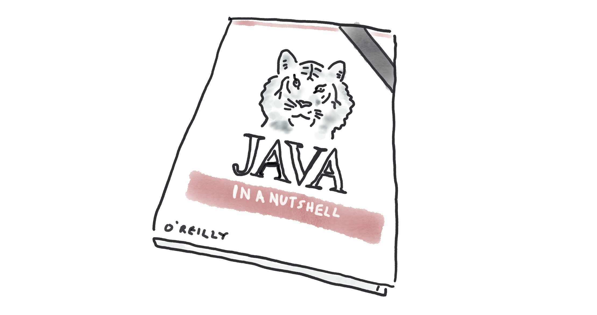

Colleagues who’ve noticed that I occasionally abandon my day-job duties and gallivant around at conferences sometimes ask me for conference tips. How can they too ditch the day job for trains, planes, and an adoring audience? I understand why they're asking - speaking at conferences is fun, the better conferences serve dessert four times a day, and hotel breakfast buffets almost always include bacon. Speaking at conferences is also the cheapest way to _attend_ conferences and learn. 

For a long time, I was a bit unsure about what to advise colleagues. I speak at conferences, because I speak at conferences. In 2007 I submitted to JavaZone, got accepted, and since then, more speaking just … followed. Speaking at a conference created a feedback loop which made me more likely to be accepted in CFPs and more likely to be straight-out invited to conferences. 

But when I thought about it a bit more, I realised my first conference talk didn’t come out of nowhere. Before I gave [that talk](/getting-the-most-out-of-gc-javazone), I’d given lunch and learns, and written articles for IBM’s developerWorks. And it turns out that when I review talks for programme committees, I look for similar kinds of experience. If I see a name I don’t know first-hand, I’ll do a search for videos of them speaking and slide decks. If I can’t find those, I’ll look for blogs. Do they have something new to say? Is this useful teaching material? Is it clearly expressed?

### The speaker ladder 

So although there definitely is a feedback cycle for public speaking, there _are_ ways to get started which are accessible to all of us. These lower rungs will lead to higher levels, and, eventually, to bacon-for-breakfast and multiple-desserts.

- Internal lunch and learns or tech days
- Speaker coaching events (many local user groups and conferences run these to help develop new speakers)
- Local user groups
- Regional conferences
- International conferences.   
- Invited conferences
- Keynotes
- TED talks (I guess? I haven’t got past “keynote” yet, and suspect I never will)

### The pre-speaker ladder

Even _before_ speaking, you should have something to say, and make it public. Blog, or, if you're ok dealing with video, make those. 
This has two benefits; it helps you wrangle your thoughts, and it gives programme committees evidence that you know what you’re talking about. Here are some ways of sharing; as with the speaker ladder, the bottom rungs are open to everyone, and invites to the higher rungs tend to follow.

- Social media threads 
- Self-published blogs
- Articles in industry publications
- Self-published books
- Books with prestige publishers such as Manning and O’Reilly

## What should I talk about?

One of the biggest barriers for new speakers is the idea that they don’t have anything to talk about, or that they’re not experienced enough. It’s not true! 
I mentioned that programme committees look for evidence you know what you’re talking about. I use the criteria "know what you're talking about" very loosely. There are all kinds of talks, and only some involve experts: 

- I created [technology x], here’s what influenced the design and how to use it
- I have years of experience in using [technology x] in the real world, here are the best practices
- Ten ways I personally have failed at [technology x] (and how you can avoid the same failures)
- I’ve just started using [technology x] and here’s all the things I had to learn for myself because the documentation assumes we’re all experts
- Our industry is going about [technology x] all wrong and here’s why [technology y] is a better choice 

Talks from creators and experts are great, but talks from people who’re just learning a technology are also valuable. In my experience, some experts are actually lousy teachers. They have so much knowledge that _everything_ is obvious to them. For the rest of us, it’s useful to have things spelled out. It’s even more useful to have the pitfalls pointed out. I sometimes joke about pain-driven development, but it’s an even better model for conference speaking. Did you just have a nightmarish project? Did you just do something that was way harder than it should be? When the bad things happen, make a note, and then when you’ve recovered, come back and turn it into a conference talk. “I made this mistake so you don’t have to”, is one of my favourite genres of talk. Have you made mistakes at work? Yes? Then you’re qualified!

### Where should I publish? 

Before you turn all your painful projects and awful mistakes into informative conference talks, you should turn them into informative blogs. But where should you write? The best answer for this changes over time. Four years ago, I would have said [Medium](http://medium.com), but Medium’s paywall is too intrusive these days. A lot of momentum these days seems to be around newsletter platforms such as [substack](https://substack.com/). 

Alternatively, since you’re probably using LinkedIn already, [LinkedIn articles](https://www.linkedin.com/help/linkedin/answer/a522427) can be a convenient place to host writing. I have a suspicion that the LinkedIn algorithm prefers links to articles over links to other platforms, so if your main audience is on LinkedIn, that can be another advantage of Articles. For me personally, I get relatively little engagement on LinkedIn no matter what platform I use to write, so I wouldn’t want to put my writing into the LinkedIn walled garden. Your mileage may vary. 

If you have time, the best blogging platform is one where [you own the content](https://trishagee.com/2014/03/20/atom-to-hugo/). Specifically, you need a copy of your writing that’s on your own machine, not on a cloud server somewhere, and the writing needs to be in a portable format. It’s happened more than once that I’ve invested far too many time carefully crafting content for a platform, only for the platform to become irrelevant or non-existent. Remember blogspot? No? Exactly. (A quick search tells me that blogspot was been bought by Google some time ago and, to everyone’s surprise, has not yet been [killed](https://killedbygoogle.com/). But it’s safe to say it’s not where the cool kids are.)

If you want to own your own content, that pretty much means setting up a Wordpress site, or using a statically generated site with Github Pages. I didn’t fancy paying for Wordpress hosting and I just couldn’t with all the php, so [I’ve gone for GitHub Pages + Gatsby](https://hollycummins.com/tech-stack/). I couldn’t find a Gatsby template that did what I needed, so I’ve written my own. Getting my custom platform set up was fun, but it did take up most of a Christmas holiday. Crafting your own platform is not the time-saving option.  

## Submitting to a CFP 

### How do I find out about conferences I should submit to?

Once you’ve got a topic and have started getting things written down, the next step is to get to an event. The great part about this is that, unlike writing platforms, you definitely _do not_ want to self-host your own conference. Let someone else deal with the challenges of catering and venues and tickets and logistics. 

But what event should you submit to? 
When getting started, this will probably be determined by your geography; look up the local user groups, and start attending sessions. Once you’ve got the feel for the event, reach out to the organising team and propose a talk. Most user groups will have some kind of structure for this, but it may just be an email address or named contact. 

At the next level up, discovery can be harder. How do you know what the conferences are, if you’re not going to them? And how do you know when call for papers close? (In my experience, it’s usually “just before you decide to submit”.) 

Every now and then, someone creates a site which gathers all of the tech CFPs in one place, but I have to say I don’t use them myself. This is partly out of laziness, and partly because I’m sceptical about accuracy. For example, [confs.tech](https://confs.tech/cfp) is sometimes recommended, but it’s missing both Kubecon and Devoxx, as well as JFokus, JavaLand, JavaZone. In fact, I struggled to find a conference I’ve actually been to in the feed. The [techdailycfp xitter feed](https://twitter.com/techdailycfp) has the same gap. That doesn’t mean these resources don’t have value, especially for some communities and regions, but treat them with caution.

So if there’s no one-stop website, what next? Once you have built a network of speakers, word of mouth is great for discovering good events. In the interim, follow interesting people on social media, and make a note of where they’re speaking. When you discover interesting videos, make a note of what conference they’re coming from.

### How do I get accepted to a CFP?

Helen Scott has written some great tips on doing [a good CFP submission](https://www.helenjoscott.com/2021/06/30/responding-to-a-developer-conference-cfp/). I don’t have much to add to what she wrote, apart from a plea for empathy with the programme committee. Remember that the programme committee are human, and are trying to juggle reviewing talks with their day job. Make their life easier. Don’t submit six proposals. Don’t submit proposals that are six variations on the same theme – the reviewers don’t want to be flipping back and forth between the tabs trying to figure out what the differences are. Do give them links to videos of the same talk, if you have it, or videos of other talks. If you don’t have videos, share links to writing, and if you don’t have that, explain what speaking experience you have. 

## How do I get invited to invite-only conferences?

If I’m honest, I have wondered this myself many times. I’m in the lucky position that I _do_ often get invited to conferences, and I’ve even curated invite-only tracks. Despite this, the mechanism still isn’t entirely transparent to me. There’s definitely an element of luck, along with having the right network. It’s also - as it should be - about having something interesting to say.

I often speak at GOTO. Every time they invite me it’s a pleasant surprise, and I do a little squeak of delight. But why do they invite me? At least part of the reason the GOTO team invite me is because I’ve spoken at previous GOTO events, and received good speaker ratings. So they know me, and trust that their attendees will get something out of my talks. 

But if GOTO now invite me because I’ve spoken there before, how did I get invited to my _first_ GOTO? I’d been aware of GOTO for many years, but never had an invite. Sniff. So I deployed some empathetic thinking, and some bravery. When I’ve organised speaker selection, it often happens that one or two speakers will cancel at the last minute (even before covid!). Even though speaker cancellations are inevitable, they’re horrible, and they cause panic for the organising committee. We have to scramble to find a not-terrible speaker who’s willing to step in on no notice at all. So two weeks before GOTO Copenhagen, I emailed them and said “if you happen to have a cancellation, I’d, you know, be willing to travel to Denmark even though it’s no notice at all.” I was in luck, and my timing was good. They _had_ had a cancellation, and they hadn’t managed to organise a replacement. So I was in. 

Of course, it helped that I had something to say. When I mailed GOTO, I sent them a little package with links to videos of my previous talks, and suggested a talk with an interesting-sounding title.  

### Geography

I’ve spoken at GOTO Berlin, Aarhus, Copenhagen, and Amsterdam. But I’ve never made it to GOTO Chicago. Similarly, I speak regularly at QCon London, but never at QCon San Francisco.  What’s going on? Do I become less capable as a speaker if I cross the Atlantic? Do all Americans hate me? Well, I don’t think so. I mean, I hope not! But I suspect fewer Americans know me. And that applies to selection committees, too. I speak less in the USA, so I’m less visible, so I don’t get invited to the USA, so I’m less visible, so … it’s that same feedback loop.

Another factor is cost. Some conferences pay speaker expenses (and have higher ticket prices), and some don’t (but have lower ticket prices). If a conference pays  for speakers’ travel, they’ll usually have a cap on the number of international speakers they’ll invite, and quite a small cap for the number of transatlantic speakers they can invite.  Otherwise it’s just too expensive for them.

### Reputation vs novelty 

Familiarity  clearly makes a difference to program committees. But freshness is *also* important. For many these events, it’s actually not about being a big-name speaker or having dozens of events under your belt. Often what they’re looking for is someone their attendees aren’t bored of! Real-life industry experience is super-valuable, even though people working at the coal faces don’t have the polished speaker skills of people for whom conferences are a day-job. GOTO and QCon do a great job of finding speakers with interesting stories or skills, who I’ve never seen before. It’s really cool. 

### How speakers are discovered

How do the invite-only conferences find these speakers? I’ve often wondered this. I’m sad to say that when I was doing speaker selection for one of these conferences, I _really_ wondered it. It’s hard! I curated the Java track for QCon, and I wanted to make sure that I mixed up experienced, big-name, speakers with people who regular QCon attendees wouldn’t have seen before. So where did I look? The first thing I did was make a list of topics I was interested in; for example, I felt we’d had a lot of “how to do reactive” talks, and I wanted a speaker with some battle scars from implementing reactive in the field, who could do a deeper discussion of when reactive made sense, and when it _didn’t_ make sense. Once I had my topic list, I started trawling for people who met the brief. Here’s where I looked:

- Videos on YouTube, usually from other conferences, but sometimes just … videos
- Published slide decks
- Articles on publications like InfoQ and TheNewStack
- Blogs
- Programmes of other conferences
- Social media threads

Yes, this is basically a lightly-edited combination of the speaker ladder and the pre-speaker ladder. Having content in those places increases your chance of a programme committee stumbling over your awesome stuff. For me, when I was selecting, I didn’t look on TikTok, because I’m too old. You may find that other selectors suffer from the same affliction, so know your audience when deciding where to build up eminence. At the other end of the old-school-media spectrum, if you have a recently published book, odds are conferences will reach out and invite you. On the other hand, if you have just written a book, congratulations! I don’t think you need to be reading this. 

A bit like the pre-speaker ladder, even if a programme committee never finds you, having good content out there is its own reward.  

Oh, and my top tip? I don’t actually have the bacon for breakfast. It’s too rich, and I need to leave room for all the desserts.

