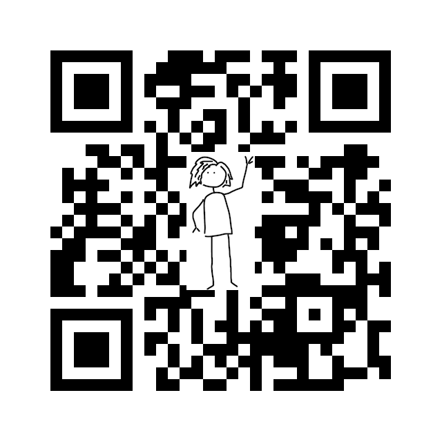

Last week, I was at Devoxx Belgium. It was great, and I learned loads. 
I also have a big list of talks to go look up later. 
Some talks I couldn't attend because of schedule clashes, and some I actually _did_
attend, but I did the over-optimistic multitasking thing and realised too late that I'd missed good stuff. 
(Yes, I know that you too think you can multitask. No, like me, you really can't.)

One of the talks I half-missed put up a QR code for the slides at the end, so I could catch up (hurray! thank you!).
So I scanned the code, and got ... this. 


There was a cookie consent, for the full creepy-tracking and personalised ads level of cookie. 
So I noped out, and didn’t get the slides for that talk. Now I'll never know what I missed. 

I'm judgey now, but I used to use similar cookie-tastic websites to make QR codes for my slides. 
 The reason I don't use them anymore is that now I have my site generate 
its own QR codes as part of the build.
(It's kind of cool; append [`/qr`](qr) to the URL of this page, and you'll get a page with a QR code that points back to the parent page).

But what if, unlike me, you didn't spend your Christmas holidays writing a big Gatsby infrastructure so that you can run custom Javascript every time you upload a talk? 
What if you want something in Java, not Javascript? It turns out, making QR codes is still really easy. 
If you can program even a little bit there's just no need to be using web-based QR code generators.
The ones you generate locally are privacy preserving, generating them is fewer clicks than fussing around in a GUI, and you can even embed your own picture into the code.

I needed to generate QR codes for the Quarkus workshops, and I was surprised how easy it was. 
I used JBang to make invocation easy, and used the `zxing` API for generation. 
If you're not interested in how it works, you can jump ahead to [the full source code](QrCode.java). Download it, 
make it executable, install jbang if you don't have it already, and then run

```shell
./QrCode.java <your-url> <path-to-a-tiny-image-to-embed> <output-file>
``` 

What's under the covers?

This code at the top of the class file declares the dependencies (with no build file, because of the magic of jbang), and also handles launching:

```java
///usr/bin/env jbang "$0" "$@" ; exit $?

//DEPS com.google.zxing:core:3.4.0
//DEPS com.google.zxing:javase:3.4.0
```

This is the meat of the method.

```java 
 private static void writeQrCode(String text, String imagePath, String outPath, int width) throws Exception {

        Map<EncodeHintType, ErrorCorrectionLevel> hints = new HashMap<>();

        // Specify the error correction, to allow the QR code to tolerate errors, such as
        // a great big picture plunked in the middle
        hints.put(EncodeHintType.ERROR_CORRECTION, ErrorCorrectionLevel.H);

        // QR codes are square
        int height = width;

        QRCodeWriter qrCodeWriter = new QRCodeWriter();
        BitMatrix bitMatrix = qrCodeWriter.encode(text, BarcodeFormat.QR_CODE, width,
                height, hints);
        // Load QR image
        BufferedImage qrImage = MatrixToImageWriter.toBufferedImage(bitMatrix,
                new MatrixToImageConfig(
                        0xFF000000,
                        0xFFFFFFFF));

        // Initialize combined image
        BufferedImage combined = new BufferedImage(qrImage.getHeight(), qrImage.getWidth(),
                BufferedImage.TYPE_INT_ARGB);
        Graphics2D g = (Graphics2D) combined.getGraphics();

        // Write QR code to new image at position 0/0
        g.drawImage(qrImage, 0, 0, null);
        g.setComposite(AlphaComposite.getInstance(AlphaComposite.SRC_OVER, 1f));

        addOverlayImage(g, qrImage, imagePath);

        ImageIO.write(combined, "png", new File(outPath));
        System.out.println("Created QR code at " + outPath);
    }
```

The reason we can put pictures in QR codes is that the QR code processor treats the image as an 'error', 
and smooths it out with error correction. 

```java 
        hints.put(EncodeHintType.ERROR_CORRECTION, ErrorCorrectionLevel.H);
```

(It turns out that ['making the whole QR code a beautiful piece of AI-generated digital art'](https://gooey.ai/qr-code/?run_id=w6dm6cdc&uid=A62l7GdqwTfTVtL7vKNcfhpo5sI2) can also be smoothed out as an error, 
but that kind of awesomeness is beyond the scope of this little utility. But go look at some of [what can be produced](https://www.creativebloq.com/news/ai-qr-codes).)  

The picture you embed can be anything - a (tiny) photo, a colour drawing, or black and white vector art. 
Most people go for something black and white. 
From my own experimentation, I think that's partly because it fits better with the rest of the QR code, visually. 
It also means the error correction has less to do, so your image can be bigger and still work.
If your image is only black and white blocks, and the 'correct' content is black and white blocks, every block
the QR code scanner reads has a 50% chance of being the same as what was supposed to be there anyway. 
If the image is colour, almost none of the overlaid blocks will be 'correct'. 

This is the code that overlays the image into the center of the QR code. 
If you didn't want your own picture, you could skip this whole section.


```java 
private static BufferedImage addOverlayImage(Graphics2D g, BufferedImage qrImage,
                                                 String imagePath) throws IOException {
        // Load logo image
        BufferedImage overlay = ImageIO.read(new File(imagePath));

        // Calculate the delta height and width between QR code and the logo
        // Note that we don't do any scaling, so the sizes need to kind of
        // work together without obscuring too much logo
        int deltaHeight = qrImage.getHeight() - overlay.getHeight();
        int deltaWidth = qrImage.getWidth() - overlay.getWidth();

        int woffset = Math.round(deltaWidth / 2);
        int hoffset = Math.round(deltaHeight / 2);

        // Write the logo into the combined image at position (deltaWidth / 2) and
        // (deltaHeight / 2), so that it's centered
        g.drawImage(overlay, woffset, hoffset, null);
        return overlay;
    }
```

Note that this code doesn't scale the image down, so if you pass in a huge image, you wouldn't see any QR code under it. 
I did that the first time I was testing, and got confused! 
If the image is medium-sized you'll see a QR code, but it won't work properly. You can play around with finding the right size for the image. How big you can go before hitting errors will depend a bit on the exact url you're encoding and also on the image you're embedding.

Finally, the last piece of code takes care of reading command-line arguments and kicking off the image creation. 

```java
    public static void main(String[] args) throws Exception {
        if (args.length != 3) {
            System.err.println(
                    "Wrong number of arguments - should be text to encode, image path, output file" +
                            " path");
            System.exit(1);
        } else {
            String text = args[0];
            String imagePath = args[1];
            String outPath = args[2];
            int width = 640;
            writeQrCode(text, imagePath, outPath, width);
        }
    }
```


Save everything into a `QrCode.java` file, and invoke your new generator like this:

```shell
./QrCode.java http://hollycummins.com ~/Downloads/small-waving-person.png ~/Downloads/myqr.png
```

(This assumes you have jbang installed to handle the launch, and you'll need to set the java file to be executable. You can also just invoke jbang explicitly with `jbang QrCode.java <args>`.)

Here's what you'll get:



