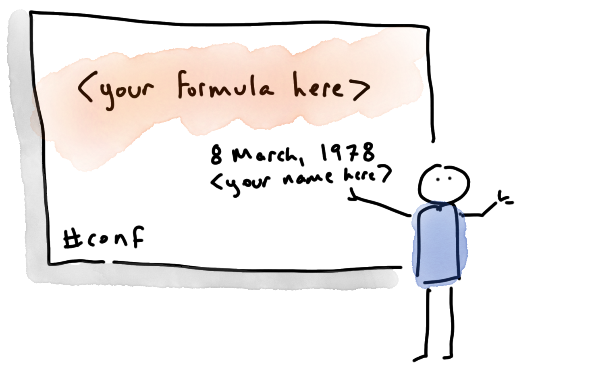

## Why crafting a good presentation title is annoyingly important, and annoyingly hard

I hate choosing titles for my talks. Titles have to be good. They have to be _really_ good. Titles are the difference between a full room and you speaking to a room containing two colleagues and someone who got lost looking for Venkat’s session. That’s a lot of pressure for six (or so) words. 

Not only do titles need to be good, we have choose them at the time when we’re _least_ equipped to do so. By definition, conferences and meetups need to publish talk titles early. 
But because it's only sensible to hold off writing my talk until after it’s been accepted by a conference, I don’t entirely know what the talk will be about when I choose the title. 
Even in the good case, I only know what the talk’s about once I’ve finished all the slides. 
In the bad case, I have to deliver a talk a few times before I properly figure out what my point even is, but that’s a topic for another post.

Just because I’m bad at talk titles myself doesn’t mean I don’t notice other people’s mistakes. So here’s my “do as I say, not as a I do” guide to choosing a good title. 

## Your title has to work hard, because people will select a talk based only on the title 

You know what your talk is about, and you wrote up a beautiful abstract to explain it to prospective audiences. Sadly, most conference attendees will never read that abstract. Reading an abstract is an extra click and an extra twenty seconds of reading, when people are standing in a busy corridor and they only have ten minutes in the break between sessions and they also need to find a loo and barge their way through to the pastry table and some coffee would also be welcome. Some conference apps are so clunky they actively discourage abstract-reading, even for people who already have their pastry: once you’ve paged away you can’t get back to the right point in the schedule. I love conference apps that have a tooltip hover for abstracts, but they’re in a minority. 

## Avoid ambiguous terms 

A while ago, I went to a talk called “Take a walk on the client side.” I went because a good friend of mine was presenting it. 
 Because I just shuffled along without thinking much about where I was going, I was expecting a talk about front-end UI development. 
 It took me quite a while to work out what was going on in the talk, because I kept waiting for the UI to appear, and it never did. 
 Eventually, after about twenty minutes of live demo, I worked out that in this context “client” meant “cli,” not “ui”. 
 It’s the same word, both meanings are valid, but they're pretty much opposites. 
 It was an excellent talk, but it would have been even better if I’d actually known what it was about while I was watching it. 

Yes, if I’d read the abstract, I probably would have understood, but I didn’t. Remember, many people won’t read an abstract. To the speaker, who was immersed in the topic, “client” was unambiguous, but for everyone else, “cli” would have carried more meaning. 

## Avoid cute plays on words 

The other problem with “Take a walk on the client side” as a talk title is that, after going to the talk, I had the [Lou Reed song](https://www.youtube.com/watch?v=oG6fayQBm9w) stuck in my head the whole day. In fact, now that I’m writing about the talk, the song is back again. I do not want to be humming Lou Reed right now, and I blame the speaker. 

A talk title's most important job is to tell the audience what they’re going to get out of the session, and it doesn't have many words to do it in. 
If all but one or two words of the title are just recycling something from J K Rowling or Tolkien or Lou Reed or whoever, it leaves very few words to explain what the talk is about. 
For example, “Does my bus look big in this?” ([true talk title](https://www.infoq.com/presentations/soa-without-esb/)), there’s only one word in the whole title doing real work. That’s just not enough information density. 

I get why people write this type of light-hearted title. When we choose a witty riff on a well-known phrase, we _are_ trying to communicate what people will get out of the session, but in an indirect way. We’re saying “what you’ll get out of this talk is <mumble> something vague about [topic], and also a lot of entertainment, because I am Witty and Fun.” 
That’s a _totally_ legitimate objective for a conference talk. However, it’s a high bar. I get frustrated if I go to a talk with a fun title, and the talk turns out not to be a-laugh-a-minute. 
It was a bait and switch – you promised me a joke-fest, but then gave me something dry and technical. 
As with everything, it is much better to under-promise and over-deliver. Choose a talk title that makes the topic clear, and then have the entertainment be a lovely surprise.

## Avoid cute plays on politically-loaded words 

For a while, we had a rash of “Make [whatever] great again” talk titles. I’m relieved to see that they’ve mostly passed. I’m sure when speakers chose those titles, no harm was meant, and it just seemed like an amusing play on words. Nonetheless, those words came with a lot of baggage, and this kind of title will cause problems for part of your audience. Do you really want the audience to be distracted trying to figure out if you deliberately chose a title with racist overtones or just did it by accident? 
No, you don't.

## Avoid flab 

Many years ago I had a talk called “OSGi and Java EE: a match made in a … box?”. The information density is kind of ok(ish), because three of four words (“OSGi”, “Java EE,” and “match”) are all doing work. However, “box” isn’t contributing any meaning at all. It was supposed to be adding humour, but in hindsight I think it only added confusion. If I’m honest, I got a bit stuck for a title and filled in the gap with words that seemed to fit, instead of really thinking about what point I was trying to make.

Recently, I spotted (but did not go to) a talk called “Take your shot of Vitamin!” Vitamin is not a well-known tool (I had to look it up, as would most people). “Take your shot of” isn’t doing anything to help explain what Vitamin is. Something like “How Decathlon Improve Productivity with the Vitamin Design System” is wordy, and a bit clunky, and deeply boring, but at least it would allow people to understand what the talk is about without having to read an abstract. Alternatively, “How Decathlon Improve Vitality with the Vitamin Design System” is a bit less generic, and it retains the original’s playing with the double meaning of ‘vitamin.’ 

## Avoid cliché

There are some phrases that tend to turn up over and over again in titles. There are a 960 talks on YouTube that start with “the developer’s guide to.” There are 36 “the busy developer’s guide to.” Another common variant is “a hitchhikers guide to.” It’s kind of friendly and nice, but ultimately it’s adding words without adding meaning.

## Don’t disguise product pitches 

Sometimes speakers don’t just forget to include the topic of their talk, they actively omit the real topic. If your whole talk is about a product, make that clear in the title. Yes, you want to explain the benefits of the product to your audience, but don’t try and draw people in with the promise of a universal topic, and then talk about your wonder-product for forty minutes. It does not win fans.

## Don’t have the same talk titles as everyone else 

This advice contradicts a lot of my previous advice. That’s why writing talk titles is hard! Because talk titles are trying to do a lot in a small number of characters, many of them pretty bland. After all, if you’re not allowed to have plays on words, or words which aren’t working hard, and you want to avoid offending anyone, you’re not left with much space for colour. So then conference programmes end up with columns of “Lessons learned doing [process]”, “Lessons learned: [other process]”, “[Technology]: [claimed benefit]”, “[Other technology]: [other claimed benefit]”. I have written many of those utilitarian titles myself. 

It’s hard, but it _is_ possible to do better. Devoxx recently had a talk called “Understanding Probabilistic Data Structures with 112,092 UFO Sightings”. This is a great title. There’s a clear topic and objective: how to work with probabilistic data structures. Even the ‘understanding’ part is doing work; it suggests this talk is aimed at a beginner audience, who don’t already understand probabilistic data structures. And then we move on to the colour. Including a concrete number makes the title memorable: if the it had been  “Understanding Probabilistic Data Structures with UFO Sightings” it would not have been as strong. Finally, the title surfaces the fact that there will be a demo (good), and the demo domain is likely to be flying-saucer-entertaining (excellent) and pop-psychology-informative (unexpected bonus!). It would have been a shame to keep such a great demo topic buried in the abstract. But the most important thing about the title is that every single word in the title is adding something to our understanding of what to expect from the talk.

Information theory can help us understand what’s wrong with many titles. The entropy of “Lessons learned doing [process]” is slightly higher than that of “Does my bus look big in this?”, but both have a pretty low [entropy](https://www.quantamagazine.org/how-claude-shannons-concept-of-entropy-quantifies-information-20220906/). That is, if you wrote a clever compressor-for-talk-titles that had access to a pop-culture-database, they’d both compress down pretty easily. There's a pretty obvious formula going on in both cases. On the other hand, any title including the phrase “112,092 UFO Sightings” will have a high entropy, because no other talk will have the number “112,092” in its title. (I checked on YouTube. There really are no others.) 

Aim for high entropy -  find a way to add personality and surprise readers while _also_ adding meaning and without descending into cliché. If you find a way to do that, it’s is a total win. Share your tips with me?

# Afterthoughts: can you rename talks the second time round?

If a title doesn't work, is it cool to change the title but keep the talk the same? 
I don't know, and it's something I puzzle over myself. Sometimes, after I’ve written a talk, I realise the title doesn’t accurately reflect what the talk turned out to be about. Or sometimes I give the talk I think is good, but audiences stay away in droves. Maybe I just chose a bad topic, but maybe the title wasn’t as compelling as it could be? 

An obvious solution is to try again with a better title, but I try not to do this too often. It feels like cheating to deliver the same talk under a different title. What if program committees get confused about what they’re getting? What if someone goes to the talk thinking it’s new, and then ends up bored? 

However, I do make exceptions. I wrote a talk that promised to be about testing in general, but because of time constraints, the final slides mostly focussed on contract testing. I’ve updated the title to be more specific and set expectations better. One of my favourite current talks was originally called “Writing Greener Java Applications.” It was a good talk, but every time I gave it, I was speaking to a depressingly small number of people.  So I reworked the structure slightly, and called it “These Five Tricks Can Make Your Apps Greener, Cheaper, and Nicer.” It’s a total click-bait title, but I’m hoping it’s so blatant that it makes people smile. I think the title also does a better job of actually conveying what people will get out of the talk - there will be practical, actionable, advice, and the actions will be _easy_. It also introduces the idea of co-benefits (what I call “the double win”). Even if people don’t care about saving the world, there are other reasons to be green, like saving money.

_I was prompted to write this after reading QCon’s excellent guidance for speakers about talk titles. Much of their advice is similar to what I’ve doled out myself over the years, but I stole “Does my Bus look big in this?” from their guide.