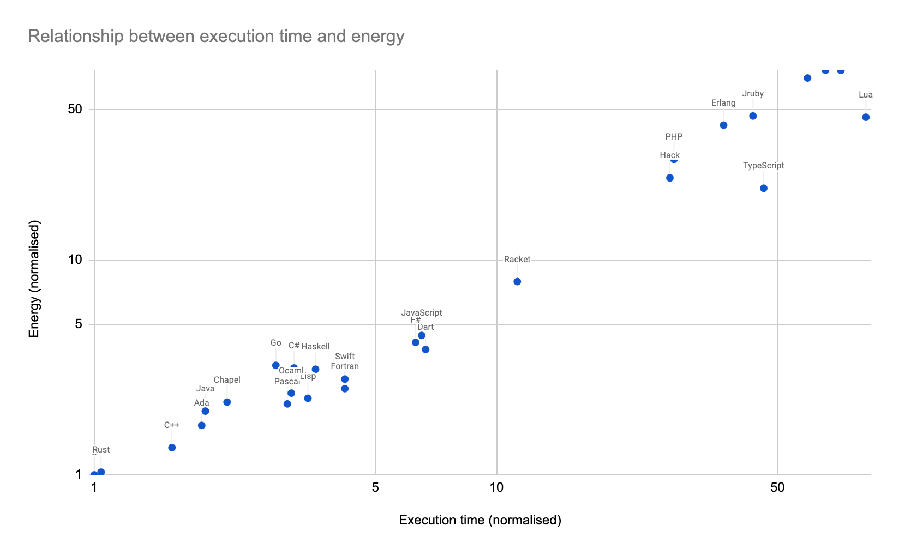

# TL;DR

If you're looking for the talk where I describe the Vroom Model, the best source is this [GOTO Aarhus talk](/five-tricks-making-your-applications-greener-goto-aarhus). 

You might also like to browse everything I have about [sustainability](/category/sustainability). 

# Background 

I use [Algolia](https://www.algolia.com/) in my [site stack](/tech-stack). 
It's one of the more pointless parts of the site, because it doesn't get used much. 
Every week Algolia mails me to tell me that no one has searched for anything.

Every now and then, someone actually does search for something, and I get all excited. 
Sometimes someone did a search but Algolia had no results to return, which is a shame.
If someone took the time to search, I want to make sure my site helps them find what they need.

Twice, the failed search has been 'vroom model.' Since there's not many searches, this 
makes 'vroom model' both the most popular search on my site, _and_ the least successful search on my site. 
Oops. 
Why is 'vroom model' not finding anything? Two reasons:

- I index the titles of externally hosted content such as talks, but not the contents. I should sort that out, but it's a bit involved.
- I am an idiot, and gave my model a un-searchable name. I didn't actually call my model 'vroom model,' I called it 'vrrrooooom model'. Or perhaps it was 'vrooooom' model. Or maybe 'vrrooom model'? The number of 'r's and 'o's in 'vrrrooooooom' is totally non-deterministic. That looks cute on a slide, but is hopeless for trying to find it by text search. When I looked, I discovered that I've used several different spellings, even in my own writing. More evidence, if any were needed, that naming is the hardest problem in computer science.

How hard is naming? Well, it turns out there already _is_ something called the Vroom Model (one 'r', two 'o's). It was invented in 1973 by Victor Vroom, working alongside Phillip Yetton and Arthur Jago. 
The original Vroom Model, or, to be more complete, [Vroom-Yetton-Jago Normative Decision Model](https://en.wikipedia.org/wiki/Vroom–Yetton_decision_model) is about decision making, not about sustainability. 

If you use Google search for "vrrroooom model," it will search instead for "vroom model," and show you Dr. Vroom's model. 
If you force it to search for the original spelling, with all the r's and o's, it will show you a set of images which are barely safe for work. They involve cars. And bikinis. 

# Ok but what is Holly's Vrrroooooooooom Model?

Let's assume you're interested in green software rather than sexy vehicles. What's the vrrrooooom model, in that context?
While we're here, I'll explain. Calculating carbon emissions is important, but hard. 
Sometimes it's important to be accurate, but if you're optimising, you don't need a 
perfectly precise absolute number, you just need to be consistent in your measurements
so that you know you're going in the right direction. 
Sarah Bergman made this point when discussing the Green Software Foundation's [Software Carbon Intensity](https://learn.greensoftware.foundation/measurement/#the-sci-equation) specification. 
Sometimes you'll need to guess about the exact values of some constants when doing SCI calculations, but as long as the external value does stay the same, that's enough to allow you to do data-driven optimisation. 

But sometimes even that level of measurement is too much work. 
We all have competing priorities and too much to do. 
Does that mean we should just give up on carbon efficiency if we don't have time for rigorous measurements? 
No way! 
 

In some of my talks, I describe two useful heuristics for reducing carbon footprint. 
I should emphasise that these are heuristics, and they will never be as good as proper measurements. 
Remember, all models are wrong, but some are useful. 

## The Economic Model

The first model is the economic model, which I learned from [Adrian Cockcroft](https://www.infoq.com/presentations/devsusops/).
The proper name is "economic input-output life cycle assessment." 
That's a bit of a mouthful, which is why Adrian calls it the economic model. 
In the simplest terms, if you reduce your company's cloud bill, or data centre bill, or electricity bill, 
you're probably reducing your cloud footprint. 
This only works if you keep everything else the same; you can't just shift consumption from one account to another and claim a win, or move to a cheap-but-polluting supplier and claim a win. 

## The Vrrrrrroooom Model

The second model is the vrrooom model. 
I made the name of this one up, which is where the failed-search-problem started! 
The vroom model says that energy consumption is (sort of, mostly) proportional to execution time. 
Again, this only works if you keep other things the same; it's cheating to upgrade hardware or move to a massively parallel cloud execution model and then claim a win because your code is running faster. 
There will also be some workloads that break this model. 
For example, memory contributes to carbon footprint, so an increase in memory consumption could drive execution time down but energy consumption up.

For a quick visual to see how well the heuristic stacks up against reality, have a look at the results table in the internet-famous ["Energy Efficiency Across Programming Languages"](https://greenlab.di.uminho.pt/wp-content/uploads/2017/10/sleFinal.pdf) paper. 
There are some quite legitimate critiques of this paper. 
The measurements here were based on a series of micro-benchmarks, and should be taken with some salt. 
Nonetheless, I find the correlation between time and energy pretty striking. 
I've plotted the authors' results, and you can see the line is pretty close to straight. 
C is fastest and uses the lowest-energy, Rust is very very close to matching C, and
Java does pretty well in both execution speed and energy use. JavaScript is middle of the pack, 
but notice how TypeScript is _far_ slower and more energy-hungry. PHP, Perl, and Python bring up the rear.

_The relationship between energy and execution time for a series of benchmarks. Values are normalised against the results for C. Data source: [Pereira et. al](https://greenlab.di.uminho.pt/wp-content/uploads/2017/10/sleFinal.pdf)_

Going beyond languages to frameworks, we see a similar pattern with Quarkus. 
Applications built on top of Quarkus tend to have a [higher throughput](https://www.redhat.com/rhdc/managed-files/mi-idc-quarkus-lab-validation-analyst-paper-f23914-202006-en.pdf), and they also 
have a [lower energy consumption](https://www.redhat.com/en/resources/greener-java-applications-detail). 

I think we can take a lot of encouragement from both the vroom model and the economic model. 
Everybody likes low bills and fast software. 
Cheap and speedy IT is its own reward, but the economic and vroom models tell us that it is also _green_. Result. 

