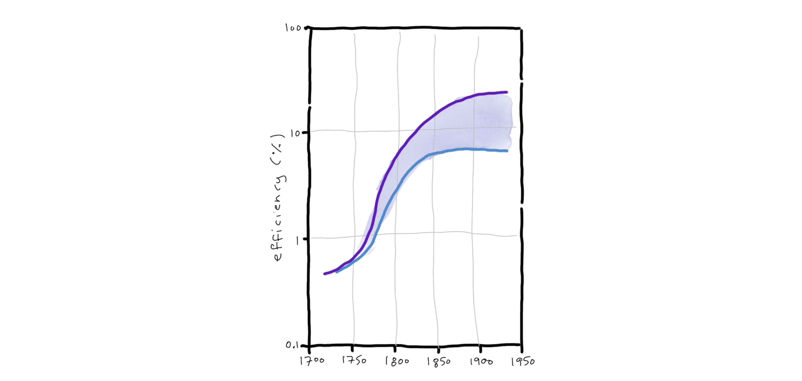

_This talk is based on a keynote I presented at [Tech.Rocks Summit](https://events.tech.rocks/summit-2023/). I'm grateful to the organisers for suggesting the topic._

Is efficiency a good thing? On the face of it, the question seems absurd. 
Of _course_ efficiency is a good thing. None of aspire to be inefficient. 
Most of us strive to be as efficient as possible, and to make our organisations equally efficient.

And yet. Our obsession with efficiency is actually relatively recent. 
If you search "what is efficiency?," Google will suggest you might also like to search for "when was efficiency invented?". 

## Forms of efficiency 

People first started thinking about efficiency in the 1700s. 
At the time, it was in a quite specific context: machines. 
Steam engines were machines which could convert heat energy into mechanical energy – that is, movement.
That mechanical energy drove machines which did useful things, such as pumping water or moving a vehicle. 
But the conversion was not particularly effective; the vast majority of the heat energy was just ... lost.
Scientists and engineers worked hard to make these engines more efficient, so that less coal required for each unit of useful work. 

As communication and transport technology advanced, the scale of administrative structures increased.
By the late 1800s, the world had large, empire-scale, governments, and large, multi-country corporations. 
These large structures had a natural tendency to descend into chaos, if there was too little process, 
or bureaucracy, if there was too much process.
Efficiency shifted to become a management concern. 
Researchers started exploring how to optimise the interaction of human beings at scale, so that each process
required the minimum amount of time and money to produce meaningful value.  

Early in the twentieth century, this optimisation effort was extended to factories. 
Factories take in things, which have some value, and produce other things, which hopefully have more value. 
How should the conversion of things to other things be done, so as to maximise the increase in value? Time-and-motion studies aimed to eliminate wasted effort in manufacturing processes.  

In the nineteen sixties, a new form of efficiency became important: software efficiency. 
Given enough hardware, and electricity, and time, software could convert questions into answers.
How do we reduce the amount of resources required, and perform calculations as quickly as possible?

## We're good at efficiency

After two hundred years of effort, we're getting pretty good at efficiency. 
By the time they were phased out in the 1950s, steam engines were twenty five times more efficient than they'd been at the start.

_source: http://geosci.uchicago.edu/~moyer/GEOS24705/2016/Assignments/PS7.pdf_
 
You've probably heard of Moore's law, which predicts that the number of transistors on a chip doubles every two years. Koomey's law is a related observation: the energy efficiency of computers doubles roughly every eighteen months. This is brilliant. (If it wasn't for Koomey's law, we wouldn't be able to afford Moore's law!)

Software efficiency also continues to improve. 
I'm a Java person, and it's noticeable that each new release of the JVM goes faster than the previous release. 
The frameworks we build on top of the JVM have also become astonishingly efficient. 
In 2010, if you wanted to launch your code on an application server, you had enough time to make a cup of tea while it was starting. 

By 2022, GraalVM, in combination with Quarkus, could start an application in 15 ms, _faster than an LED lightbulb_. (Did you know LED lightbulbs take some time to start up? I didn't, until I started comparing their start times to Quarkus native start times.) Even when running as a vanilla JVM application, without GraalVM's native compilation, a Quarkus REST application starts in under a second. 

A lot of this performance improvement has been driven by the move to cloud. 
Cloud applications tend to be at least a bit ephemeral, so startup time matters. 
Footprint also matters, because there's a financial incentive to try and pack many cloud applications 
onto a single physical machine.

Our systems are getting quicker, and we've also greatly reduced toil and repetitive tasks. 
Infrastructure-as-code and GitOps has allowed us to automate our infrastructure.
AI tools have automated _us_. Dall-E can produce much better kangaroos than I can draw, in just a few seconds.
ChatGPT can write an coherent essay exploring the benefits and risks of efficiency in seconds, when it takes me _days_ of effort to write the essay you're reading now. That's not even counting the thinking-time. 
I started thinking about this topic in March 2023, and it was only in December 2023, nine months later, that I had a draft essay.
Then it took me a further three months to finish off the draft. That's an elapsed time of _one year_, or 3,153,600 times slower than ChatGPT's elapsed time.

The worst part? ChatGPT came to broadly the same conclusions as me. When I saw that, I was pretty deflated.
 ChatGPT even included some of my points that I'd thought were all clever and novel. 

## No, we're really bad at efficiency

So is efficiency a solved problem? Not quite. 
In fact, we're astonishingly terrible at all forms of efficiency. 

Let's start by considering process efficiency. 
Many years ago, pre-cloud, some of my colleagues sold a nifty provisioning system that would 
allow people to do self-service requests for virtualised infrastructure. 
They promised the client instances could be created in ten minutes, which at the time was impressive. 
(Remember, this was pre-cloud.) 

To their dismay, the client came back with a complaint. They weren't getting new instances in ten minutes.
The spin-up wasn't an hour, or ten hours. It wasn't even ten days. 
It was taking the system _three months_ to provision a new instance. 
My colleagues were puzzled. How could this be? 
On investigation, it turned out the problem wasn't technology, it was people. 
The client had added some guard rails and governance to the system. 
And then a few extra guard rails.
What with one guard rail and another, there was an 84-step pre-approval process for each instance.

So, we all know people can be inefficient. But surely our software is efficient, right?
Well, not necessarily. 
In 2017, LinkedIn did a research trip to Nashik, a small city about 100 miles from Mumbai.

The team wanted to see how people were using one of their new features.
The answer was, they weren't. The site failed to load, because even in the city, connectivity was too poor. 
Many modern web sites have similar problems. The sites have so much bloat, they're actually _useless_ in large parts of the world.

Waste and bloat is everywhere. A quarter of our servers are zombies - that is, they haven't delivered 
any computing services for six months. A further quarter are utilised less than five percent of the time. 
The average server in our industry has utilisation between 12 and 18%. 
That's just not good enough. It's financially wasteful and environmentally destructive.
All computer systems have overheads, so even at idle, that server still consumes significant electricity. 
And then there's the physical hardware. Manufacturing hardware takes raw materials, and water, and energy. 
There's only a return on that investment if the hardware is _used_. 

All of this inefficiency is unfortunate, but accidental. 
We'd perhaps like to get rid of it, but we haven't really put our minds to the problem. 

But sometimes, we cling to inefficiency. Deliberate inefficiency is a common organisational anti-pattern. 
Team members won't report an inefficiency, because eliminating the inefficiency might mean eliminating their colleagues. Inefficiency creates employment. Dysfunctional employment, but employment.

Several software solution vendors have told me similar stories about the challenges they have selling their product. 
Their nifty technologies make teams more efficient, and allow them to do more with less. 
But it turns out, the managers of those teams don't want to do more with less. 
They want to do more with _more_! We measure the status of leaders by how big their budget is, how big their team is. Managing a team of hundred is more prestigious than managing a team of twenty-people-plus-some-great-software. So why would you buy something that potentially reduced your status?

Are we doomed to inefficiency, then? Well, not necessarily. 
We can get rid of inefficiency, and we can do it without hurting people. 
In [part II](/is-efficiency-a-good-thing-part-ii) I explore some good ways of eliminating inefficiency, and also some bad-and-wrong ways.

