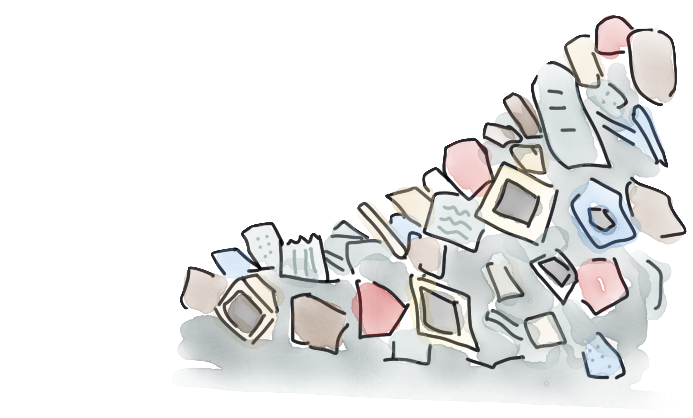
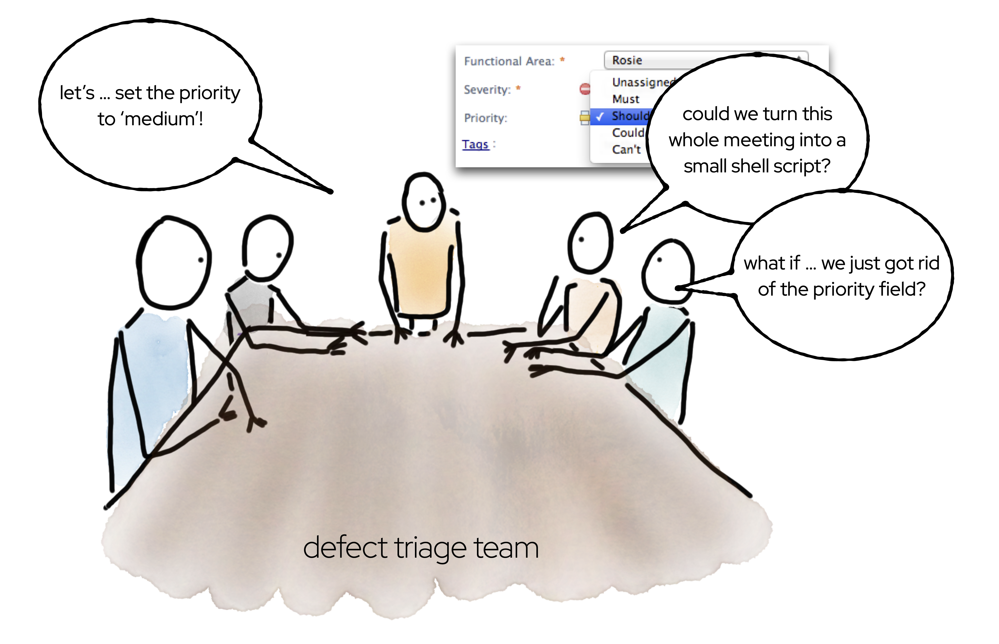
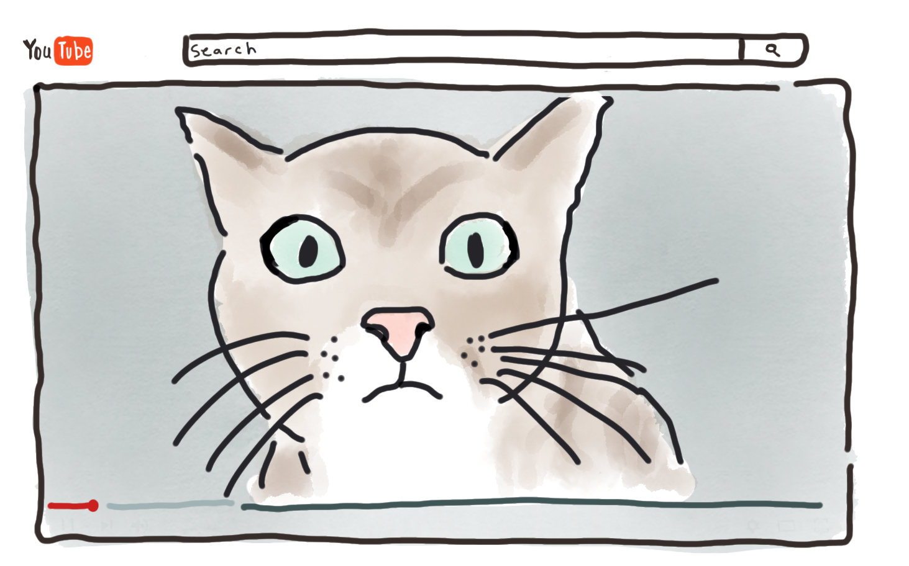
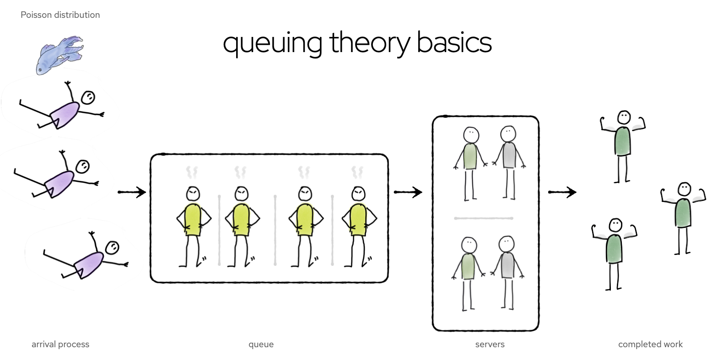
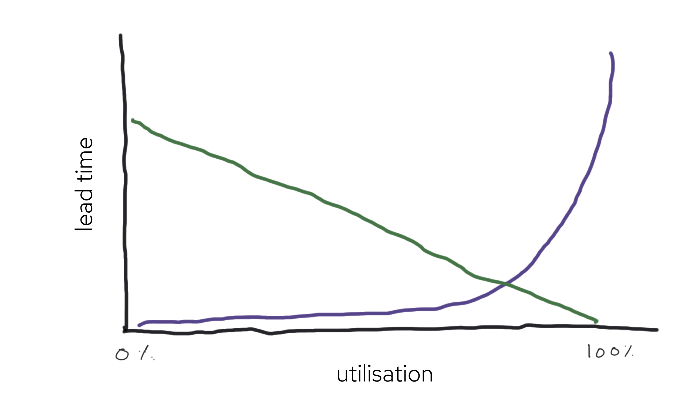
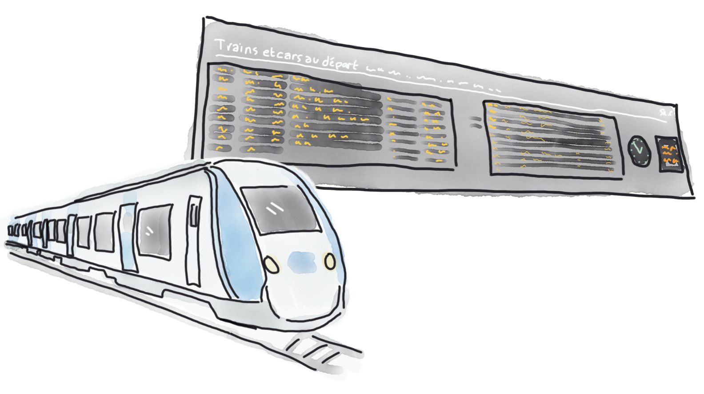

In [part I](/is-efficiency-a-good-thing-part-i) of this blog, I discussed what efficiency even is, 
and explored the question of whether we're any good at it. 
Although in some ways we're getting more efficient, many of our organisations and software systems are still shockingly inefficient.  

I get intensely annoyed by waste. All of us should take it as a personal mission to eliminate waste. 
As techies, we have a brilliant opportunity to do this by streamlining processes and optimising software. 
We should also go further; sometimes, instead of being streamlined, a process should just be eliminated. 
The management consultant Peter Drucker once said "there's nothing quite so useless as doing with great efficiency that which should not be done at all."

My team used to have a regular meeting in which we set the priority of incoming defects. 
For every defect, we would discuss the potential impact, and then set the priority to "medium". 
Every. Single. Time. (We had another field, Severity, which had more meaningful variation.)
Eventually, someone suggested that perhaps we could save some effort by writing a shell script which automated  setting the priority to "medium". 

This was a good idea, but there was a better one. If the field had so little value that we could manage it with a shell script, why did we even have the field? Why not just remove it from the tooling, and eliminate some clutter in our UI?

I sometimes have the same thought about some of the code and verbiage generated by gen AI tools. 
If the code, or comment, or words, are so predictable that ChatGPT can write it, do we really want that code? 
AI is good at writing boilerplate, but the best thing to do with boilerplate is eliminate it. 
[A GitHub study](https://the-decoder.com/github-ceo-thinks-ai-will-write-majority-of-code-in-just-five-years/) found that Copilot users accepted 30% of its suggestions, and Copilot produced 40% of the code. 
These figures seem impressive on the surface, but the more you unpack them, the less good they are. 
First of all, a 30% success rate means that 70% of the time, Copilot suggested the wrong thing. 
But what about that 40% of the code that was written by the AI? 
I suspect such a codebase will have a low information density – lots of boilerplate, lots of code comments 'documenting' parameters whose purpose is self-evident from the name, and so on. 

I've certainly seen this kind of bloat in my own experiments with ChatGPT. 
When I asked ChatGPT to write me a Quarkus `PanacheEntity`, I was initally delighted with how much code it produced. "Wow," I thought, "it would have taken me ages to write that much code!" 
But when I looked closer at the code, I realised I _wouldn't_ have written that much code, because the code didn't need to be there. 

70% of what the AI produced was waste. 
It used a bad, outdated, design where it explicitly filled in getters and setters that would normally be generated by the Panache framework. 
One of the design features of Quarkus is how it eliminates boilerplate, but ChatGPT had carefully put all the boilerplate right back in.

This kind of pointless code may seem unnecessarily flabby, but otherwise harmless. 
But superfluous code and comments is noise. It inteferes with our ability to understand code and distracts us from the important parts. It's also a maintenance liability.
For example, generic, value-free, comments can easily go out of sync with the code. When that happens, they're no longer value-free, they're value-negative.

Our industry learned, long ago, that measuring developers by the lines of code they write is a bad idea. 
We now need to learn not to measure our AIs by that criteria. 

## Measuring productivity

All organisations want to be data-driven. What does productivity data look like?
How _do_ you measure productivity, if it's not by lines of code? 
Some people joke that you should measure junior developers by how much code they write, and senior developers by how much code they delete. 
This is a nice way of thinking about the difference in roles, but it's not a proper productivity metric. 

You get what you measure, so make sure what you measure is the thing you really care about. 
This is harder than it sounds, because often the thing we really care about is hard to measure. 
For example, an important role of senior developers is to produce _other_ senior developers, but how do you measure the subtle chains of influence involved in that process? 

Often, we resort to proxy measurements. This can be dangerous, if we're unwise in our choice of proxies.
I saw a comically awful social media post recently, in which a VC boasted that his founders were measuring their sleep using a Whoop group. The goal wasn't for the founders to sleep more so they could make good decisions, it was for the founders to sleep _less_ so they could demonstrate ... commitment, or drive, or something equally nebulous. 
The founders were averaging 5.5 hours sleep a night, and this was judged to be a great result.
This is _not_ a great result. 
The effects of sleep deprivation are similar to the effects of alcohol; being tired makes people careless and stupid and causes all sorts of bad decisions and workplace-related accidents. 

Being sleep-deprived is an illusion of efficiency, not real efficiency. 
Using AI to generate reams of value-free code is an illusion of efficiency, not real efficiency. 

## Why inefficiency is efficient 
Sometimes, real efficiency looks like inefficiency. This is a complicated stuff! No wonder we get it wrong.

There's an enormous amount of research that shows fun in the workplace is good for business. 
If people are happy at work they work harder, take less sick leave, and are more productive.
In 2014, the first DORA report established that job satisfaction is the [number one predictor](https://services.google.com/fh/files/misc/state-of-devops-2014.pdf) of performance against organizational goals. 

At an individual level, the Harvard Business Review found your brain in a positive state is [31% more productive](https://hbr.org/2012/01/positive-intelligence) than your brain when it's neutral or stressed. 
How can such a positive state of mind be achieved? 
Well, cat videos are part of the solution. 
[A study from the University of Warwick](https://wrap.warwick.ac.uk/63228/7/WRAP_Oswald_681096.pdf) found that people performed 12% better on a test if they'd just watched a comedy video. 
Most managers would be delighted if you told them you knew how to achieve a 12% performance improvement ... 
at least, until you mention it involves comedy videos. 

Not only does having fun at work improve productivity, staring into space can improve productivity. 
Doing nothing creates the ideal conditions for creativity and problem-solving. 
For our industry (lucky us!), creativity and problem solving are key elements of our productivity. 
That means doing nothing is a key part of our job. 

What underpins the productivity of idleness? The default mode network is a pattern of brain activity which kicks into life when the rest of the brain goes into an idle state. 
For example, taking a shower or going for a run can trigger the default mode network. The default mode network is associated with mental time travelling, creativity and problem-solving, so triggering it is a good thing. 

It's not only fluffy-wuffy psychology which says idle time is important for productivity. Un-fluffy, un-wuffy, mathematics confirms it.  Queueing theory is the science of how and when works get done.

It could be a computer doing the work, or a person; either way, the mathematics are the same.
A getting-stuff-done process is modelled as 

- an arrival process (new work coming into the system)
- a queue (work requests waiting to get sorted out)
- servers (people, or threads, or machines, or whatever is doing the work)
- completed work (what gets spat out at the end of the process)

The arrival process is usually assumed to be a Poisson distribution; that is, random, but distributed around some average arrival rate.
If server capacity is too low, a queue builds up, and wait times are high. 
If server capacity is high, the queue will be mostly empty, and some servers will be idle. 
Is this an efficient situation, or is it inefficient? It depends what you're measuring.
Requests are handled quickly (efficient!), but there's a lot of wasted capacity (inefficient!).

What makes this trade-off particularly interesting is that it's asymmetric. 
Because requests come in somewhat randomly, there will be times when requests bunch up a bit, and queues 
build up. But what happens when requests are unusually sparse? The queue can't build _down_ below zero.

Because a queue length can't be negative, busy times hurt the system more than quiet times help it. 
You can see this effect on a plot lead time as a function of utilisation (how much of the time servers are busy).
With a Poisson distribution of arrival times, going from 80% utilization to 90% utilization doubles wait times.
If the servers are busy 100% of the time, lead times are infinite. 
There _has_ to be some slack in the system, or it collapses.

_Lead times (purple line) and resource cost (green line) as a function of utilisation. Source: http://brodzinski.com/2015/01/slack-time-value.html_

This is the reason train schedules have some slack in them. 
Trains usually travel a bit below their maximum speed, or pause for longer than strictly necessary at each station. Otherwise, any minor delay could perturb the system unrecoverably. 

On the other hand, too much slack is unaffordable. 
The green line in the plot above shows the cost of the idle capacity; at low utilisation, it's _big_.
Provisioning a dedicated pool of hundreds of build machines ensures build wait times are short, but it's ruinously expensive to have so much idle capacity, and no business would do it. 
I get my best ideas in the shower, but it wouldn't work if I spent seven hours a day in the shower, and only one hour at my desk. 
The management skill is to balance the competing inefficiencies, and come up with something that just about works.

