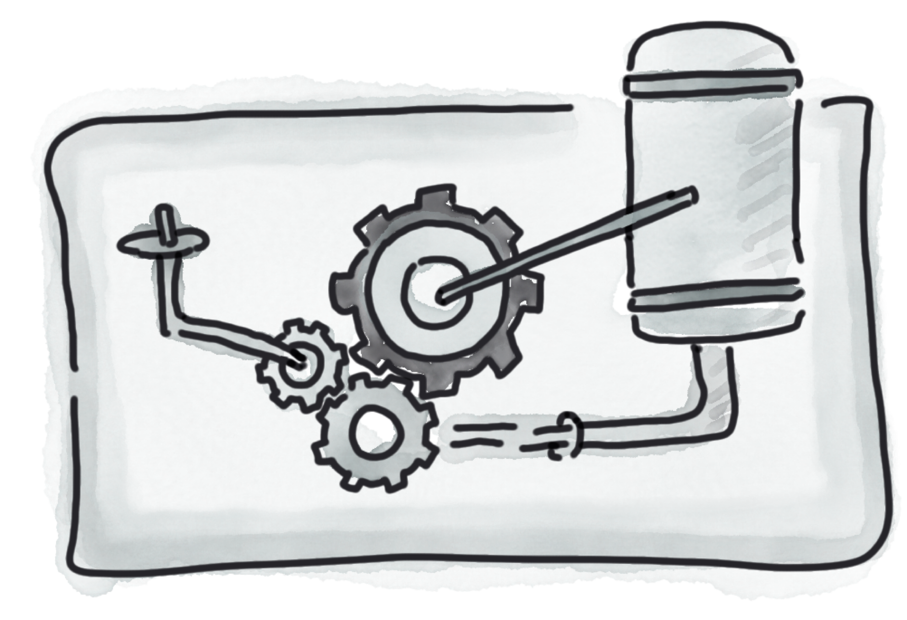
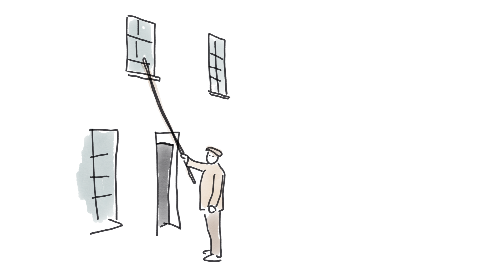
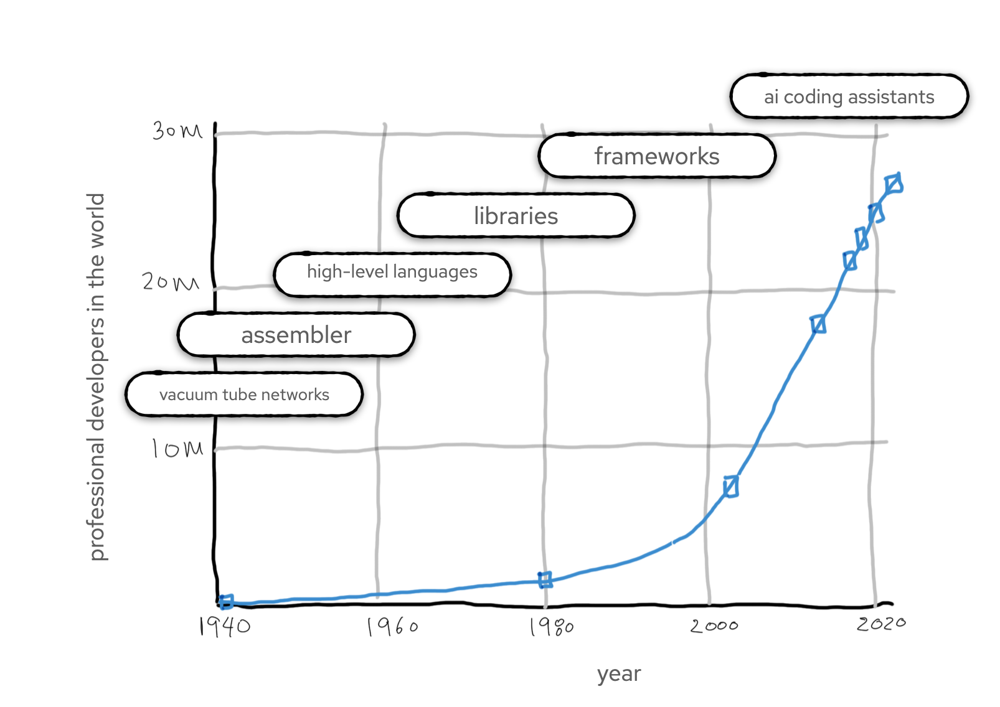

Large language models are astonishingly good at producing large volumes of code quickly.
That's also, sort of, what I do for a living, except for the "quickly" part. And the "large volumes" part.
So, will generative AI eliminate us developers?

Spoiler alert:

No.

I firmly believe developers are *not* going to be replaced by these models.
Some industry figures are saying the opposite, quite loudly, so this isn't an easy one to call.
I'll admit, some of the signs don't look so good for us developers.

It hurts my professional pride to admit it, but LLMs are much better than developers at producing large quantities of
code in a short time.
And where a machine can do a job better, in general, job markets will shift and eliminate the human jobs.
History is littered with jobs whose practitioners thought they were special and unique and un-disruptable, until ...
their jobs disappeared.

And, overall, I'm ok with that. These shifts can be painful at the time; no one likes losing their livelihood, much less
losing their whole industry.
If other opportunities don't become available, it's devastating for the people affected.
It's super-important, and humane, and fair, that businesses and governments help those who are economically displaced
get back to meaningful employment.
And we need to keep an eye on where the money is flowing when people are replaced by machines.

But even though job loss hurts, the alternative is worse.

I wouldn't want me, or anyone else, to be spending time and effort doing a job that a machine could do. That's just
pointless busywork.
Busywork doesn't help the individuals involved, and it definitely doesn't help us as a species.
Automation has been responsible
for [a huge rise in global living standards](https://ourworldindata.org/a-history-of-global-living-conditions) over the
past two hundred years.

## A short, selective, history of automation.

Many things we used to do by hand, such as washing clothes or weaving fabric, are now done by machines.
(The economic disruption caused by automated fabric weaving led to a great deal of social disruption, and gave us the
words 'sabotage' and 'Luddite'.)

Jobs have disappeared, and technology was to blame. Automation killed the job of the washerwoman, and the stockinger,
and also the knocker-up.
But wait, what on earth is a knocker-up?

Do you remember alarm clocks? They were the things we used to use before we all used our phones as alarms.
They were mechanical, and are themselves a relatively recent invention.
Before people had alarms, how did they get to work at the right time?

Often, "the right time' was the time that they got to work. Cows and carrots and fields are pretty forgiving of
tardiness.
It was only when people starting working together, in shifts, in expensive factories, that clock-time became important.

This new need for punctuality spawned a new job: the knocker-up.

The knocker-up was a human alarm clock.
Knockers-up would visit their clients and wake them up, either by tapping on the window with a stick, or by shooting
their window with pea-shooters.

(If you're reading this and are confused or horrified, the important context you're missing is that 'knocking up'
means 'to wake someone up' in UK English.
In North American English 'knocking up' means 'to impregnate', but that kind of service was definitely outside the job
description here.)

Knocking-up was a job created by the changing technology of the industrial revolution, but changing technology also
eliminated the profession.
As more people got mechanical alarm clocks, the need for the knocker-up faded.
The need didn't fade as fast as you might think, though;
professional knocking-up lasted to the 1940s and 1950s, and in some parts of
England [it hung around until the 1970s.](https://www.bbc.co.uk/news/uk-england-35840393)

Even though it survived a surprisingly long time, it's easy to see why the knocking-up industry was ultimately doomed:

- A convenient technological alternative was available
- The pool of the population who need waking up is limited; only people working outside the home on a strict schedule
  wanted the service
- Each client needed the service a maximum of once a day; no matter how much marketing a knocker-up did, no matter how
  great the knocking-up service, people didn't need re-waking once they were already awake

A cheap alternative, and finite demand. Clearly, knocking-up couldn't last.

## Why software development is different (really!)

So what's different for developers? Almost everything.
Although software-writing automation is (sort of) available, it is _not_ a convenient replacement for human developers.
That's true now, and it's likely to stay true.
Crucially, too, the world's demand for software is apparently infinite, or would be if there weren't budget constraints.
That means demand for software developers is large, and growing.

## The role of the developer - writing code is only a small part

Why can't Copilot, or ChatGPT, or Devin, or other generative AI equivalents, do the job of a software developer?
These tools are very, very, good at copying and pasting code from the internet.
Software developers are
also [very good](https://stackoverflow.blog/2021/09/28/become-a-better-coder-with-this-one-weird-click/) at copying and
pasting code from the internet, but these tools are even better.

But the job of a software developer is not to copy and paste from the internet.

That's part of the job, but only part.

The role of the knocker-up is fairly well-defined. It's ... to wake people up.
This is different from the role of, say, a hairdresser, who is partly there to cut hair, and partly there to act as a
therapist.

The role of a software developer is similarly blended, except the computer is the one on the therapy couch.
Even before we start writing code, our job is to understand what problem is being solved,
understand why the original problem statement was flawed, re-define the problem,
and explore risks.
Then, after we've written (or copy-and-pasted) the code, our job is to
get code from the internet all the way into production,
debug the code, debug the code again,
understand the computer's deepest secrets, try and stop the computer system from going completely mad, work with
colleagues to integrate incompatible systems,
manage stakeholders, manage other stakeholders who are quite obstreperous,
debug the code again since it's doing something in production which no one has seen before,
and then re-define the problem again.

Fundamentally, our job as software developers is to solve problems which have never been solved before.
I mean, if the problem had been solved already, why would we want to solve it again?
Let's just get a computer to do that for us.

## Demand is infinite

In my experience, software creates the need for ... more software.
Think, for example, of Jenkins, or Tekton. Or Kubernetes. Or, in fact, the whole of the CNCF landscape.
These are complex pieces of software which only came into existence because other software existed.
Think of ad-blockers; their whole existence is a response to other software.

Software multiplies. Software snowballs.

The world doesn't just demand software. It demands:

- software to do stuff
- software to do more stuff
- software to bypass advertisements in the software
- software to bypass the bypass software so ads still show (the ad-blocker arms race is creating a *lot* of jobs)
- software to monitor the software
- software to debug the software
- software to manage the software
- software to write the software
- software to manage the software that writes the software
- software to try and avoid skynet
- software to tell people about software
- software to work out the meaning of life
- software to gamify software

## Past productivity gains did not eliminate developer jobs

My assertion that the development for software developers will increase isn't just a reassuring wish.
We can look at the impact of earlier changes in our industry.
Each one made software development easier (in some way), made it accessible to a wider group, and made developers more
productive.
And yet following each productivity gain, demand for developers _increased_.

Programming a computer used to be _hard_.
Before we had IDEs and MacBooks, we had punch cards and vacuum tubes.

In 1947, Kathleen Booth created the first assembly language, which made programming more efficient.
In 1956 John Backus and an IBM team developed the first high-level language, FORTRAN, which made programming more
efficient.
By the mid-1960s, higher level languages were enriched with reusable libraries, which made programming more efficient.
Somewhere in the 1980s we got frameworks, which made programming more efficient.
In the 1990s we got mainstream garbage collection, which made programming more efficient.
In the 2000s we got and smart completion, which made programming more efficient.

So did each productivity improvement reduce the number of developers working in the industry?
Er, not exactly. In the 1950s, there were a few hundred developers in the world.
In 1970, there
were [around half a million](https://computinged.wordpress.com/2013/01/03/how-many-programmers-are-there-from-the-computer-boys-take-over/).
In 2024, there are
around [28 million developers](https://www.statista.com/statistics/627312/worldwide-developer-population/) in the world.
It's Jevons paradox, but for people. And exponential.

_[Source for earlier data](https://computinged.wordpress.com/2013/01/03/how-many-programmers-are-there-from-the-computer-boys-take-over/), [source for recent data](https://www.statista.com/statistics/627312/worldwide-developer-population/)_

As Gergely Orosz put it this
week, [writing about the same question](https://newsletter.pragmaticengineer.com/p/is-the-ai-developera-threat-to-jobs),
the goal of COBOL "was to allow business people with no programming background to use it. In the end, COBOL didn’t
remove the need for developers: instead, it created demand for COBOL developers."

## But our jobs will change

Even if AI is unlikely to take our jobs, it doesn't mean it won't _change_ them.
When a productivity improvement is available, it is expected that people use it.
None of us, not even the most curmudgeonly technology-resistant developer, program like it's 1947.
If we did, we wouldn't have achieved cat videos and _Baldur's Gate_ and online shopping.
None of us are using punch cards, or `GOTO` statements. We use IDEs, and Testcontainers, and Quarkus.
We wouldn't write a greenfield application in COBOL, except as a dare.
Some hardcore folks use assembler, but only in contexts where being close to the metal is worth the productivity
penalty.

I have some questions about how much the current batch of tools _actually_ improve productivity, but that's a separate
topic.
I think we can safely assume that some of the quality issues with generative AI will be ironed out.
These tools will become embedded in our workflow, just as IDEs and compilers have.
They will take away some drudgery and toil, but they will not take the jobs.
The computer assistants are coming, but the people aren't going away.

# Further reading

This topic isn't going away. Here are some other takes that I found well worth reading:

- [Is the “AI developer”a threat to jobs – or a marketing stunt?](https://newsletter.pragmaticengineer.com/p/is-the-ai-developera-threat-to-jobs),
  Gergely Orosz. March 19, 2024.
- [Generative AI Is Not Going To Build Your Engineering Team For You](https://stackoverflow.blog/2024/06/10/generative-ai-is-not-going-to-build-your-engineering-team-for-you/),
  by Charity Majors. June 10, 2024.
- [The Recurring Cycle of 'Developer Replacement' Hype](https://alonso.network/the-recurring-cycle-of-developer-replacement-hype/)
  presents a nice historical perspective. It also points out that code is not an asset, it's a liability. If AI makes it
  easier to generate a lot of that liability, the need for people who can manage the overall system is going to become
  higher.
- At GOTO Copenhagen 2024, Kent Beck was asked if AI would end the job of a developer. He had a two-word answer: "
  Jevon's Paradox." In other words, reducing the cost of a thing increases demand for it. This is a simular argument to
  mine, but I hadn't thought of linking it to Jevon's Paradox, even though I actually spend a lot of time thinking about
  Jevon's paradox in other contexts.
- [AI tools for software engineers, but without the hype](https://newsletter.pragmaticengineer.com/p/ai-tools-for-software-engineers-simon-willison),
  September 25,2024. The inaugural podcast from Gergely Orosz featured Simon Willison, who has been doing a lot of
  interesting writing and talking about AI. The whole podcast is worth a listen, but there's a discussion about the
  impact on jobs towards the end. Simon's take is that AI won't replace developer jobs, but developers who don't become
  proficient with the tools may become out-competed. 