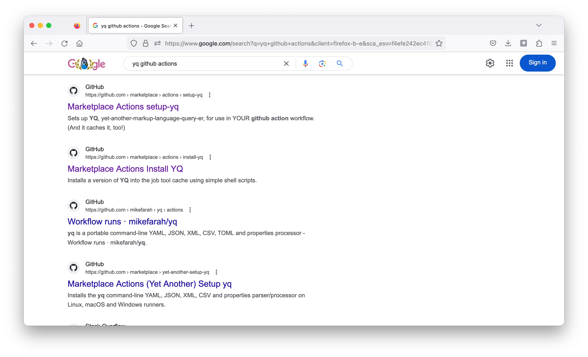
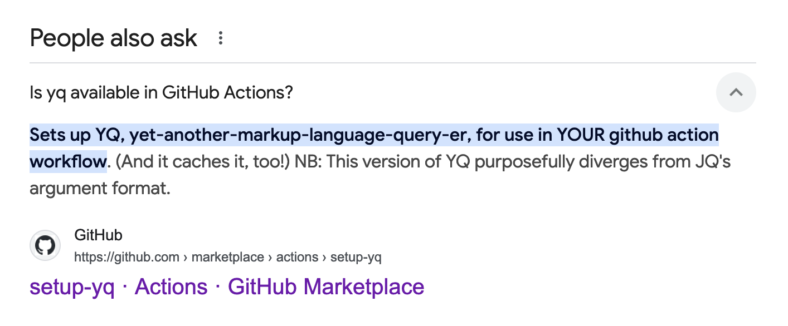

TLDR: GitHub runners come with yq pre-installed. There's no need to install it, or use a third-party action.


A problem of modern search engines is that it's much easier to index the presence of something than the absence of it. 
(LLMs have this problem too, which is why ChatGPT will sometimes misunderstand a programming model and generate pages of unnecessary boilerplate.)

I recently used [yq](https://mikefarah.gitbook.io/yq) to alphabetise an array in a yaml document. 
I wanted to run my script after every commit to a GitHub repo, but I didn't know if `yq` would be installed on the GitHub runners.
So I googled "yq github actions," as one does*.

The result was lots of marketplace actions for installing it.

   

There was a featured snippet for "is yq available on GitHub actions," which directed me to a marketplace installer. 
The yq project itself had a marketplace installer. Clearly, I needed to install it before using it. Right?

   

I wrote my workflow, using the action from the yq project itself, and sent it off to review. My colleague George Gastaldi looked at what I'd done, and pointed out yq was available on the runners. This matters, because we try and limit our use of external, 'non-official' actions, for supply chain security reasons. 

So I searched again to confirm, and ... still found very little. To actually confirm, I had to merge and experiment. 
And, indeed, the GitHub runners do come with yq pre-installed. They've had `yq` since 2021.

This is the workflow step which alphabetises an antora playbook:

```yaml
      - name: Alphabetise
        run: |
          yq '.content.sources |= sort_by(.url)' antora-playbook.yml > antora-playbook-sorted.yml
          mv antora-playbook-sorted.yml antora-playbook.yml
```
I'm hoping this blog can help the next person who might be trying to figure out how to use yq with GitHub Actions. 
For everyone else, please appreciate my attempt to illustrate 'yaml,' by combining a yak and lots of marks and language. 

   

* In hindsight, I perhaps should have been more precise and searched for "yq github runner," but even if I had, the results are pretty much the same.