---
title:
  "Transcript: When benchmarks go bad - what I learned from measuring performance wrong"
author: Holly Cummins and Francesco Nigro
category: performance
type: blog
---

This is the transcript of [a talk I gave at J-Spring](/when-benchmarks-go-bad-jspring/), with some
light editing and corrections by Francesco Nigro.
Francesco also organised the transcription. The transcription tools recorded 148 "um"s and 8 "\[snort\]"s, so I
removed
those in the editing and made a note to snort less in future.

----

## 1. Slides 1–3 — Introduction

Video at [\[00:00\]](https://www.youtube.com/watch?v=l30BJZ7joCI&t=0s)

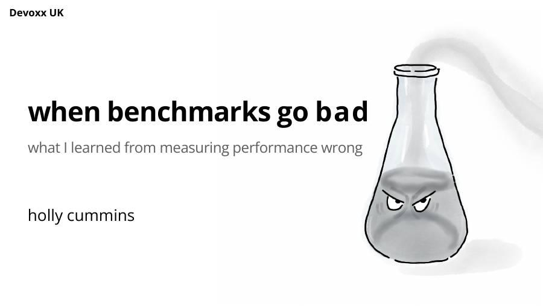

I'm part of the team that helped build Quarkus and if you've ever looked at the Quarkus website or any of the materials
about Quarkus, you'll know that performance is really important
to us.
Performance is something that we're quite proud of and on our front page we very prominently
have our performance figures.

Wen we first built that webpage, the performance figures were current and then time
passed and they became a bit staler and a bit staler until eventually I thought we've really got to update these
figures.
I did a piece of work at the end of last year to update our performance numbers, which seems like it should be a
really small piece of work: we already had a benchmark, we just needed to make a few changes to the benchmark and set up
a little bit of automation so that when we would run the benchmark, our performance numbers on our front page would
update automatically. How hard can it be, right?

## 2. Slides 4–5 — Measure, don't guess (is just the beginning)

Video at [\[01:17\]](https://www.youtube.com/watch?v=l30BJZ7joCI&t=77s)

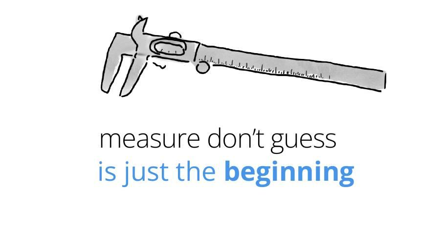

If you if you've done anything in the area of performance or performance analysis, you have probably heard the
phrase "measure, don't guess". This is absolutely important. I would still very much encourage you to start with
"measure,
don't guess".

But measure, don't guess is just the *beginning*. It turns out even once you've made the decision to measure,
there's a whole bunch of things that can trip you up or go wrong.

## 3. Slide 6 — Live demo: spring-quarkus-perf-comparison

Video at [\[01:47\]](https://www.youtube.com/watch?v=l30BJZ7joCI&t=107s)

I'm going to do a little demo now. Let's show my IDE. What I've got here is this is the benchmark that we are
now publishing on the front page. And I'm going to run a little stress test of Quarkus. And so, what this is going to do
is it's going to first of all, start a database in a container, start an OTel stack, and then it will start the
application, do a warm-up run, and then it will do a 20-second performance measurement. I do this demo fairly
regularly now, and every time I do it, I regret my life choices because it turns out that watching a performance test
run, even if it's only for 20 seconds, is really, really boring. I keep thinking I could I could make the measurement
period shorter.
I could make it 10 seconds. I could make it 5 seconds. But then, really, we start to compromise
the quality in a in a way that I can't live with. We've got some
results!

So, you can see we did a warm-up run, and then we did a load test, and we got 15,000 requests per second with
Quarkus. Remember those numbers. If I had a whiteboard, I would like write them down, but I don't.
So, our time to first request was 3 seconds, and our RSS
was 322 meg. So, now let's do the same thing for Spring. And while we're doing that, I'll just give you a quick tour of
the code. We've tried to make the application as similar as possible for both Quarkus and Spring. It's just simple
little rest application with a bit of DTO going on, a REST endpoint.
This is the script that we're using to
measure it.
The code is exactly the
same in some cases. Of course, you can't have it be exactly the same everywhere since they're different frameworks.

We've got answers! So, you can see we've got
the warm up, and then we've got results here, which are 13K requests per second. And if we scroll up, we've got 4
seconds to start and an RSS of 658 MB.

## 4. Slides 7–11 — Was this a good measurement? What was wrong?

Video at [\[05:07\]](https://www.youtube.com/watch?v=l30BJZ7joCI&t=307s)

And so, let's go back to our slides. Everybody remember those numbers?
The first question is, was this a good measurement? Did I do things right?
Hands up if
you think this was an example of performance best practices. One or two hands.

Hands up if you think that maybe it
wasn't. Lots of hands.

I have to say I'm inclined to agree with you. There's there's a whole bunch of things
that were wrong with that. The first thing that I will point out is of course when you run something like this ,
in front of an audience, there is the demo effect. Those results that I showed you are
completely not what I was expecting and are basically completely wrong. I would expect that the throughput of Quarkus
would be about double the throughput of Spring and we saw that it was maybe like 10% more. So, with my my knowledge of
what was supposed to happen, I can tell you something something weird
was going on there.
Even if the results had been what I expected, there's a whole
bunch of other things that were wrong.

## 5. Slides 12–13 — Building a benchmark is easy. Building a good benchmark is hard.

Video at [\[06:37\]](https://www.youtube.com/watch?v=l30BJZ7joCI&t=397s)

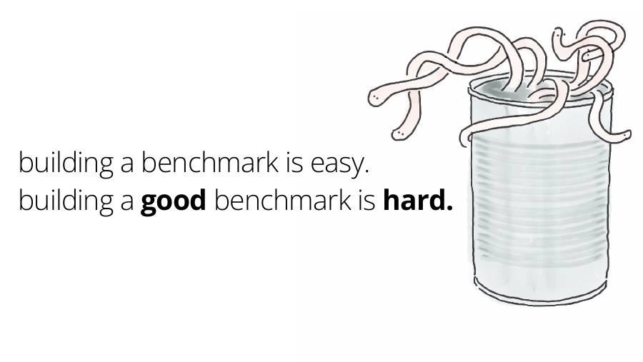

What my min-fail there shows I is that it is it is trivially easy to build a benchmark. It is
trivially easy to build an application and then run it.
And we see this all the time, because I work in the Quarkus
team we keep an eye on what's going on in the internet and about once a month someone will write an
article and they'll say "I benchmarked Quarkus against Spring and these are my results". Sometimes those results make us
look really nice. Sometimes those results don't make us look so nice as we should.

But in almost every case, no matter what, when
we dig into what was done, we can see that "oh, actually yeah, this wasn't done quite right and this wasn't done
quite right". And that's not just a Quarkus-Spring thing. That's almost every benchmark you run.

Speaking personally, I find this really depressing
because I think benchmarking is important. I think understanding performance is important for all sorts of
reasons. It's important in terms of understanding how much things cost. It's important in
terms of allowing you to make decisions that will help you and your organization save money. it is important in terms of
allowing you to choose sustainable options. And if something is important, we want most people to be able to do a good
job of it.

We're looking at LLMs now and we're starting to write skills for LLMs and of
course we want to know is our skill making things better or worse. That's a benchmarking challenge. And so
even if you're not looking at literal performance, there's so many decisions that you make as a software engineer
where having data is important and it turns out it's really hard to get that data.
Doing a good job of this is _not_ easy.

I showed you briefly the script
that I used, the `stress.sh` script. My original intention when I wrote that script was that it would be five lines and
when I was doing a live demo it would fit on the screen and everybody could understand exactly what was being
done. You saw as I was scrolling through there was a lot more than 5 lines there there.

There was a a constant dialogue
between myself and and my colleagues. I'm a software engineer, my colleagues were performance engineers, and so we kept
going back and forth between "can we do this because it's understandable?" versus "it's understandable but it's _wrong_,
so we need
to to make it more complex."
And so just every implementation decision we made ends up being this can of worms.

## 6. Slides 14–15 — You are not measuring what you think you are measuring

Video at [\[09:06\]](https://www.youtube.com/watch?v=l30BJZ7joCI&t=546s)

The fundamental problem is that if you do a measurement but you're not measuring what you think you're measuring
that measurement is _useless_. So this this isn't just nitpickingness. This really matters.

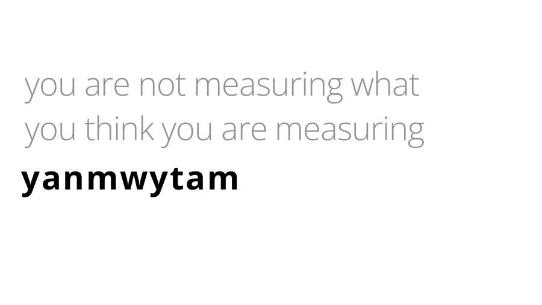

This principle
of
"you are not measuring what you think what you think you're measuring is an important one". I've tried to come up with
an acronym for it. Unfortunately the acronym is YINMWYTM or Yian-Mu-Tslam. which is why I don't think this is going to
be a very successful acronym

## 7. Slides 16–25 — Workload vs environment / anatomy of a benchmark

Video at [\[09:44\]](https://www.youtube.com/watch?v=l30BJZ7joCI&t=584s)

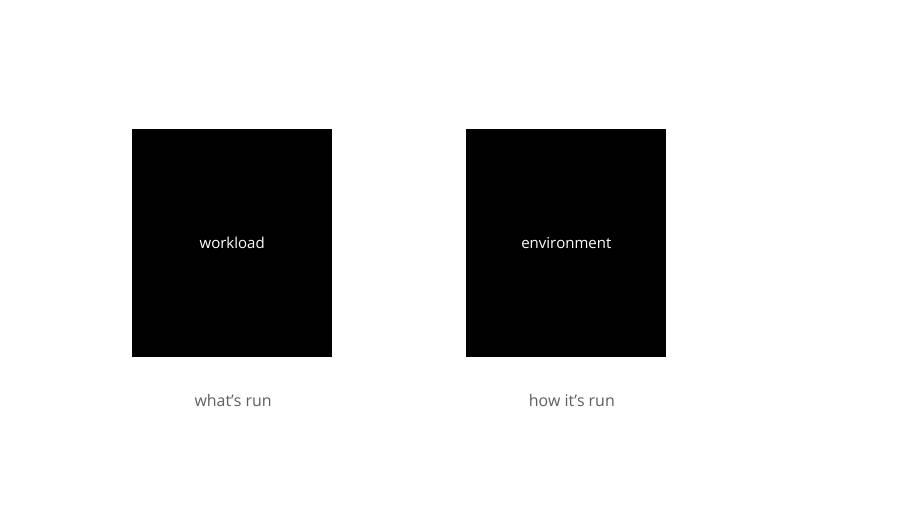

But going back to the the the question of of benchmark design, ultimately when you're when you're designing a
benchmark, there's two parts to it. There's the workload, your actual application, what you're running, and then there's
all of the surrounding environment, how it's run, how you send load in.

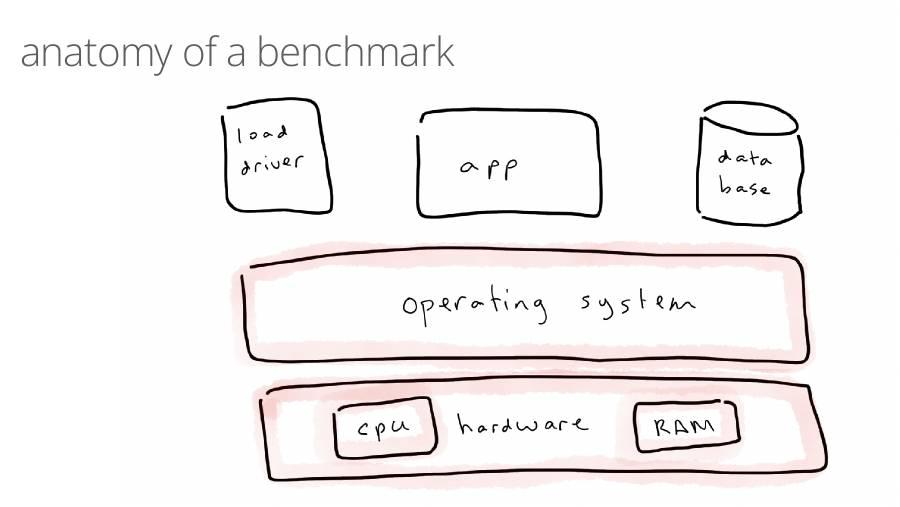

And so we can drill into that in a
little bit more detail. So that app there, that is your workload. There is of course massive opportunity for failure
here. And then everything around it is the environment. And you'll be surprised to hear we have opportunities for
failures with all of these, which is depressing, unfortunately. So even things like the CPU and the RAM and
your and your hardware can can cause problems

## 8. Slides 26–29 — Reproducibility: you are measuring noise

Video at [\[10:33\]](https://www.youtube.com/watch?v=l30BJZ7joCI&t=633s)

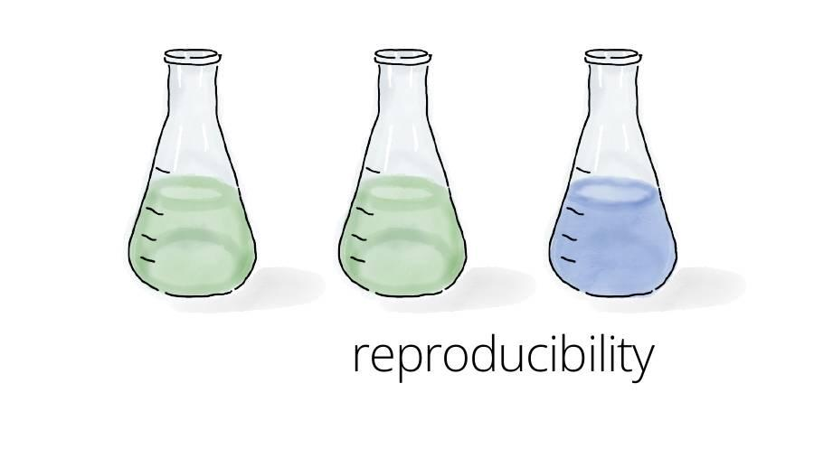

And what what a lot of the problems come down to is a question of reproducibility. What you want is that when you run
your experiment and then you run it again, and you run it again, you get the exact same number every time. And you saw
with my experiment that I did just now, I had a massive failure of reproducibility where my my spring results were far
more positive than I than I expected them to be.

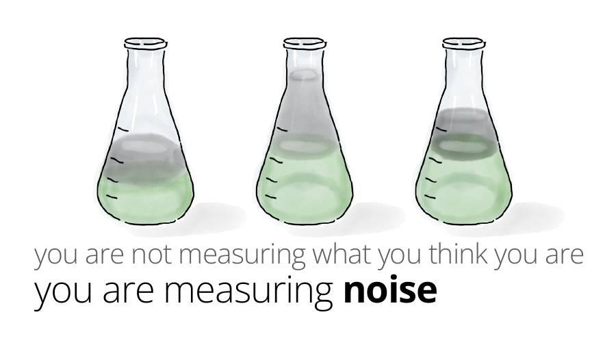

Reproducibility matters a lot in the if you're doing a science experiment and you're you're doing it a few times to get
some statistical
validity, reproducibility matters. But it matters even more if you're doing something like what I was doing, where
you're measuring two things that are _different_. If you're measuring two things that are different, you have to make
sure
that there's almost no noise in the system, because otherwise your comparison will just be wrong. You think you're
comparing Spring and Quarkus. You think you're comparing Alice's code and Bob's code. And actually, you're just
measuring noise instead.

## 9. Slide 30 — Variation caused by environment issues \~40%

Video at [\[11:42\]](https://www.youtube.com/watch?v=l30BJZ7joCI&t=702s)

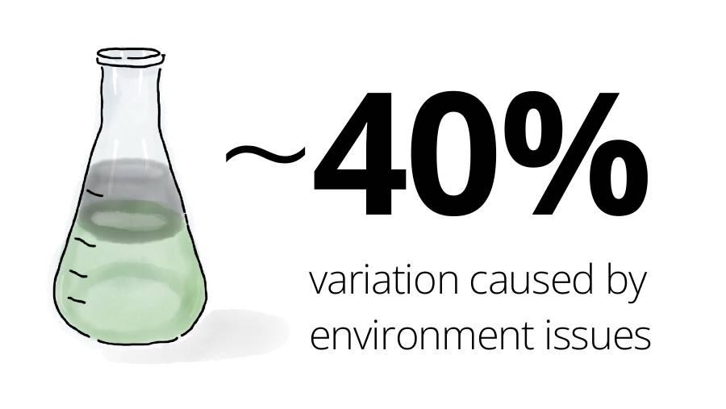

The thing about this noise is, when I first started talking to my performance engineer colleagues and they were
saying, "No, it needs to be reproducible," I thought we were being really persnickety and
we were talking about like, "Oh it's 5% wrong this way or 5% wrong that way." But actually, the amount of
difference that these reproducibility problems can make to your results is huge.

We see a 40% variation in some measurements and sometimes it's even more than that. So, getting this right makes a huge
difference to
the numbers you get, which means it makes a huge difference to the answers that you get if you're trying to make a
decision.

## 10. Slides 42–43 — Load generation on the same machine

Video at [\[12:28\]](https://www.youtube.com/watch?v=l30BJZ7joCI&t=748s)

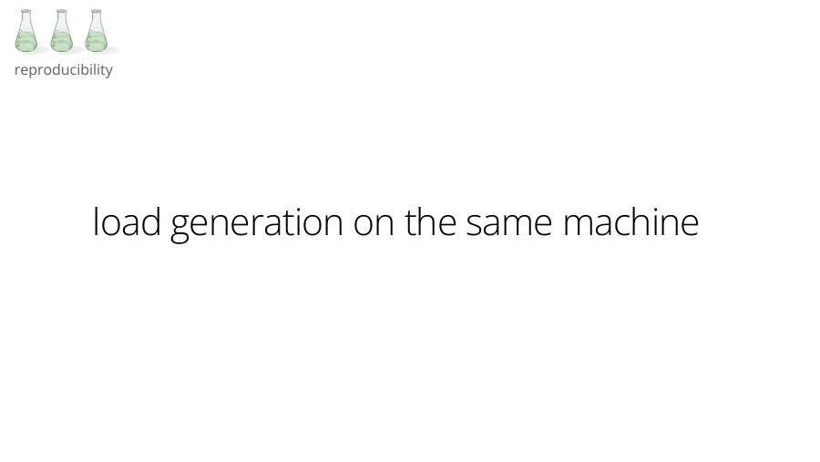

When I did my toy demo, one of the first things that some of you will have noticed, you'll have looked at what I
did and said, "ooh,
shouldn't be
doing that," is I was driving the load into my application on the exact same hardware that I was using to run the
workload. This is a newbie performance error. You cannot do that. I'll come back to that
though because it's not quite that obvious. But the way I did it, this is a fail. But when I ran on my laptop, I had no
choice
but to to do that.

## 11. Laptop thermal throttling

Video at [\[13:02\]](https://www.youtube.com/watch?v=l30BJZ7joCI&t=782s)

But I think the the biggest problem that you will get when you run on a laptop has to do with the thermal behavior of
your laptop. Laptops are really optimized in order to preserve battery life and also in order to not melt. Consumers
tend to get upset if their laptops get destroyed. And so, as soon as the laptop detects that it's a little bit warm, it
will just throttle everything. It will shut down some CPUs. It will slow the CPUs down because it's only got a tiny
little
fan compared to a server.

And so, that means that as soon as I start running my presentation, plus running some benchmarks, my laptop's going to
get warm, and then everything starts to change in a really
non-deterministic way. But it's definitely slowing.

## 12. Slides 40–41 — CPU frequency is not deterministic

Video at [\[13:50\]](https://www.youtube.com/watch?v=l30BJZ7joCI&t=830s)

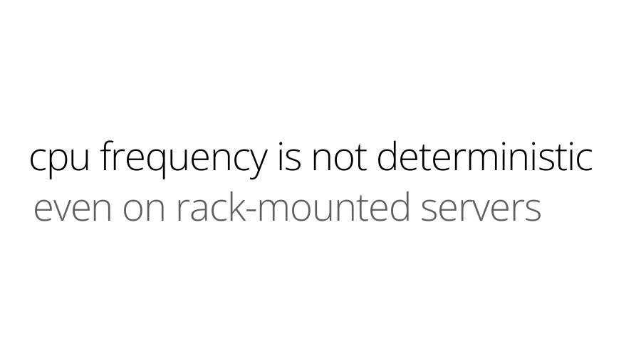

But, it gets worse than that because even if I'm on a proper server, in a data center, the CPU frequency is not
deterministic. And we'd kind of forgotten this when we were doing some of our results. And so, only about a couple of
months ago, we started really in detail measuring the CPU frequency as we were running the experiments and
seeing it varying all over the place. And it's the exact same thing. Most modern hardware will throttle some CPUs. It
will ramp up some CPUs in order to control the temperature, in order to optimize the CPU for what it thinks you're
trying to do, which may not actually be what you're trying to do.

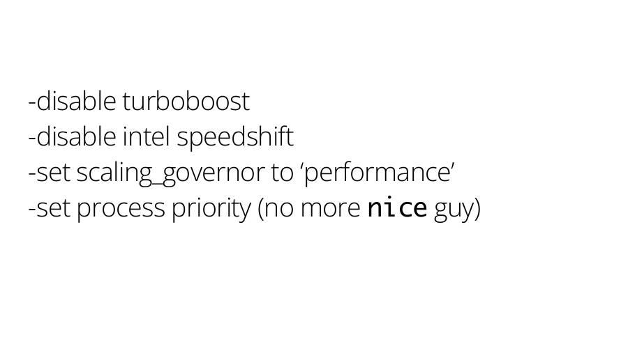

So, if you're running on Intel hardware in a lab, and
you want to get reproducible results, what you need to do is you need to disable Intel Turbo Boost. You need to disable
Intel Speed Shift. You need to set the scaling governor to performance. And then, of course, you don't want your process
to give way to some other process because you're trying to measure that process. So, you need to make sure that `nice`
is
disabled.

## 13. Slides 31–34 — State is noise, caches are noise

Video at [\[14:57\]](https://www.youtube.com/watch?v=l30BJZ7joCI&t=897s)

And it gets worse anytime you're running an experiment repeatedly, which you probably will in order to get some
kind of statistical validity, you'll end up with a little bit of state building up. That state is noise.

And computers
try and cache things because that gives you an efficiency. That cache is noise. So, So have to do a whole bunch of work
to tell the computer to be as inefficient as possible while running your benchmark. So you have to tell it to drop the
file system caches. And you also have to tell it to drop the container caches because Podman or Docker or any of these
container runtimes, they will cache images because not doing that would be ridiculous. So you have to make sure you drop
the caches.

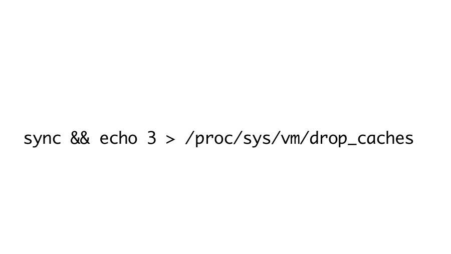

-

## 14. Slides 35–36 — Stale database images (oops)

Video at [\[15:44\]](https://www.youtube.com/watch?v=l30BJZ7joCI&t=944s)

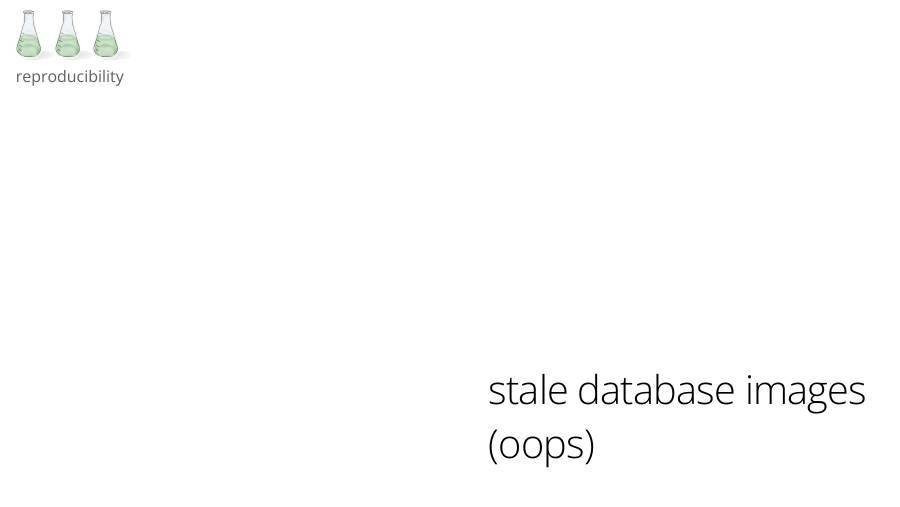

We had a problem with this in our lab setup. Only after we'd been running for a couple of months did we
realize that we had a database image that had was pre-populated with some data. And we had changed that at some point to
make the data more representative. We hadn't wiped the caches. And so we were every time we did a run, we were running
not measuring what we thought we were. We were measuring something else.

## 15. Slide 45 — Everything is connected to everything

Video at [\[16:13\]](https://www.youtube.com/watch?v=l30BJZ7joCI&t=973s)

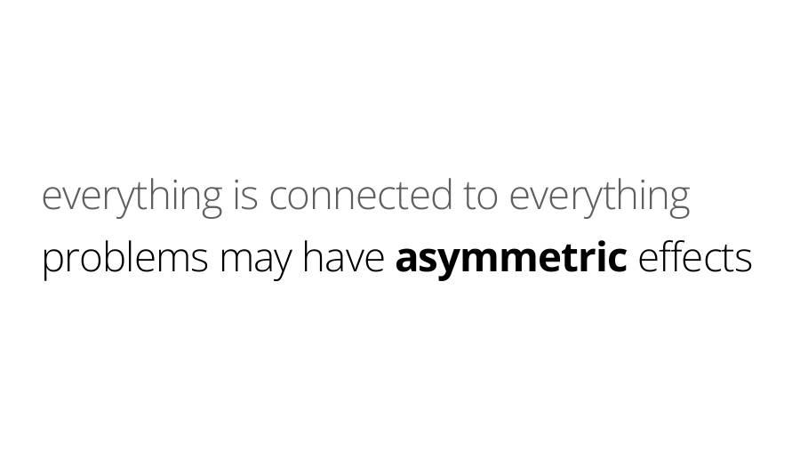

And the problem with all of this noise is – I studied physics in in university and the
general scientific practice is, "Okay, well, I just have to run a measurement enough times and it will be valid." But a
lot
of these sources of noise are not just random.

The noise is _not_ going to cancel out if you do the experiment enough
times. Performance is really complex and everything is connected to everything else. You can get
systemic errors and so some sources of noise may have really asymmetric effects. And that's what we saw in a lot
of our experiments.

## 16. Slides 44, 46–49 — Quarkus can handle 1.8x more load (isolation was wrong)

Video at [\[16:51\]](https://www.youtube.com/watch?v=l30BJZ7joCI&t=1011s)

So I mentioned that you really don't want to run your load generator on the same machine as your application. Despite
that, this is
actually what we did in our experiments because if you don't do that, you end up measuring a lot of network effects and
we wanted to rule those out.

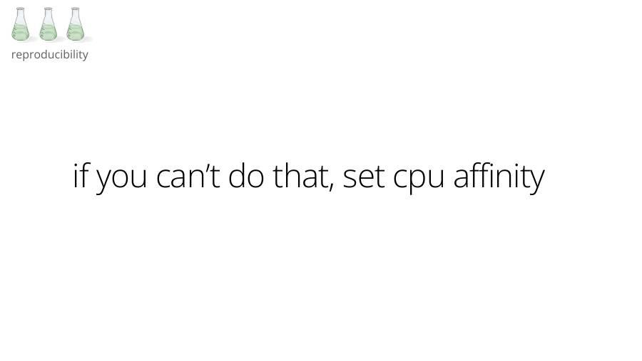

So what we did is we pinned some tasks to some cores and some tasks to other cores and then
we made sure that we had the memory affinity correctly, so that it was as if we were running on different machines, but
just with this really fast network pipe between them because it was all in the same computer. We thought well, I say
we did this, we thought we were doing that. We did a set of measurements and we found that Quarkus could handle
1.8 times more load than Spring. It had 1.8 times more throughput.

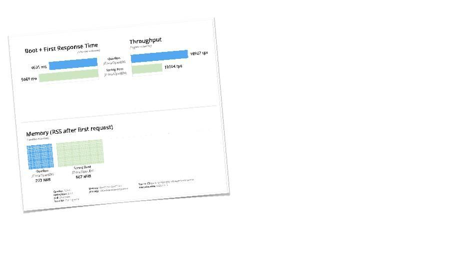

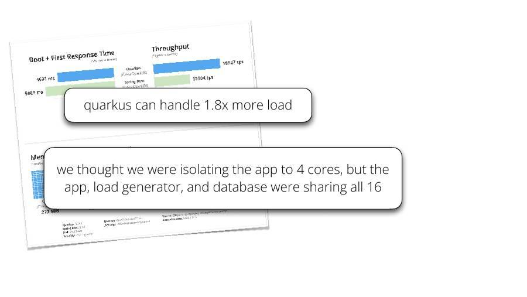

We looked at that and we're like, "yeah, I was
kind of expecting that to be higher". Something doesn't seem quite right there. That was because we'd got it
wrong! We were using CPU groups and we made a subtle error setting them up.
It wasn't what we intended to do, but we had put
the application, the load generator and the time-to-first-request probe into the same cgroup, so they all shared the
same CPUs: the 16-thread load generator was competing with the application it was measuring. The fix was to pin each
component to its own disjoint set of cores (this was easier with taskset for the processes, and a cpuset for the
database
container).

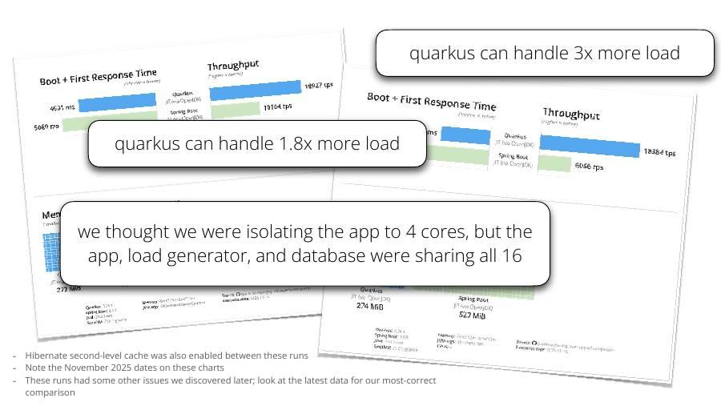

So, once we
fixed that, we all of a sudden were able to handle three times more load. So, just having that proper process isolation,
which should be something that affects both frameworks equally, ended up really favoring one over the other

## 17. Slides 50–51 — The setup script

Video at [\[18:17\]](https://www.youtube.com/watch?v=l30BJZ7joCI&t=1097s)

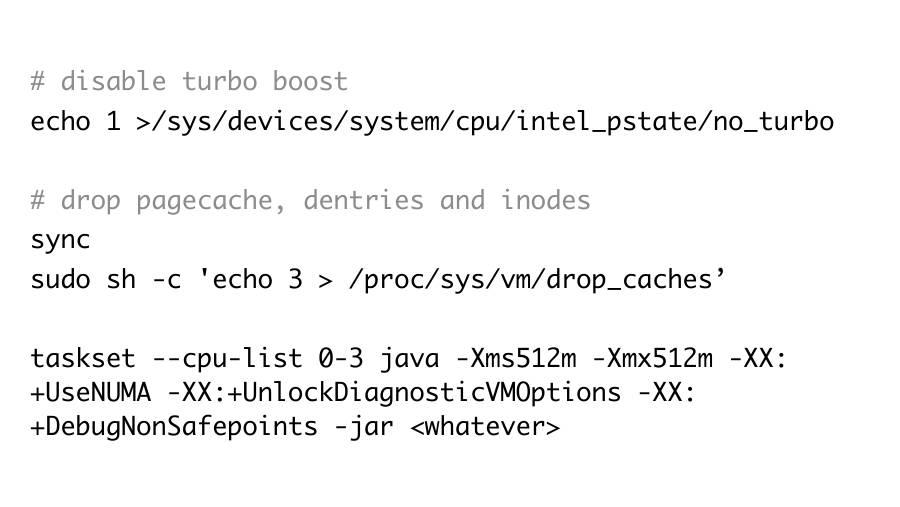

What we ended up with at the end is a script a bit like this.

We made sure to drop all the caches, so everything
ran as slowly as possible.

We made sure to disable turbo boost, so that everything ran as slowly as possible.

We made
sure to restrict the application to only a small number of cores, so that it ran as slowly as possible.

And then we ran
our measurements.

## 18. Slide 52 — No one would run a real app like this

Video at [\[18:35\]](https://www.youtube.com/watch?v=l30BJZ7joCI&t=1115s)

Was this a good thing to do? It you can see that there's a a new problem here, which is that everything we've done has
been to slow the application down. And as a performance engineer, they were really happy with this because it gave very
reproducible results. But as a normal human being who is not a performance engineer, I was looking at this
and I kept going back to our performance team going, yeah, but this is _stupid_.

No one in their right mind would
run an application like this. Partly because the script to actually set things up is about 20 lines. And then, once
you've done that, you end up with a system that's running slower than it would in the real world. You just wouldn't do
this.

## 19. Slides 53–54 — Realism, and be cautious of micro-benchmarks

Video at [\[19:23\]](https://www.youtube.com/watch?v=l30BJZ7joCI&t=1163s)

And this is because so far everything that we've been doing has been optimizing for reproducibility, but reproducibility
isn't the only important thing. You also need to think about realism –- is what I'm doing reflective of what happens in
the real world?

Let's talk about some benchmarking anti-patterns that cause realism fails.

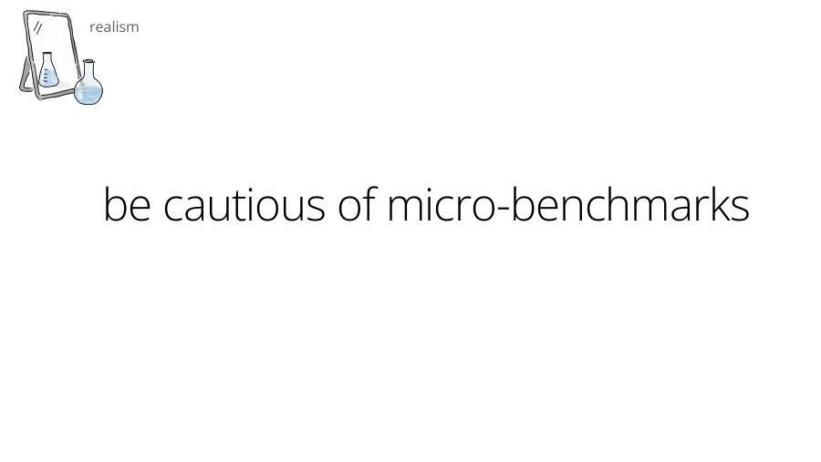

Quite often, when they're trying to make a decision, people will tend to do microbenchmarks because
that allows you to really neatly isolate one aspect of the system. But the problem is, although they're very
reproducible,
they tend to not reflect the real world. So again this is something that you have to be careful of.

## 20. Slide 55 — Warm up before measuring

Video at [\[20:03\]](https://www.youtube.com/watch?v=l30BJZ7joCI&t=1203s)

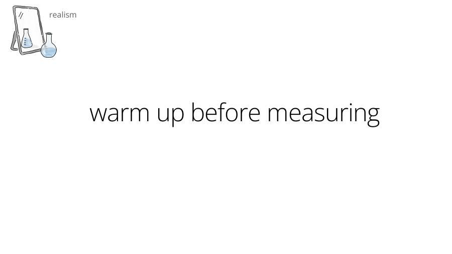

With a normal application, you might care about the performance in the first 30 seconds of its life, but probably
you don't. Probably you care about the performance after it's been running for a day. So it's really important to warm
up before measuring to get that that realism.

## 21. Slide 56 — Have data in the database

Video at [\[20:23\]](https://www.youtube.com/watch?v=l30BJZ7joCI&t=1223s)

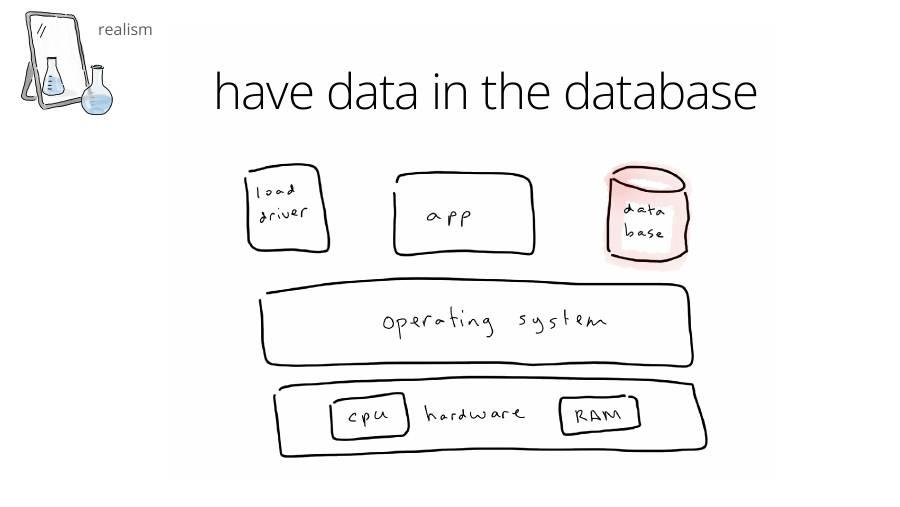

If you're talking to a database, you need to have data in the database. That is,
you need data in the database if in
production you would have data in the database, which you almost certainly would. If you remember that slide
there with the stale database images, the problem that we had was that we were using an old image that didn't have
enough
data in it.
It wasn't realistic enough. Fixing that realism gap really changed our performance.

## 22. Slides 57–59 — "Quarkus is only 1.4x faster" and hardware schedulers

Video at [\[20:55\]](https://www.youtube.com/watch?v=l30BJZ7joCI&t=1255s)

But even with those good practices, you're still you're still not guaranteed to reflect the reality for everybody else
who tries your
benchmark. So one of the things that we did with this benchmark was we really wanted to be as open as and transparent as
possible and as fair as possible, obviously. Because it was open source, that meant that other people were able to
try it, which was fantastic. But, then we started having questions coming back like, "I tried your benchmark and even
with the exact same script, I saw Quarkus is only 1.4 times faster than Spring. What's going on?"

And so, when we
dug into this, we realized that we're running on one set of hardware in our lab. And if you run on different hardware,
with different operating systems,
you can get a really different ratio.

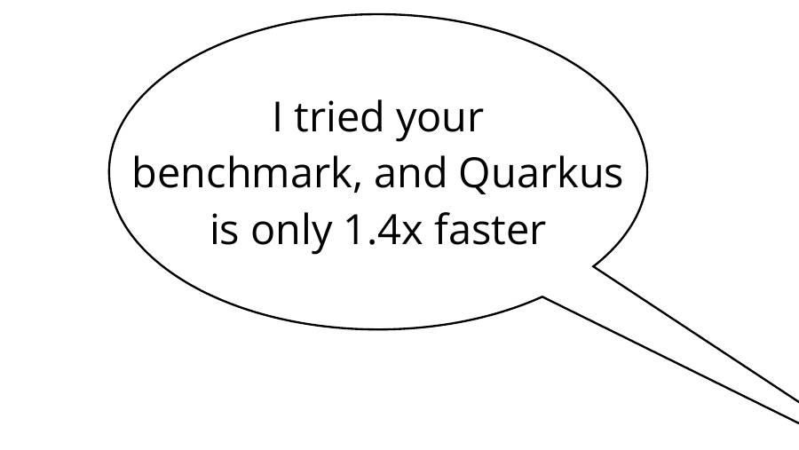

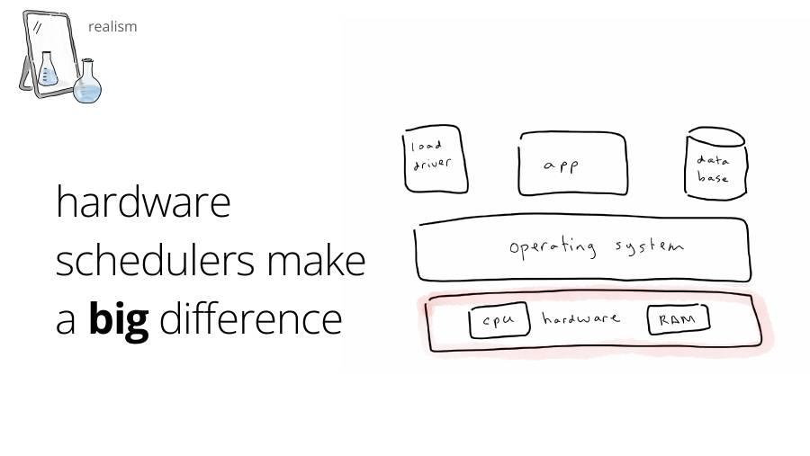

You can get a different answer and maybe guide a different decision depending on
the way your specific operating system scheduler works.
If you're talking about something as complex as an application framework, the scheduler can
make a big difference, especially if the app creates many platform threads.
And so, you have to figure out, "which kernel version will I be running on in production?" and make sure you're
measuring on that.
So, not just checking the hardware, but the OS too.

## 23. Slides 60–61 — Relevance: are we measuring the right thing?

Video at [\[22:16\]](https://www.youtube.com/watch?v=l30BJZ7joCI&t=1336s)

And then, we had a new problem, which is because we're not trying to make a decision for our company about our code
that's only going to run in one environment. We're trying to provide guidance about lots of different
environments.

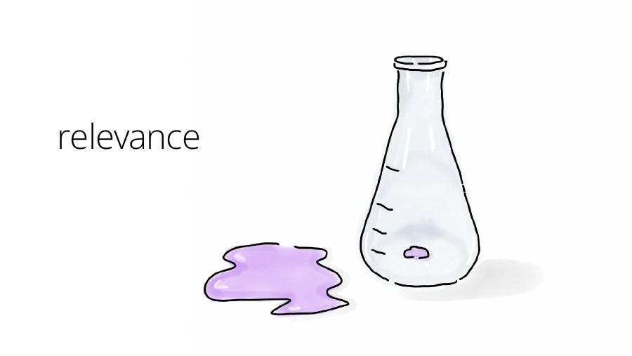

How do we do that?
We can't measure them all because then it's a combinatoric explosion.
How do you choose?

And this then really is a question of relevance, which is again, are we measuring the
right thing? There's lots of setups that maybe someone is doing somewhere, but we need to make sure that we're measuring
the thing that's most relevant to the biggest number of people.
We need to make sure that we're
aiming for this target. And we need to make sure that we're actually _hitting_ that target in terms of what we're
measuring.

## 24. Slides 62–66 — What even is "faster"? What problem are we trying to solve?

Video at [\[23:17\]](https://www.youtube.com/watch?v=l30BJZ7joCI&t=1397s)

Defining the target starts with defining "what problem are we trying to solve?" Which in this case really is what
question
are we trying to ask? What question are we trying to answer? And at a high level, the question seems really easy: which
is faster? Is it A or B?

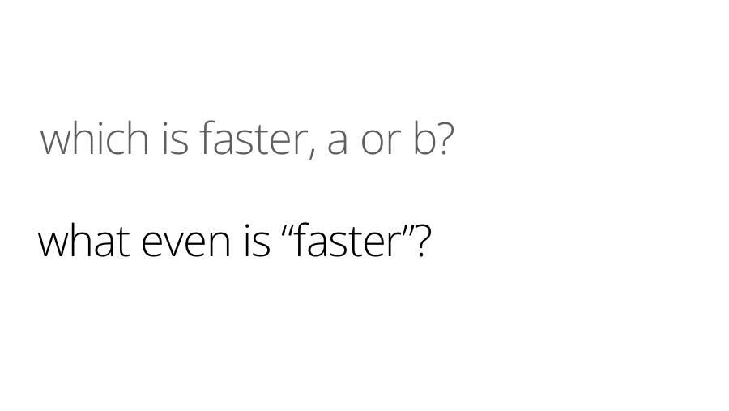

But then you have to drill into it and figure out, well, what what even is faster?
What do I mean by faster? And when I was preparing this talk, someone posted an issue on our on one of
our discussions and they said, "Oh, I believe compiling natively will offer better performance since the images are
light and the scaling up is faster." This is a completely reasonable thing to to believe because the images are
smaller and the scaling up is faster. But again it comes back to what problem are you trying to
solve?

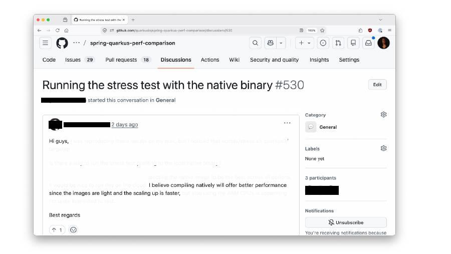

If you have something that doesn't need to handle much load and needs to scale up and down often,
something like native, something like OpenJ9, that's going to be a really good choice. If you have a different set of
environments, then actually maybe native is going to be a really poor choice.
So, there's no such thing as
better performance without qualifying, well, "what problem am I trying to solve?"

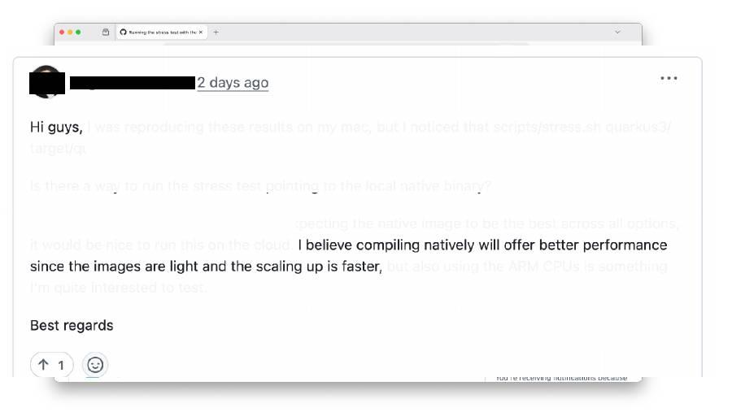

## 25. Slides 67–71 — "Performance" could be…

Video at [\[24:51\]](https://www.youtube.com/watch?v=l30BJZ7joCI&t=1491s)

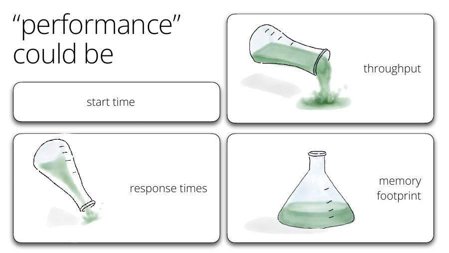

So, when we talk about performance, it could be throughput. That's the usual definition that most of us think of: how
many transactions per second can this thing handle? How wide is the bottleneck?

Or
it could be response times. How quick is it between when the response leaves my system and when it gets to the user. Can
I
make that as short as possible?

Or it could be memory footprint. In the cloud memory is money. How how
densely can I pack these thing onto a machine? How much hardware does it occupy when it's not
doing anything at all?

And then of course, going back to that comment about native, it could be start time. How quickly
does this thing come start up? How long does it take between when it first is ready to serve requests and when it's
running at at optimum speed?

## 26. Slides 72–80 — From metrics to outcomes (…money)

Video at [\[25:54\]](https://www.youtube.com/watch?v=l30BJZ7joCI&t=1554s)

With all of these metrics, even once you figure out which of these you care about, usually it's not actually
one of
these that you care about.

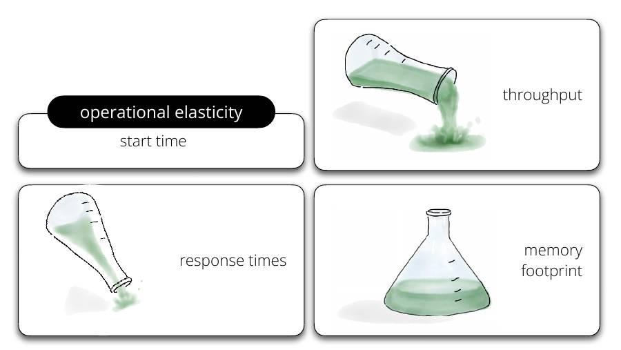

So for example with start time what you really care about if you're optimizing for start time
is you care about your operational elasticity. How quickly can I scale things up? How can I afford to scale things down
knowing that they're going to come back up quickly?

If you care about throughput and memory footprint, the reason you care about those is because you want to minimize your
hardware requirements.

If you're looking
at response times, usually the impact there is on user satisfaction. User users tend to get quite annoyed if services
are slow. They they will go elsewhere. So if you have a user
facing use case then maybe that's the the metric you want to focus on.

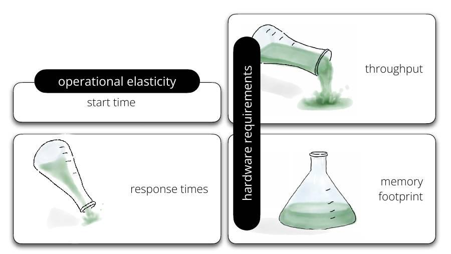

And again, with all of these then with with memory
footprint and with throughput with the hardware, really what you're trying to optimize is money.

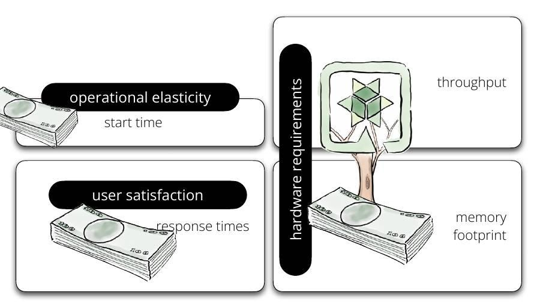

Another criteria that this optimisation helps is sustainability. If you can minimize your hardware
requirements, as well as saving money, you're saving the world. Pretty good.

With user satisfaction, it
comes down to money again; if your users are satisfied, they will not go elsewhere, they will spend more, they
will do all of these good things that you may be trying to optimize for. And operational elasticity,
ultimately, it's about money as well.

So with all of these things the ultimate lagging indicator is
money, but it's up to you to work out the path backwards to the leading indicator, which might be memory
footprint or throughput or whatever else it is. And that is that is not a trivial exercise.

It's really easy to get
distracted by what's easiest to measure rather than thinking about what actually makes my management happy with me, what
actually makes my organization work better. It comes back (again) to this question of "are you
measuring what you think you're measuring?"

## 27. Slides 81–84 — Measuring response times the wrong way

Video at [\[28:21\]](https://www.youtube.com/watch?v=l30BJZ7joCI&t=1701s)

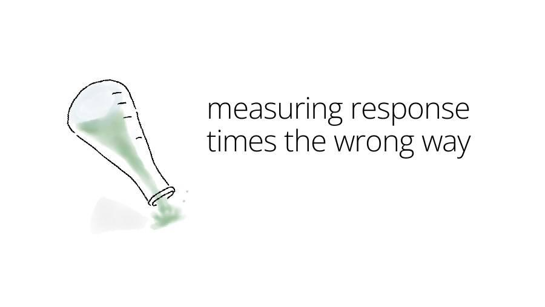

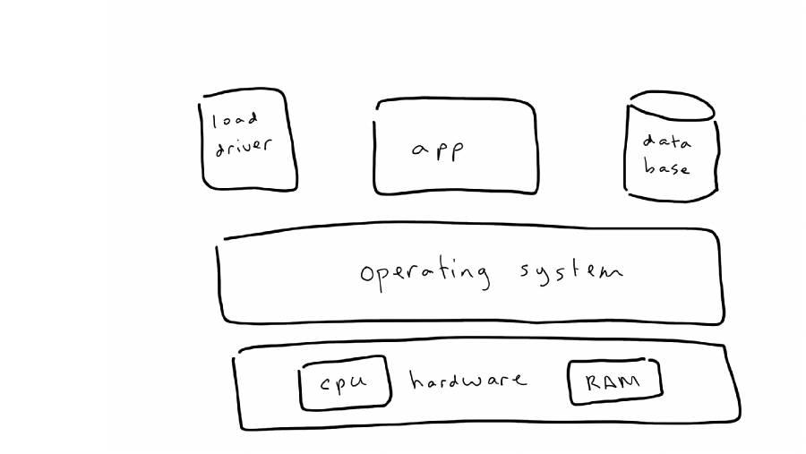

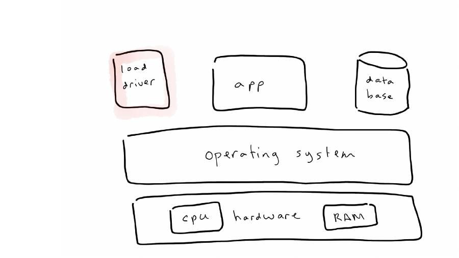

But even once you've defined your metrics, there's there's all sorts of "exciting" things that can go wrong. Often,
you're not really measuring what you think you're measuring. Response times is one of the
things that is easiest to measure completely completely incorrectly.

With response times, there's there's two
problems that can happen. The first is misunderstanding the nature of response times. If you measure response times, you
can't just measure an average response time. You need to be collecting the distribution. Ideally, you would look at that
whole distribution, but at in the very least that you need to be looking at something like the P99, the 99th percentile
for your distribution.

## 28. Slides 85–94 — Coordinated omission

Video at [\[29:07\]](https://www.youtube.com/watch?v=l30BJZ7joCI&t=1747s)

The other problem that happens is load drivers can cause all sorts of problems with with response time measurement.
And this is what's called coordinated omission.

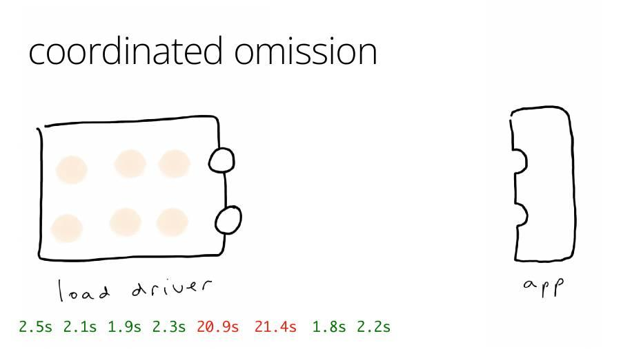

Say, we have a
load
driver and we have our application. My load driver sends requests into the application, and then the application
sends them back, and then we make a note of the time. It was 2 seconds. We're going to write each time down because
we
know we need a distribution.

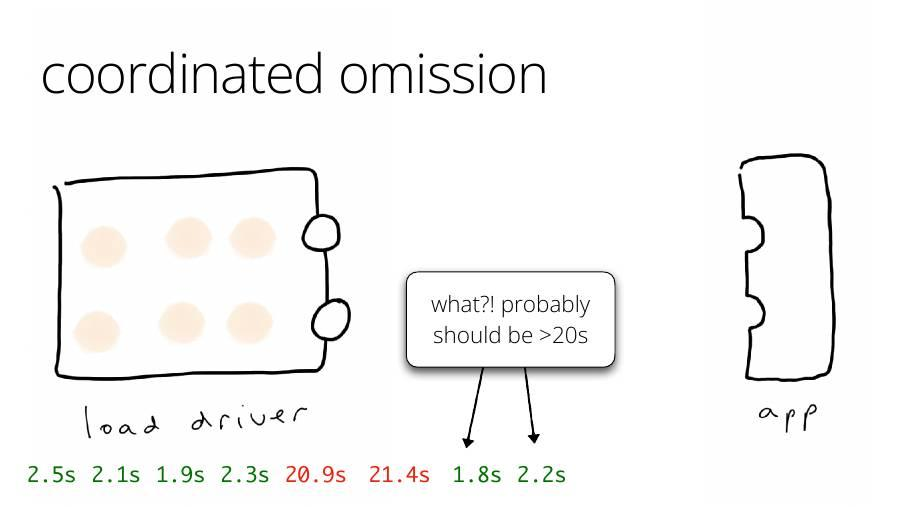

So, we do it again, and we get more response times, and so we write those down. And then,
maybe our server gets a little bit sad. And so, instead of sending the request back, something's going on. Something
awful has happened to our server. So, the request isn't coming back.

Meanwhile, our load driver knows it's supposed to
be sending a request every 3 seconds, or whatever it's supposed to be doing. So, it starts building up a queue of
requests. Eventually, those bad requests come back, and we make a note, and we say, "Yep, it was 20 seconds for those
requests. Gosh, that was bad." Oh, well, on we go. So, we send the next request in, and it goes, and then the server's
happy again. So, it comes back, and we say, "Hooray! 2 seconds."

But, this is this is totally wrong, because although
the actual time in transit was 2 seconds, the time from when we first _should_ have sent that request was way
more. It should be at least 20 seconds. And this is coordinated omission. Coordinated omission happens when if your
system under test starts slowing down, your load driver also starts slowing down because it's not getting the feedback.
And what that means is that that bad thing that happened, instead of measuring it as this thing that
affected all of the subsequent requests, you measured it as just a one-off bad event, and you got a really incorrect
idea about what your user-facing response times were.

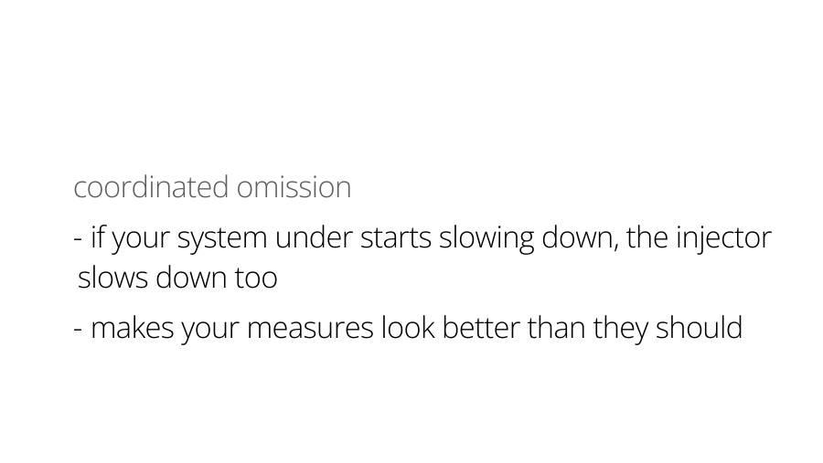

## 29. Slides 95–102 — Load generators: not ok / ok

Video at [\[31:10\]](https://www.youtube.com/watch?v=l30BJZ7joCI&t=1870s)

What’s most frightening is that it can happen on the load generator side too: if it suffers from some, let’s say, big GC
pause, and cannot keep up, it needs to correctly report it – and why.

Even while correctly accounting for coordinated
omission, the temptation is to blame the system under test, which is wrong.

These are a really common
problems in
load drivers. So, if you're using JMeter, just don't. It suffers from coordinated omission. If you're using wrk, it
also suffers from coordinated omission. Better choices are Gatling, wrk 2, or Red Hat have a tool called Hyperfoil.
Hyperfoil can diagnose “internal coordinated omission”s too, which is pretty unique.
Any of those are safe options.

## 30. Slides 103–106 — Measuring start time: time to first request

Video at [\[31:39\]](https://www.youtube.com/watch?v=l30BJZ7joCI&t=1899s)

Another thing that is easy to get wrong is start time. With application frameworks, every application framework will, at
some point in its startup, give you a little message that says, "Hey, I'm ready to start receiving requests."  That
might be true, or it might not be true. Trust, but verify.

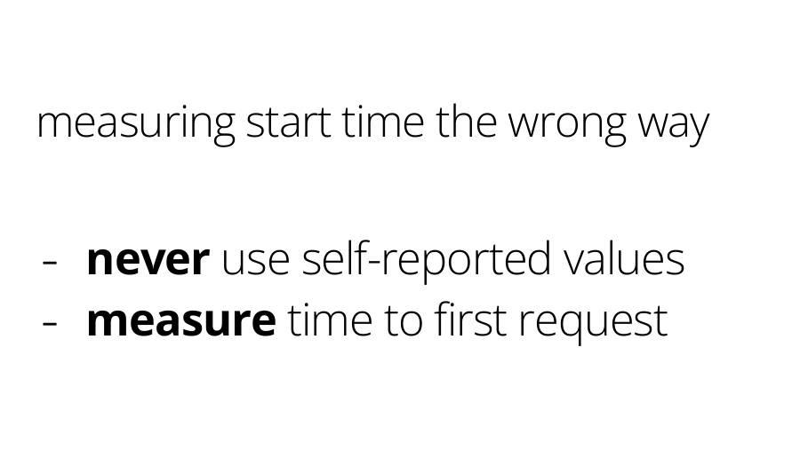

The only the only way you can actually know when it's
ready to start serving requests is to fire in requests and see when you get a request back. So, you have to measure the
time to first request yourself.

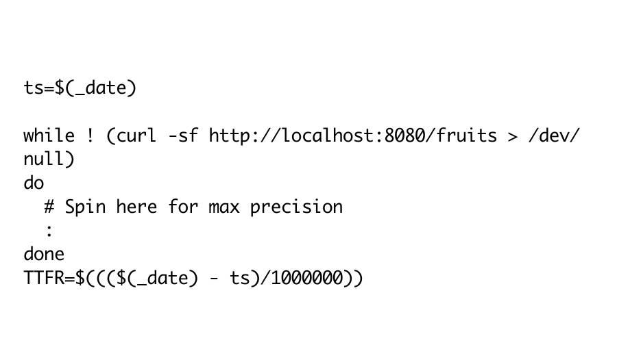

We've been through many variations of the best way to do this. This is the one that
we're now happiest with. We've done it with shell scripts, then we wrote a C program to do it, and then we decided that
the C program actually wasn't better than the shell script, and we went back to the shell script. But, something like
this, where you just spin on another core, and then fire in requests, will give you the maximum precision. This is
actually a simplified version. The full script is ... that.

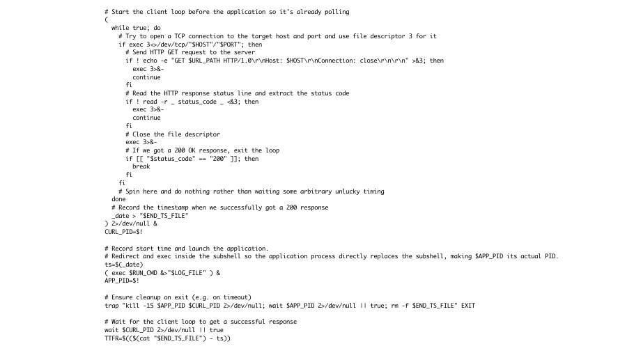

I apologize. I wish it was the previous one. But needing to
worry so much about millisecond-level measurement errors is actually, this is
a lucky place to be, because Quarkus starts fast enough that milliseconds would matter.

## 31. Slides 107–109 — Memory footprint: RSS, not just heap

Video at [\[32:48\]](https://www.youtube.com/watch?v=l30BJZ7joCI&t=1968s)

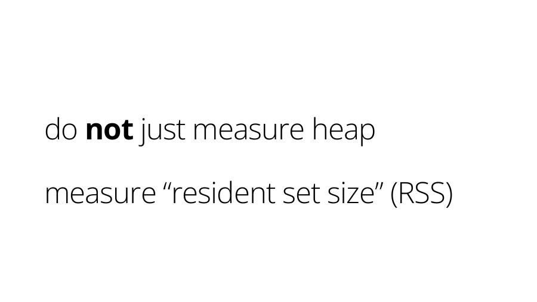

Okay, what about memory footprint? You'll be surprised to hear that you can make mistakes measuring
memory footprint. The key thing with memory footprint is that you can't just measure the heap. You have to measure
what's called the resident set size because it's a bit like an iceberg.
In a Java application, you have quite a lot of memory that sits in the JVM's heap, and then you have a
portion of memory that is native memory outside of the that heap. I say it's like an iceberg, it's actually like a
reverse iceberg. So, most of the memory is in the heap, which is kind of reassuring, but then there is some memory
that's invisible outside of the heap.

## 32. Slides 115–118 — Script: time to first request \+ RSS

Video at [\[33:36\]](https://www.youtube.com/watch?v=l30BJZ7joCI&t=2016s)

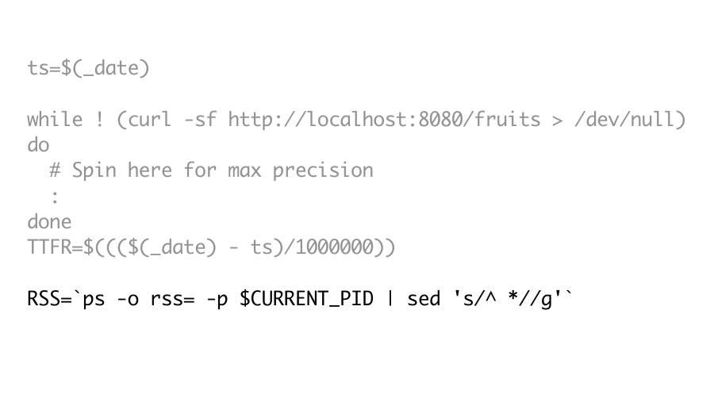

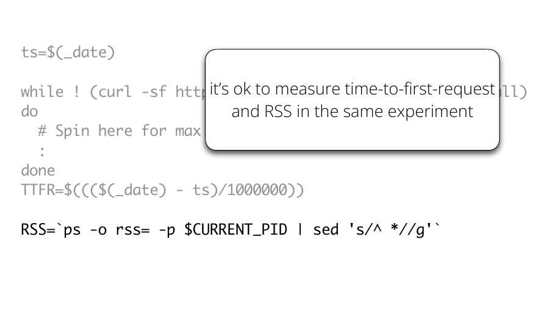

To measure RSS, don't ask the JVM, use a `ps` command, and that will give you a good value. You can see I've
just tacked this onto the time to first requests. It's completely fair and legitimate to measure time to requests to
first request and RSS in the same experiment

## 33. Slides 110–114 — Metrics affect each other, there no "true" RSS

Video at [\[33:58\]](https://www.youtube.com/watch?v=l30BJZ7joCI&t=2038s)

But, in general, measuring more than one of these metrics in the same experiment isn't a great idea. So, for example, if
you're trying to measure max throughput, if you drive that system as hard as you can to measure the max throughput,
that's going to have a weird effect on your RSS.

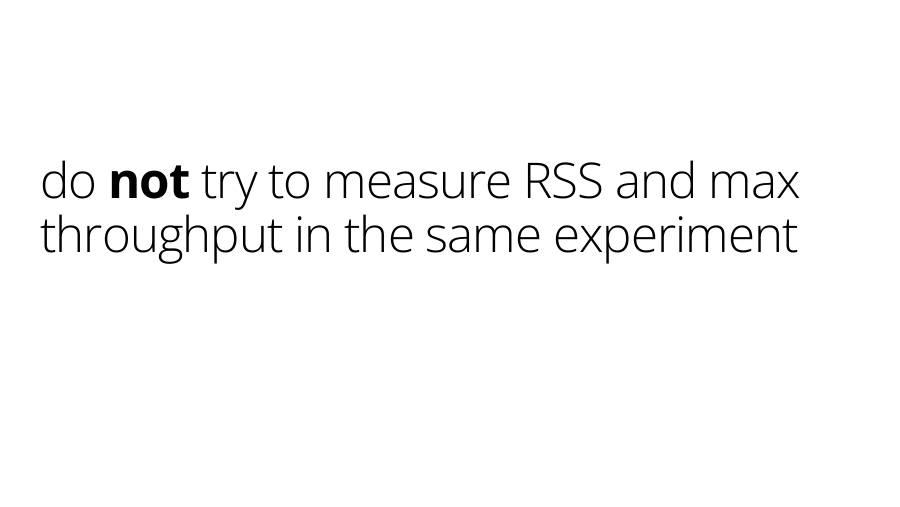

Similarly, if you if you try and constrain your heap to to
optimize your RSS, then you may find that your throughput goes down. So, there's not really a true RSS even for for
loosest definition of RSS.

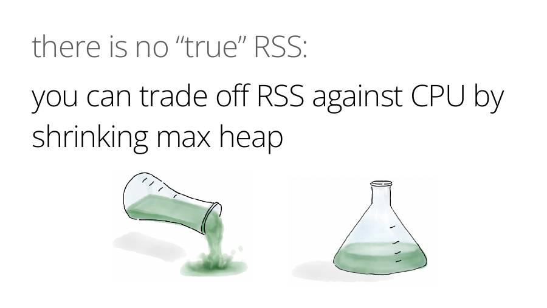

Depending on the constraints you put on the system, you may get get different values. You
can trade off RSS against CPU by shrinking the heap, for example.

## 34. Slides 119–120 — Science 101: vary one thing at once

Video at [\[34:41\]](https://www.youtube.com/watch?v=l30BJZ7joCI&t=2081s)

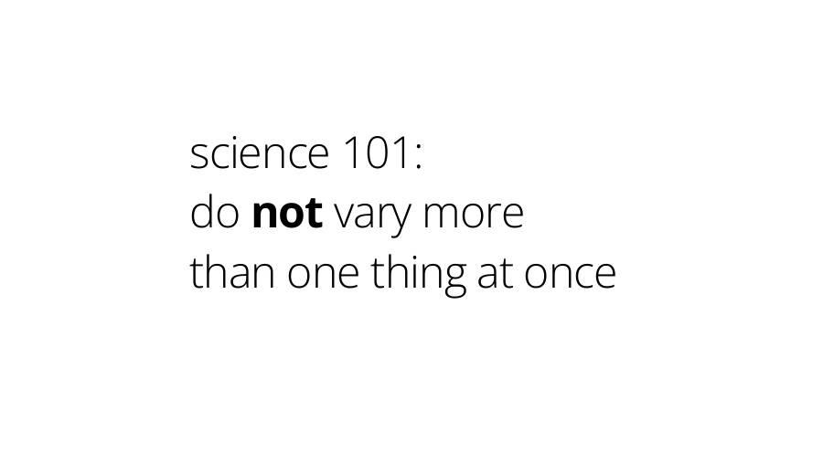

A core scientific principle is "don't vary more than one thing at once". So, since your throughput might vary if you're
measuring max
throughput, you have to kind of not be measuring RSS at the same time. So, you're not measuring what you think you are,
especially if you're measuring more than one thing. While running performance tests you’re not supposed to change more
than one thing at time, because you won’t be able to see the effect of that change in isolation.

## 35. Slides 121–127 — Reactive CRUD case study: disk bottleneck

Video at [\[35:01\]](https://www.youtube.com/watch?v=l30BJZ7joCI&t=2101s)

And then this the the question again is, are we measuring what we think we're measuring?
I mentioned
that we see lots and lots of blogs that just make us go, "Oh, no, no, no, don't do that.
Don't do that."

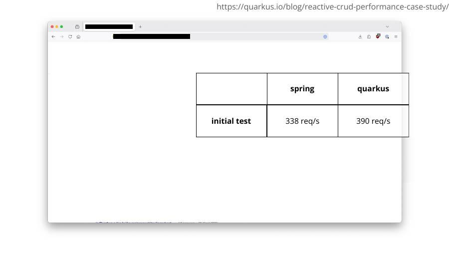

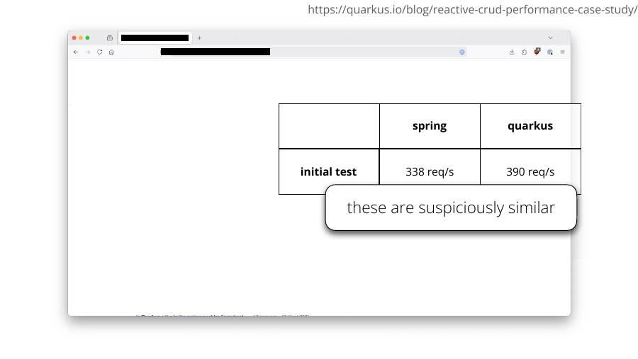

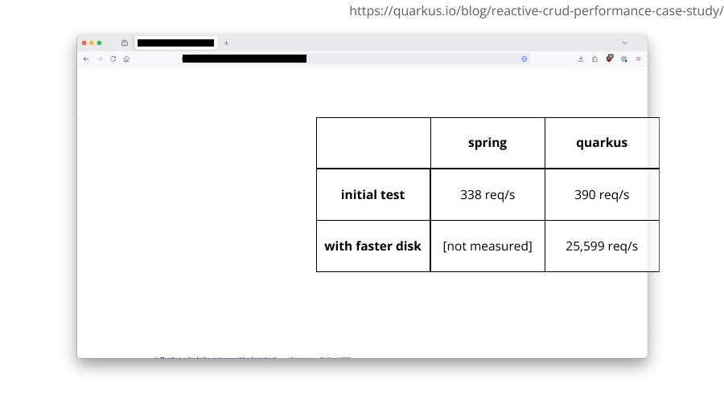

There was a blog that came out a couple of years ago on a prominent site.
And they they did a
comparison of Quarkus and Spring.
You can see they got two numbers for throughput, which were suspiciously similar.
And so, one of our performance team looked at it, and he said, "Hmm, I think those two numbers are too similar." And so,
he realized that in the experiment, the disk was the bottleneck. It was it couldn't go any faster because it was run
with a slow disk. When he tried it with a faster disk, he went from 390 requests per second to 25,000 requests per
second. This is a massive difference just by changing out the disk. (We didn't measure it for Spring.)

## 36. Slide 128 — Is the bottleneck what you think?

Video at [\[35:56\]](https://www.youtube.com/watch?v=l30BJZ7joCI&t=2156s)

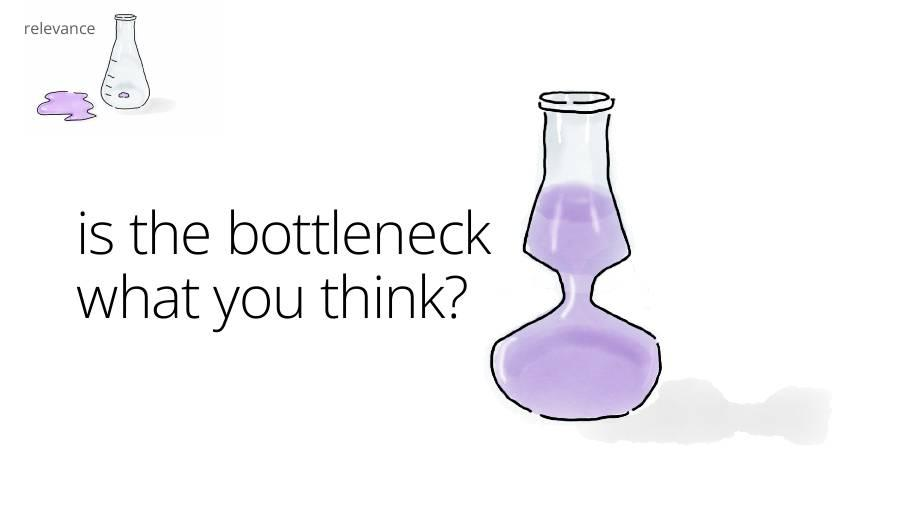

A really important question when you're looking at these results is "is the bottleneck what you think it is?" If the
bottleneck isn't what you think it is, if you're not measuring what you think you are, _there's no point._ And this
this trap is really easy to fall into

## 37. Slides 129–132 — Rust vs Quarkus: suspiciously similar metrics

Video at [\[36:17\]](https://www.youtube.com/watch?v=l30BJZ7joCI&t=2177s)

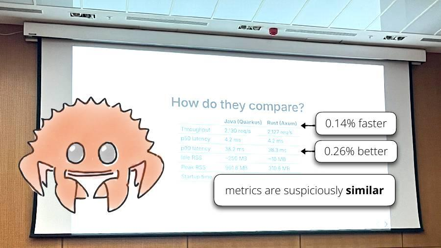

As I was preparing this talk, even after I had just had that that other example in my mind, I went to a talk at
Devoxx Greece, and it was a talk about Rust for Java developers.
At the end he had some performance numbers, and
he'd used Quarkus for his performance numbers. And so, it's quite faint there, but what he found was that Quarkus was
about 0.14% faster on throughput than Rust, and 0.26% better on response time than Rust. And I saw that, and of course,
you know, I'm a Quarkus person. I was like, "Yes, that just goes to show, doesn't it? Look, Quarkus is faster than
Rust."

And so, I shared this to all my team, and of course, my performance colleagues came back, and they were pointed out "
aave you noticed that those metrics are suspiciously similar? You're not measuring what you think you're measuring."
There is a bottleneck somewhere. We haven't done the analysis to figure out where the bottleneck is in this
experiment. It's not our experiment, but we're pretty sure there is a bottleneck somewhere.

## 38. Slides 133–138 — Does this tell us Quarkus is as fast as Rust? No.

Video at [\[37:14\]](https://www.youtube.com/watch?v=l30BJZ7joCI&t=2234s)

So, this is not telling us, sadly, that Quarkus is always as fast as Rust.

But, again, it comes back to what problem are
you trying to solve? This might be telling us that on many systems that will have that bottleneck Quarkus may as well be
as fast as Rust because the bottleneck is elsewhere.

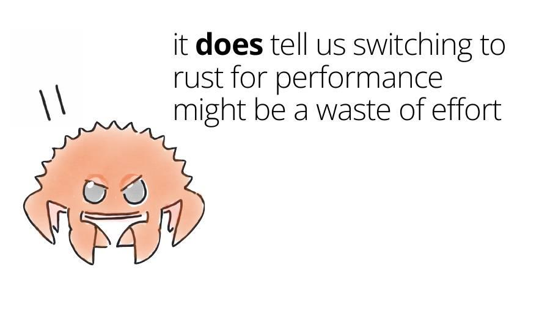

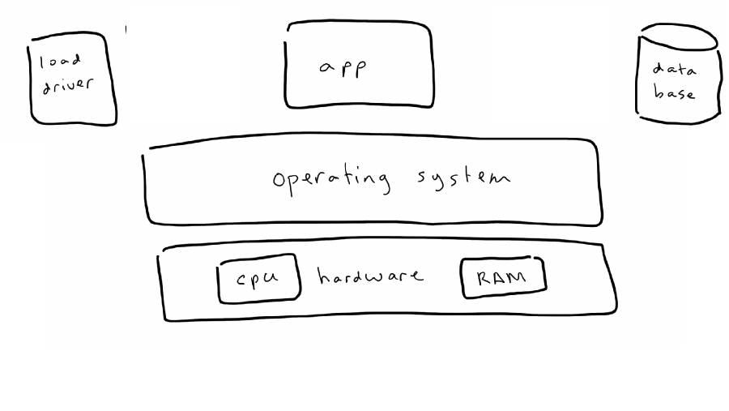

So, switching to Rust would be a a waste of effort because the
wrong question was being asked. In this domain there's no objective truth.
It's all about what
problem you're trying to solve

## 39. Slides 139–141 — Load generation on a different machine / all-in-one topology

Video at [\[37:56\]](https://www.youtube.com/watch?v=l30BJZ7joCI&t=2276s)

I mentioned that load generation on different machines can be a fail. When we run our load generator on different
machines, and the reason that we don't do that, we find that that network all of a sudden becomes the bottleneck. And
so, we're not measuring what we think we are.

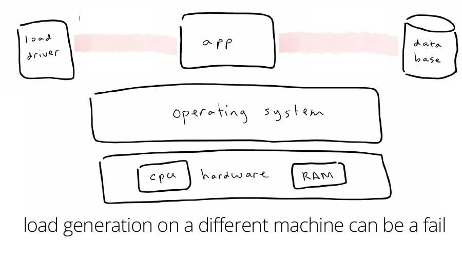

So, that's why we do the load generation on the same machine, even though
it seems like we just didn't read how to measure performance on the textbook. The network can be the bottleneck.

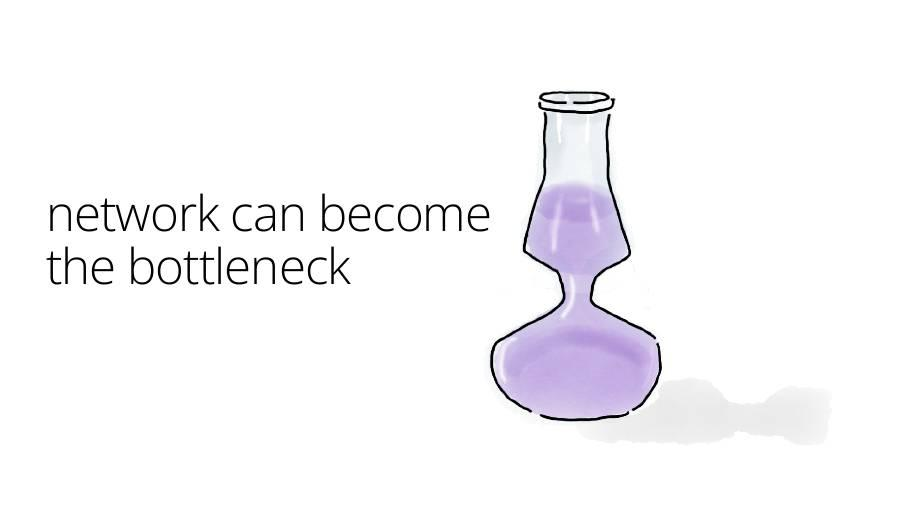

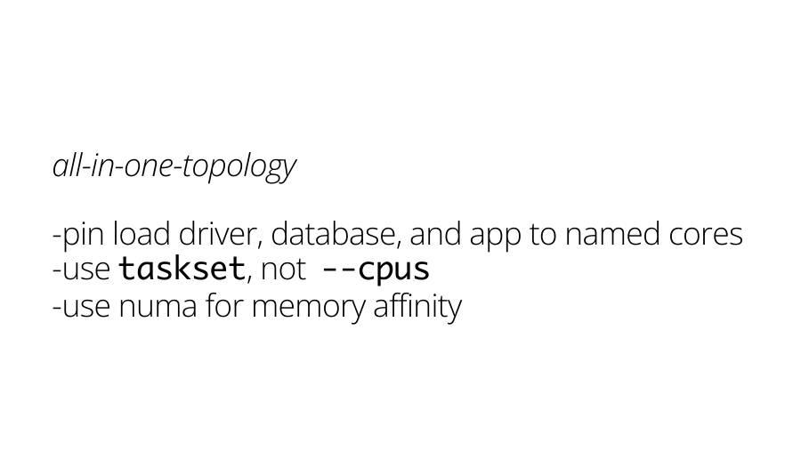

But, if you do everything on one machine, you do have to do it carefully. So, we pin everything to cores, we use task
set, and we use NUMA to
get the memory memory affinity.

## 40. Slides 142–143 — Active benchmarking

Video at [\[38:33\]](https://www.youtube.com/watch?v=l30BJZ7joCI&t=2313s)

By now it should be obvious that benchmarking is really hard. There's so many things that can go wrong. Then the
question
is, how do you even know what you're measuring? How do you know if you had a bottleneck somewhere else? How do you know
where the the bottleneck is?

There's a technique called active benchmarking that I would really recommend you to to bake
in from the start when you're doing this. Active benchmarking is all about it's observability for benchmarks,
basically. If two numbers look suspiciousy similar, despite the fact you assumed they would be different , that’s a good
hint worth investigating.

Providing a benchmark requires making it sure it stresses what it claim to stress –- and enable
others who use it, to verify what's being stressed.

## 41. Slides 144–147 — Brendan Gregg's USE method

Video at [\[39:17\]](https://www.youtube.com/watch?v=l30BJZ7joCI&t=2357s)

There's a useful technique here from Brendan Gregg, who is a bit of a guru in this area. It's called the USE
method.

For every resource -- he's thinking very much about hardware resources your disk, your CPU, I
would also encourage you to extend that to things like your database and some of your software components. For every
resource, you want to measure the utilization. Utilization is how much of the time was your resource doing the thing?

Also measure the saturation. The saturation is how much of the time was there more stuff coming into it than it could
handle, so you got a queue building up.

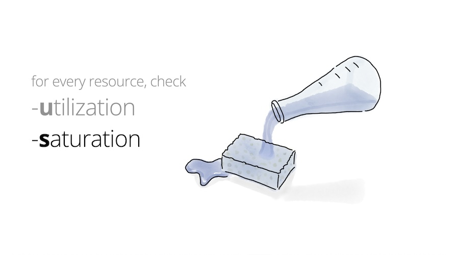

And then finally, look at errors. again, this one seems obvious, but it's so
easy to miss

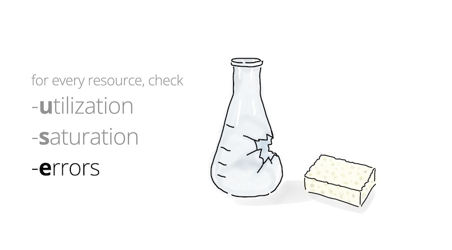

## 42. Slides 148–150 — Errors: tuning keep-alive for Spring

Video at [\[40:12\]](https://www.youtube.com/watch?v=l30BJZ7joCI&t=2412s)

So, when we were doing our measurements, what we found was we just we wanted to test everything out of the box.
And then after a while, because you know, this wasn't the first thing that we did, eventually someone pointed out that
when
they looked at the logs, the Spring application was having a bunch of errors.

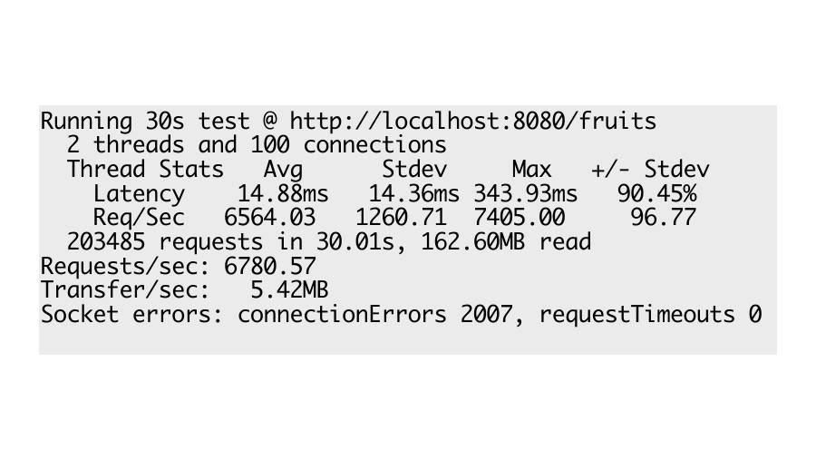

And we thought, well, this isn't a fair
comparison if we're running Quarkus without errors and Spring with errors. And we needed to do some tuning of how
transactions were managed in order to get rid of those errors for Spring. So, we had to tune the keep-alive.

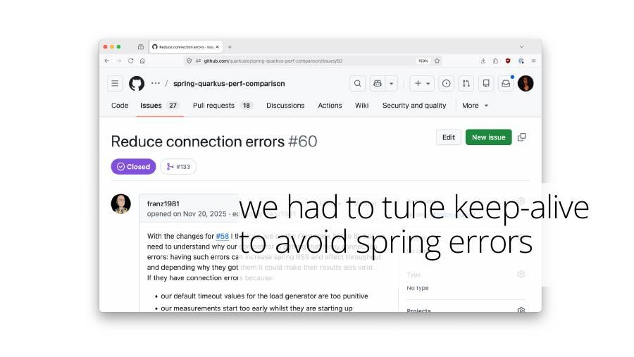

For this particular case, when we fixed the errors, it didn't make that much difference, actually. But sometimes it
can make a huge difference

## 43. Slides 151–159 — Code that deadlocked: 1.75 req/s

Video at [\[40:58\]](https://www.youtube.com/watch?v=l30BJZ7joCI&t=2458s)

In this in this experiment that I showed you before where changing the disk gave a 10 times improvement in the
performance, there was an earlier iteration of this benchmark where what they'd done was they measured Spring and they
got 350 and they measured Quarkus and they got quite a different result.

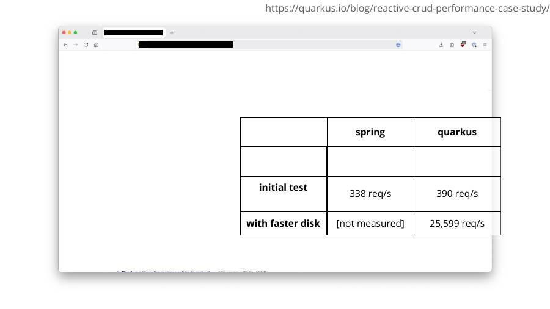

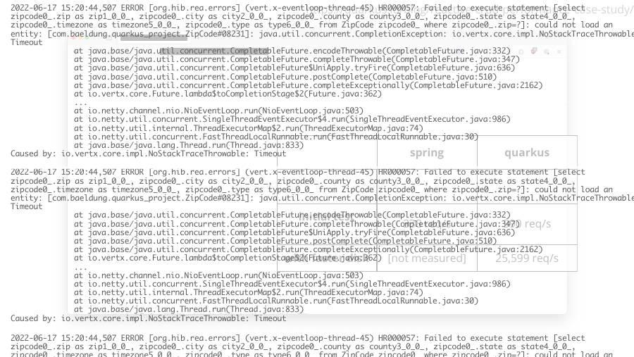

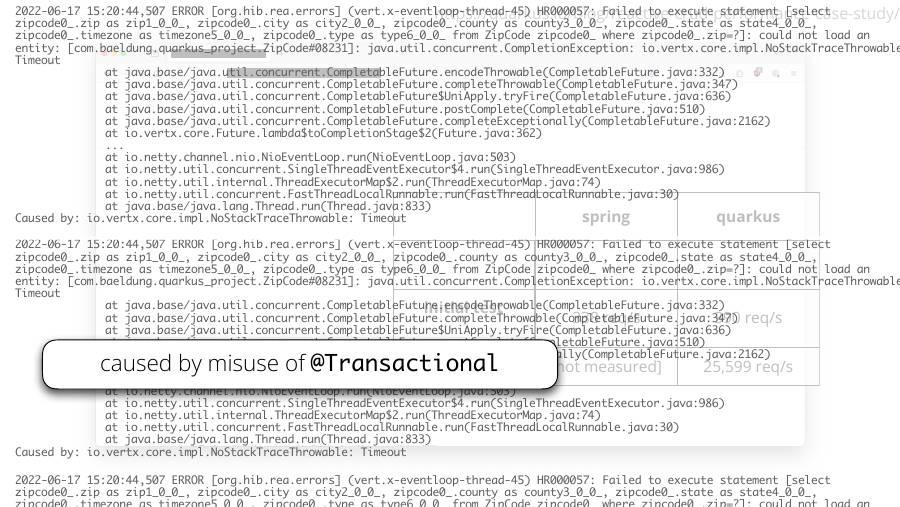

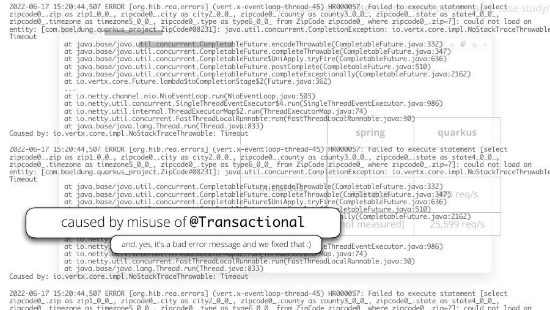

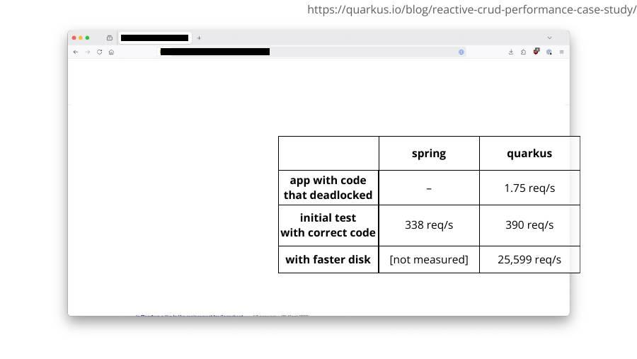

It was because with Quarkus, when they
looked in the log, it was just loads and loads of errors because they had used the wrong transactional annotation.
It has to be said, our error message at the time was really terrible and we have now fixed the error message to actually
explain what the problem was. But effectively, the code as they had it written was deadlocking and so it couldn't handle
more than one transaction at a time.

So, they were getting the 338 requests per second with Spring and with Quarkus, they were getting
_1_ request per second. So, their initial headline was Quarkus has one request per second and Spring has 300 requests
per second. It was it was wrong in every way, but it's easy to to make that kind of
mistake

## 44. Slide 174 — Beware the McNamara fallacy

Video at [\[42:07\]](https://www.youtube.com/watch?v=l30BJZ7joCI&t=2527s)

When you do these kinds of experiments, unless you do that deep digging in, you're vulnerable to a fallacy called the
McNamara
fallacy.

The McNamara fallacy is that as soon as you get numbers, those numbers are so seductive, and they make you look so
clever and
so professional and so data-driven that you go, "Look, I've got numbers. I am data-driven. I am evidence-based." And you
don't actually do that next step to go, "Well, wait a minute. Do these Do these numbers make sense? Do I trust
these numbers?"

## 45. Slides 175–178 — Check in with the real world

Video at [\[42:37\]](https://www.youtube.com/watch?v=l30BJZ7joCI&t=2557s)

If you're doing measurements in the lab, it's really important to have that feedback cycle of validation with
the real world. So, keep checking back.

So, like I showed you when I ran it on my laptop, I was
really surprised by those results because they don't match what I see everywhere else. So use your lab
measurements to guide your decisions in the real world, but then continue gathering data about what happens in the real
world to then validate, "Well, hey, did I measure this right? Or did I do some benchmarking that led us to make a
completely wrong decision because I had a problem in my in my lab setup?"

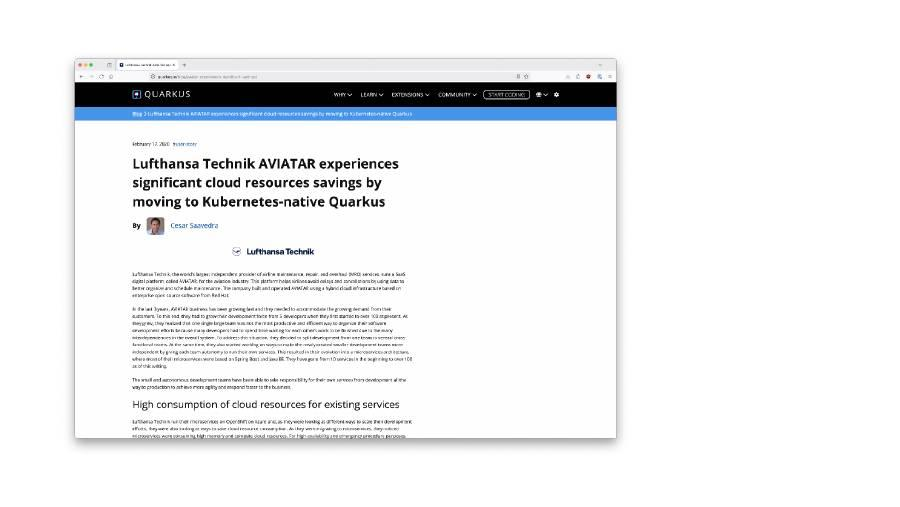

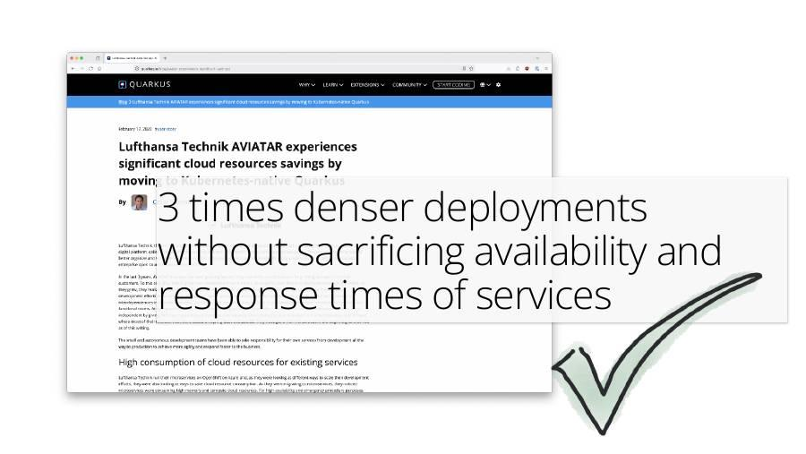

With us with Quarkus, we've been
doing this, and I have an intuition about about what the performance difference is, and that
intuition comes from what we hear in the field. We have references where people will say, "Yes, we
switched to Quarkus, and our resource consumption went down to a third of what it was before." And so, that's guides my
sense of
what's correct.

If we did an experiment and we found Quarkus was 10 times faster, I'd be like, "yeah, no, I don't think
so. That doesn't seem right." So, do continue sense checking against whatever your version of the field
is.

## 46. Slides 160–167 — Three criteria: reproducibility, realism, relevance

Video at [\[43:53\]](https://www.youtube.com/watch?v=l30BJZ7joCI&t=2633s)

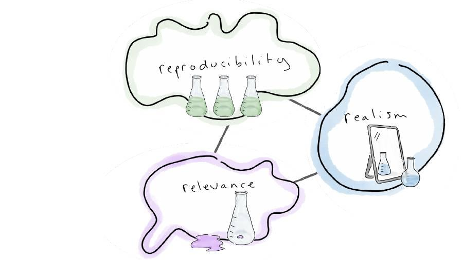

I've talked about these three criteria for for thinking about your benchmarks. The first is reproducibility.
Can I get the same answer repeatedly? Are the results deterministic, or is there a whole bunch of randomness in there?

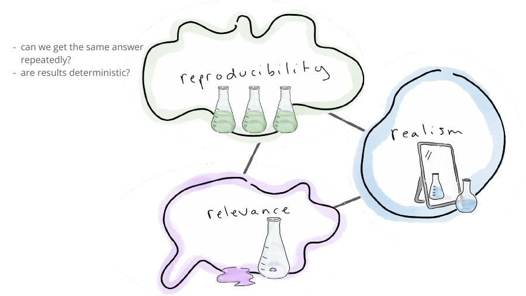

The next one is realism. Is this reflective of the real world? Is Is the way I'm running my application the way
applications will be run in the real real world or have I just dialed all the knobs to make everything slower?

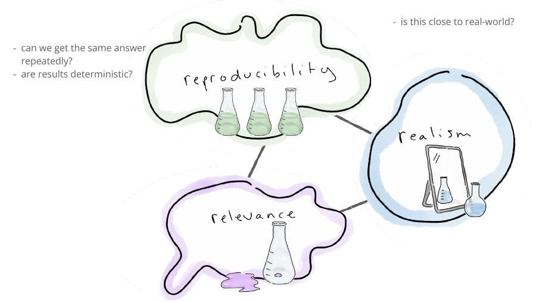

The last one is relevance. Am I measuring start times when what actually matters in production is throughput? Am I
measuring on Intel when in production I'm running on arm? You know, am I am I asking the right questions? Is Is
this number helping us make a decision or is it just a vanity metric where I get the number and then no
matter what we just carry on? And is it a question that we really care about or is it just something that makes
me feel good as an engineer but it doesn't actually move the needle for the business?

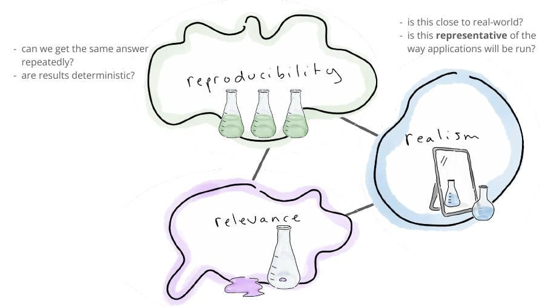

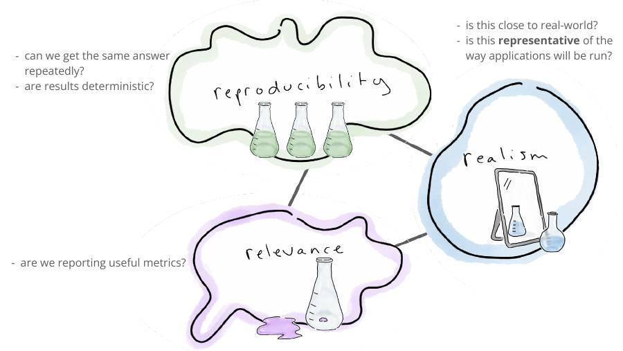

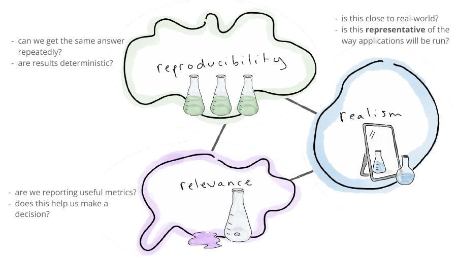

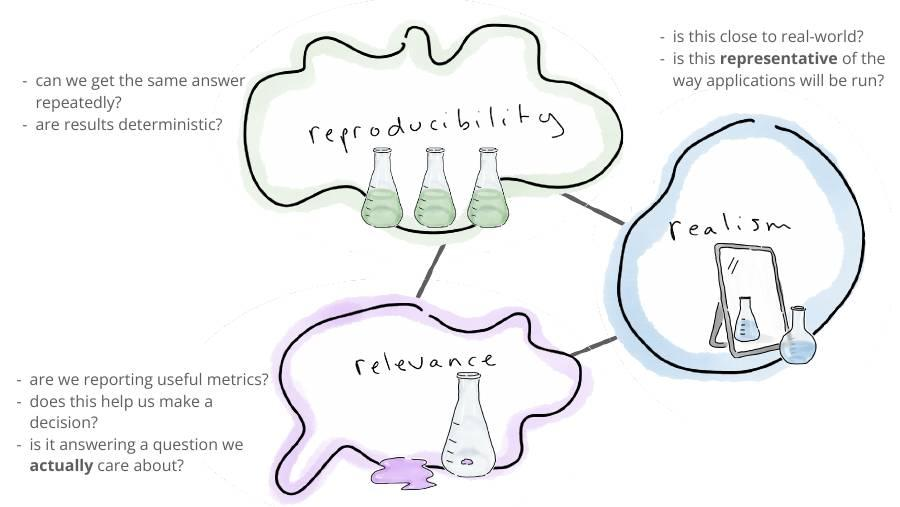

## 47. Slides 168–169 — Easy to make all three worse; choose one

Video at [\[45:05\]](https://www.youtube.com/watch?v=l30BJZ7joCI&t=2705s)

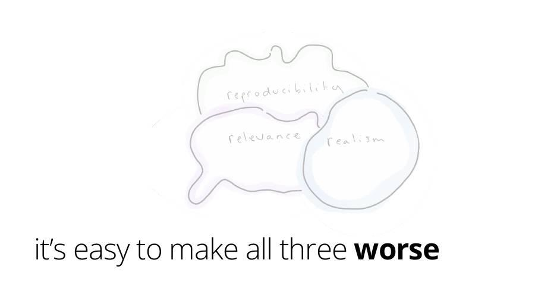

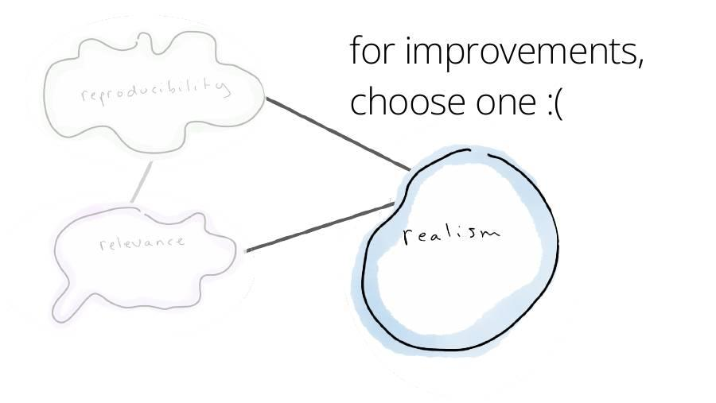

Unfortunately, this is a bit like the iron triangle for product management where you can have quality and
speed and cost. It is extremely easy to make all three worse. I can with no effort at all make a benchmark that is
atrocious on all of these metrics. If you want to make things better, unfortunately, usually you have to choose one to
optimize. You might be able to get two but that's generally the best you can do.

## 48. Slides 170–173 — Which criterion for which purpose

Video at [\[45:32\]](https://www.youtube.com/watch?v=l30BJZ7joCI&t=2732s)

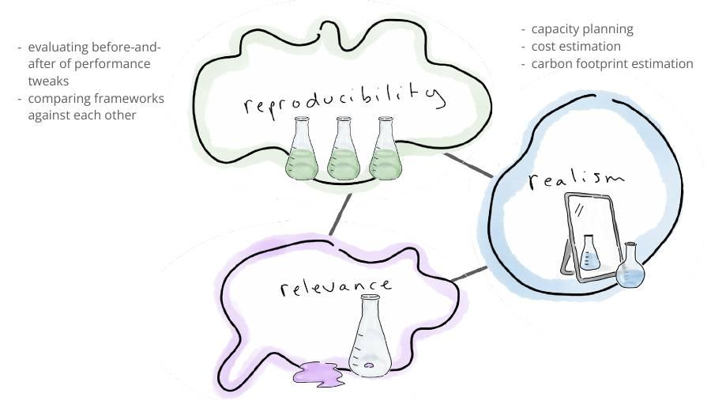

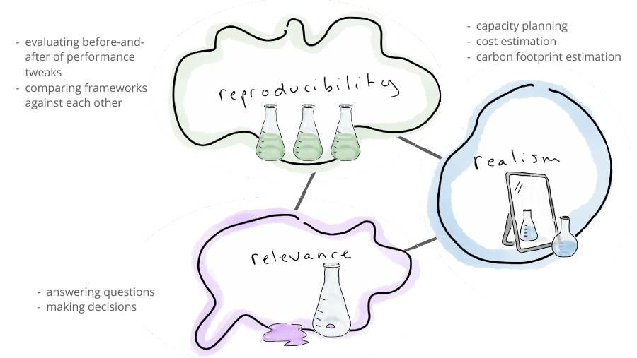

So you really have to decide why am I doing this measurement? If I'm trying to evaluate a before and after of a change,
if you're doing something like me where I'm comparing two frameworks against each other, reproducibility reproducibility
is really the most important criteria. If you're doing capacity planning or cost estimation or you're trying to measure
your carbon footprint, then realism is most important. You want to be doing something similar to what you're doing in
production. You don't want to turn every knob down to the go slow setting. And then, if you're making decisions, if
you're trying to answer questions, then really relevance is what you should be looking at as well of does
Does this relate to to anything I care about?

## 49. Slides 179–190 — The distillate

Video at [\[46:16\]](https://www.youtube.com/watch?v=l30BJZ7joCI&t=2776s)

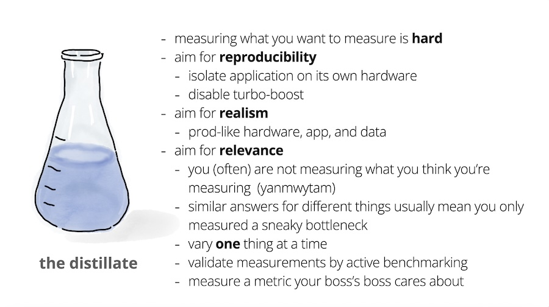

To summarize, this is really hard stuff. It is so easy to get wrong. Even experts get it wrong. We made so many
mistakes with really, really qualified people when we were doing this exercise.

But, do aim for reproducibility. So,
that means isolating applications onto their own hardware, disable turbo boost.

Aim for realism. Get everything,
including your data, as close to production specifications as you can.

And then, I think in some ways this is
the most important one. Aim for relevance. So, so often you get a number, but it wasn't measuring what you thought you
were measuring. So, you cannot use that number to make a decision. If you see similar numbers for things, almost always,
I mean, there is a small chance what you were varying genuinely doesn't make a difference, but
almost always you were measuring a bottleneck that you didn't know about. You're not actually measuring the change that
you were trying to measure.

Use good scientific principles, don't vary multiple things at once, just vary one thing at
once.

Do the experiment, get the measurements, and adopt active benchmarking practices so that you can actually look
back at your results and say, "I was trying to to measure something that was CPU bound. My CPU was at 10%. That tells me
I had a bottleneck somewhere else. Let me go figure out what my bottleneck was."

Measurement is
important, but don't just measure for the sake of it. Measure something with business relevance. Trace back from your
lagging indicators to your leading indicators, figure out what they are so you can measure
the right thing

## 51. Slides 191–192 — Thanks and Outro music

Video at [\[48:08\]](https://www.youtube.com/watch?v=l30BJZ7joCI&t=2888s)

### Closing song

_Do you wanna build a benchmark?  
Come on, let's run the test.  
I never trust the numbers now.  
My cores run hot.  
The
thermals are stressed.  
It used to seem so easy, but now it's not..._

