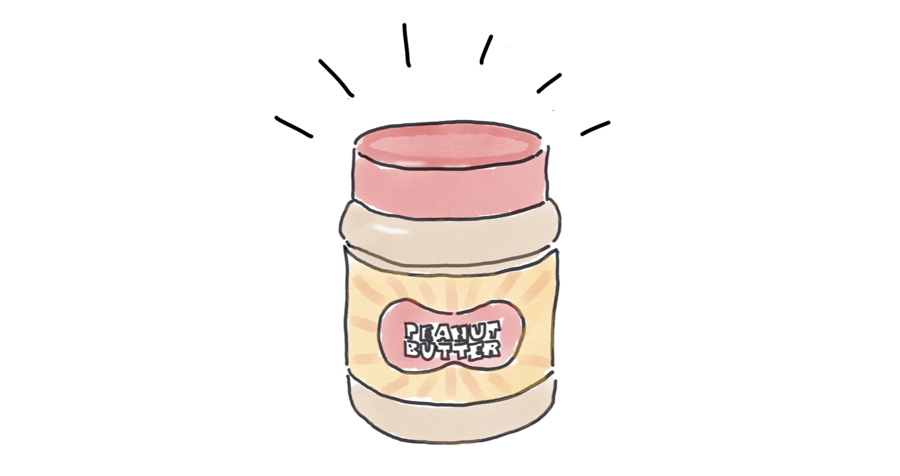
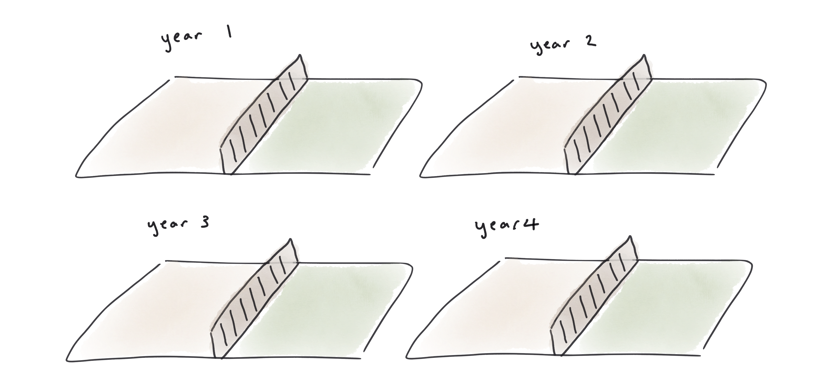

Innovation is great. I think so, I'm sure you think so, and I suspect we _all_ think so.
Inovation is good for business, and it's good for us, and it's healthy.

I like to think I'm kind of innovative; my job title is even "Innovation Leader". I've written a mobile app to count fish using Watson, and I created the world's first application server in a hat, and invented a [cuddly throwable application server](https://noti.st/holly-cummins/TQpfJM).

## Barriers to innovation

And yet ... like many of us, I wish I innovated more. Why aren't we all innovating as much as we would like? What's holding us back? In every organisation I've worked with, the barriers to innovation are depressingly similar:

- Time
- Money
- Ideas

I'm not going to write about how to come up with better ideas, because there's a lot of great material out there. Let's talk instead about how to make more time. The answer is surprisingly simple. All you need is ...

... a time machine.

Of course, a time machine only fixes half the problem.
You're also going to need office space (well, in 2021 maybe not so much).
And you'll likely need cloud compute, or some cool bits of hardware, or external expertise. The way to secure those resources is ...

... a money tree.

What if you don't have a time machine or a money tree? Well then, sadly, you're in
the same boat as the rest of us. The good news is that there are ways to make time to innovate without defying the laws of physics or economics.

## Strategies for making time

Techniques for building innovation into an organisation range
from a centralised innovation department to just ... allowing slack in the system for grassroots innovation.
There are lots of options in the middle, too, such as hackathons and 20%-time projects.

Before we discuss the tradeoffs of the various strategies, I'd like to share a story.
If you went to an American school, you were most likely taught about
George Washington Carver, who invented peanut butter. In fact, Carver's
contributions to the science of 'not starving' were much more significant -
and he actually didn't invent peanut butter.

Carver was born into slavery in the American South, just before the Civil War.
As if that wasn't a rough enough start to life, as a baby
he and his mother were abducted
by slave raiders. His master managed to recover him, but, sadly, not his mother.
When slavery was abolished Carver was raised
as a son by his former master. However, educational prospects
in his area were limited, so Carver travelled across the country,
working his way through school and then university as he did so.
Carver had a knack for plants, so he studied botany and went on to
teach it.

Even after the abolition of slavery, life was bleak for African
Americans in the South. Cotton is an unusually needy crop,
and generations of cotton farming had
stripped all nutrients from the soil. The land, and the people,
were exhausted and hungry. It was hard to see a way out from
the vicious cycle of poverty; expensive fertilizers which might have restored the
soil were far beyond the reach
of farmers who could barely feed themselves.

If you're a keen gardener, you probably know that peas and other legumes
can fix nitrogen from the air and enrich the soil. Despite the name,
peanuts are related to beans, and also improve the land.

Carver discovered that by rotating
cotton crops with peanuts, farmers were able to grow more cotton.
Farmers loved the improved cotton yields, but they had a problem. Peanuts.
What should they do with all of these peanuts they were producing?

At the time, peanuts were barely considered a crop, and were only used
for animal feed. While people were going hungry, peanuts were being discarded
as waste. This is Carver's second great contribution.
Carver pointed out that peanuts were high in nutrients, especially high
in protein, and that they were also pretty tasty. He catalogued
peanut recipes and invented many more, such as chocolate-covered peanuts.
Carver's work led to the adoption
of peanuts as an ingredient, which persists in Southern cooking
to this day. He also invented some surprising industrial
uses for peanuts, such as peanut shampoo and peanut nitroglycerine.
(A century earlier, Antoine-Augustin Parmentier was responsible for a similar effort to change the image of the potato.
Parmentier's work led to the decriminalization of potatoes
in France, which just goes to show the history of food is stranger than you might imagine.)

Carver was a prolific inventor, and his innovations improved
many lives, but I think there's a deeper lesson in his story. The way
peanuts can enrich soil while also yielding a useful crop is
profoundly counter-intuitive. It's like subtracting one from
one and ending up with four. Bonkers.

Do we see these sort of 'should be subtractive but are additive' effects anywhere
else? I believe we see them in people.
If you ask a team to do the same thing, over and over again,
they get tired. They burn out. Productivity suffers.

Rest helps revive tired teams, but sometimes a change is
as good as a rest. When a team is following its passion
and innovating, they're inspired. They get a bounce in their step; their eyes sparkle
and they stay late just because.

This is why setting up a dedicated innovation teams can sometimes
miss out on the full potential of innovation. Siloed innovation teams are a bit like repeatedly
growing cotton on one field, and repeatedly growing peanuts on a neighbouring
field. The innovation team will be having fun, but they may miss out on the experience of real world challenges
which would lead to more meaningful innovations. Meanwhile, the 'business as usual' team
risk being ground down by too much work and too little play. Innovation,
particularly Big Innovation, needs to be managed differently and funded
differently, so innovation teams play an important part in an organisation's
innovation portfolio – but they shouldn't be the only entry.

# 20% projects

Many businesses recognise the value of rotation to spread the innovation fun,
and have adopted different strategies to support part-time passion projects.
For example, Google famously has a [20% rule](https://www.inc.com/bryan-adams/12-ways-to-encourage-more-free-thinking-and-innovation-into-any-business.html)
which allows employees to spend one day a week on projects of their choosing. Many Google flagship
products, such as GMail, Google Maps, and Adsense, originated from this part-time employee tinkering.

There's a problem, though. Often, [takeup is low](https://qz.com/115831/googles-20-time-which-brought-you-gmail-and-adsense-is-now-as-good-as-dead/), and the program
ends up being a headline, rather than a reality. This isn't because of leadership malice; it's
just that there is always more work to do than there is time.
Our day jobs expand to fill the contracted working hours, and then usually
expand beyond them. We're bogged down by day-jobness.

# Hackathons

To counteract this, some organisations organise hackathons.
The idea is that employees go somewhere, eat junk food,
drink too many caffeinated beverages, stay up late, sleep on the floor, and build exciting
prototypes. The problem is that hackathons almost always happen on the weekend.
The time shortage is being 'fixed' by taking a chunk out of
employee's personal time.

More generally, employee 'passion' can be used as a means of extracting
extra labour from the workforce, without extra compensation. Loving
one's job is good, but it shouldn't be a lever to enable exploitation.

## Off-plan post-release weeks

"Off-plan post-release weeks" are one of my favourite innovation mechanisms.
The name isn't great, because I made it up. The origin is an experience
I had in the WebSphere product team, many years ago. Back when we only released
infrequently, releases were a big big deal. There was always a bit of a
rush to meet the release deadline and get as many features as possible onto the train before it left. Here, 'bit of a rush' is a nice
way of saying 'increasingly stressful period of evening and weekend-working' (this is a great reason to make
releases more frequent, but that's a separate topic).

Once the release was out the door, there'd be a collective flop and let
down of adrenaline among the development team. To make up for
desperate weekend-working grinds, we'd get all time off. (Have I mentioned
that more frequent releases are a great idea with many efficiency benefits?)
If the release had just been mildly exhausting, we'd get a different kind of treat.
All plans and schedules and backlogs would be shelved for a sprint, and the team
could work on whatever product features they liked.

It sounds like a rough deal that we after working really hard our reward was ... the opportunity to
do work.
But it was great!
The team loved it, and some of our best features
came out of those off-plan weeks. What makes this model stickier than
20% time is that the whole team took it at the same time. Day-to-day
commitments couldn't derail the innovation work, because they all went away.

The success of "free time to do work" as a reward shows the importance of autonomy; allowing teams to decide what to build, even for just a sprint, made people happy and unleashed a flood of innovation.

## Slack in the system

What if innovation could happen _without_ any 20% rules, or post-deadline-exhaustion,
or junk food and Coca-cola? What if we just ... had enough space to come
up with great ideas, and then had enough time to try them out?

Well, it's a bit utopian. Most of our workplaces aren't so luxurious.
But that doesn't mean we shouldn't strive for space.
There's a growing body of evidence that healthy workspaces, with [generative cultures](https://itrevolution.com/westrums-organizational-model-in-tech-orgs/)
and happy employees, are associated with higher business performance.
An over-emphasis on productivity metrics, like [other metrics](https://twitter.com/holly_cummins/status/1448346379080843273?s=20), could [actually be _lowering_ productivity](https://madned.substack.com/p/the-value-of-screwing-around-at-work).
Even [five day weeks](https://www.bbc.co.uk/news/business-57724779) might be lowering productivity.

What does this mean in practice? As leaders, we need to re-evaluate how reliant we are on superficial productivity metrics,
and shift to thinking about outcomes instead.
What might look like a spontaneous employee ball-game involving maltesers, comedy hats, and wastepaper baskets, could actually be
an employee wellness experience which is
getting blood circulation going, improving employee health, and averting (expensive) staff burnout. What might look like [goofing off](https://www.forbes.com/sites/susanadams/2012/06/18/eight-ways-goofing-off-can-make-you-more-productive/) or daydreaming could actually be laying the foundations for a breathrough innovation.

_In the next part of this blog, I'll talk about choosing innovation winners, innovation funnels and innovation fizzles and the perils of MVPs._
