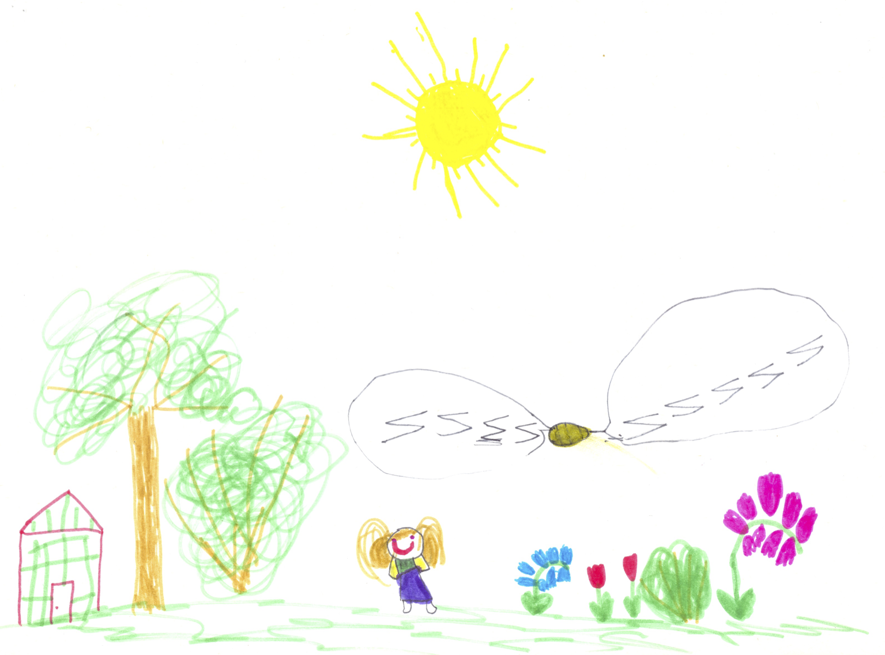
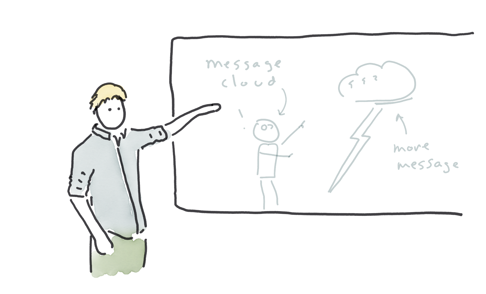
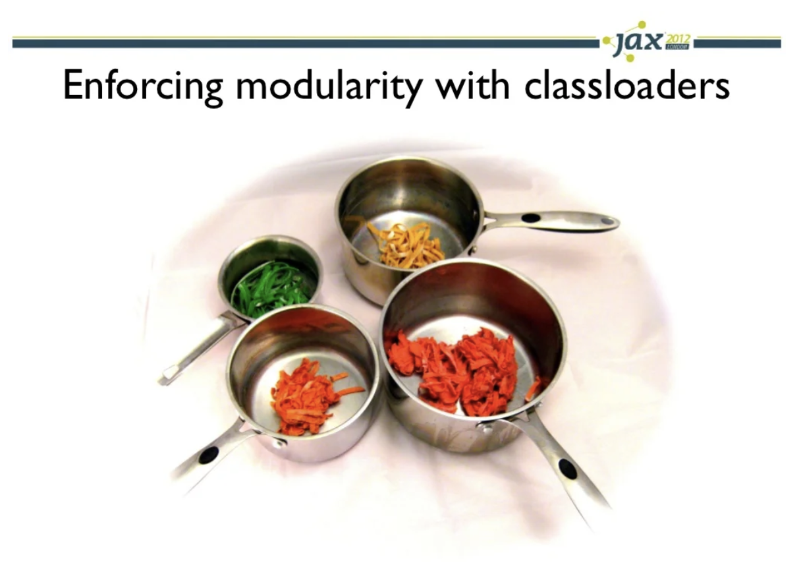
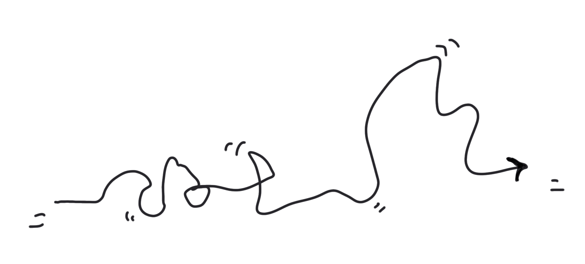
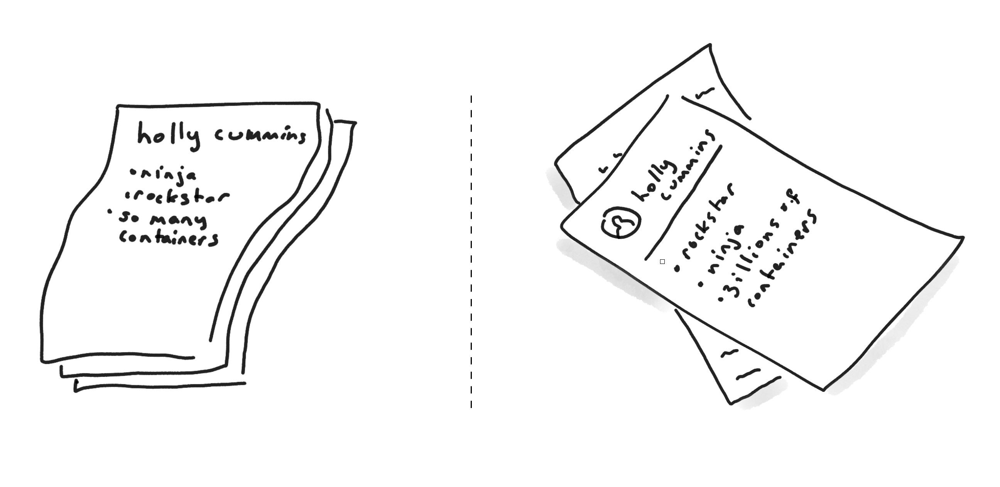
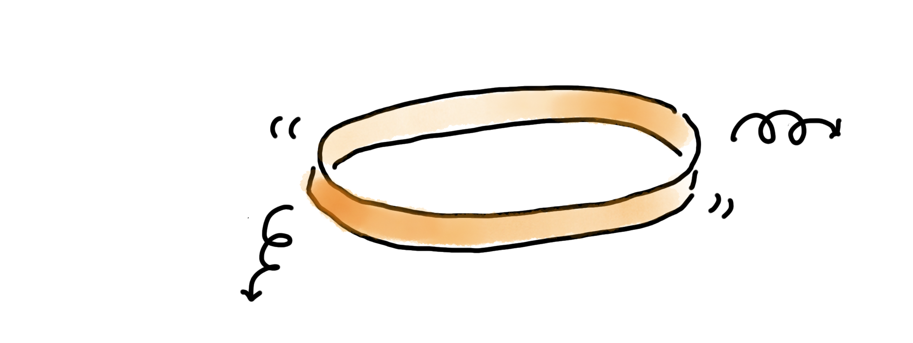
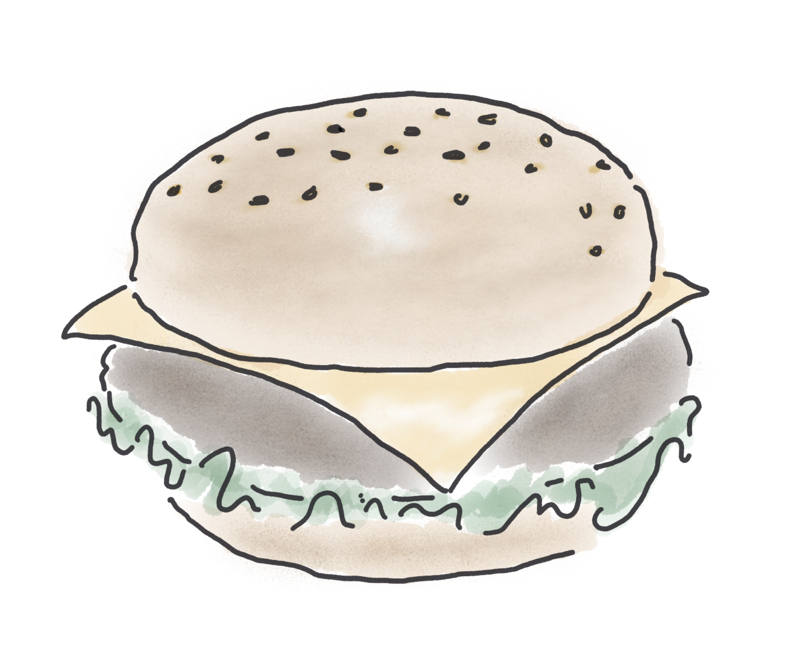

I've never been particularly artistic. As a kid, like all young children, I liked drawing.
At some point, probably once I started having art class in school, it became obvious to me I wasn't very good at it_.
My more talented peers were producing beautiful pictures, and clumsy me was drawing lumpy figures that only barely looked human.
Luckily, I knew the solution. I gave up. 

_An early effort, drawn when I was six and a half. The thing in the air is an (inexplicably large) bee._

I stopped even trying, because if I wasn't trying, I couldn't fail. 
I never drew in my spare time, and as soon as art classes weren't compulsory, I dropped them. Instead,
I focussed on the things I knew I was good at (science, math, English ... definitely nothing that required hand-eye coordination).

I didn't even miss the drawing I wasn't doing until a few years ago. I started doing more conference speaking, and I needed _lots of pictures_. 
It's well known that visuals make talks more enjoyable for the audience. 
Well-chosen visuals can actually make talks more effective, too – reinforcing a message
across both visual and verbal channels makes it [sink in more](https://www.shiftelearning.com/blog/bid/350326/studies-confirm-the-power-of-visuals-in-elearning). 
People remember visual messages better than they do verbal-only ones, a phenomenon known as the [picture superiority effect](https://en.wikipedia.org/wiki/Picture_superiority_effect). 
Part of the reason for this is that images seem to be a 'native format' for our brain's memory, just like words ([dual coding theory](https://en.wikipedia.org/wiki/Dual-coding_theory)).

_2021. Talks work better with graphics._

Like many other presenters, I used photographs in my presentations. 
But the right photograph can be hard to find, and [copyright predators](https://doctorow.medium.com/a-bug-in-early-creative-commons-licenses-has-enabled-a-new-breed-of-superpredator-5f6360713299) are an increasing concern.
You're limited in what you can express with existing photos.
I tried [taking my own photographs], but staging photographs is hard work. 
My breaking point came when I spent hours and hours making batches of coloured fresh spaghetti 
and arranging it in different configurations to illustrate classloaders, jars, coupling, testing and services
for a talk on [software modularity](https://noti.st/holly-cummins/iNasA3/everything-i-know-about-software-i-learnt-from-spaghetti-bolognese). I even invested in a light tent. 
The photographs were ... not great. (It turns out that even though pointing a camera and pushing a button is easy, _photography_ is a skill.)

_Homemade spaghetti in a homemade photograph, 2012_

I was also conscious that when I used photos, even if the photos were _good_ photos, my presentations looked exactly like everyone else's.

So ten years ago, I tried drawing my own slides. I was drawing at about the level I had when I gave up on art, in primary school.
Nonetheless, I was impressed at how flexible sketches were for communicating technical ideas:

Even with my clumsy drawings, I was also able to express emotion. And drawings lent themselves to animations which built up a story in a way photos didn't:

Here's what I've learned over seven years of drawing:

## Difference is good

If a presentation looks exactly the same as six other presentations a conference-goer has seen that 
day, it's unlikely to be memorable. If it looks exactly the same as the presentations they were seeing 
five years ago, that's even worse. 
Just yesterday, after a [talk](cloud-chaos-and-microservices-mayhem-goto-amsterdam/), someone said to me "I enjoy that your slides don't look like the others."
 There's a lot to be said for novelty.

## Competence is over-rated

Most of us naturally avoid doing things we're bad at, especially in public. 
We don't want to be inadequate, and we don't want to be caught out as inadequate. 
But going outside our comfort zone can be good for us, and good for those around us. 
For example, I find the most helpful conference talks are from people learning a topic,
because they did into the non-obvious points and gotchas. 
Similarly, new joiners to a team make a huge contribution because they spot gaps and bring fresh ideas.

My artistic mediocrity may bring a similar 'win'. When I give a talk, 
people enjoy my drawings, but no one in the audience is going to be dazzled
by the artistic majesty of my creations. My illustrations serve my technical content, 
because they're so simple they _can't_ do anything else. If, on the other hand, 
Leonardo Da Vinci was trying to explain microservices anti-patterns, 
people might be distracted by the Mona Lisa on the slide in the background.  

_2021. Abstract and low-skill, but still effective at communication._

That doesn't mean incompetence doesn't have its downsides;
occasionally, people just end up confused. I was so pleased with a drawing I did 
for [a Javaland keynote](cloudy-with-a-chance-of-meatballs-cloud-surprises-for-the-java-developer-keynote-javaland/)of someone
cuddling a cloud that I put it in my email signature. I hastily took it back out after the
third person asked me why I was sharing a picture of someone holding a large loaf of bread.

_Extract of my email signature, 2015. Love cloud, or love bread? You decide._

It's uncomfortable doing things badly, and most of us try to avoid it. 
But sometimes doing something badly is better than not doing it at all. 
And doing it badly is how we learn, which is how we get better. 

 ## Practice

In the IBM Garage, we used to tell a story about a university pottery class which was divided 
into two groups. Half were asked to produce a single pot, and graded on the quality of that pot. 
The other were graded by pottery weight; the more pots they produced, the higher the grade. 
It's obvious that this is a terrible way of grading work; what's less obvious is 
that the by-weight group ended up producing work of a higher quality! 

How can incentivising quantity possibly create quality? And is the story even true? Austin Kleon 
[looked into](https://austinkleon.com/2020/12/10/quantity-leads-to-quality-the-origin-of-a-parable/) the pottery-grading facts.
The story turns out to be mostly-true, but the original medium was photography. Rewarding 
quantity created the conditions necessary for students to get lots of practice, which gave
better end results. The other group focussed on trying to get the one-perfect-shot learned less and 
so didn't actually get the perfect shot.
For a lived example, Amy Iskioff Newell wrote a wonderful blog exploring how taking 33,000 selfies in the pandemic
[grew her photography skills](https://www.amywriteswords.com/p/6-i-took-33000-selfies?s=r).
No matter what the form, the underlying – verifiable – lesson is that the more we do something, 
the better we get.

_2018, CV-driven development as a driver for container adoption. The image on the 
left was my first attempt, but I tried again and got the image on the right. I think it's much better._

"Practice improves us" is pretty obvious, but we're not very good at believing it. 
Many of us tend to think that our aptitudes are inborn and our blind spots are innate. 
This is no doubt partly true, but not entirely true. How true is 'partly true'? 
For practical purposes, it doesn't actually _matter_.

What matters is how elastic we _perceive_ our abilities to be. 
And that matters a lot, like "near-instantaneously changing test scores matters".
A one-hour lecture on how the brain is like a muscle and our abilities aren't fixed significantly improves 
teen's academic results [over a whole school term](http://web.stanford.edu/~paunesku/articles/paunesku_2015.pdf). 
How significant? 
[One model](https://www.nature.com/articles/s41586-019-1466-y) estimates the effect is comparable to the 
difference between an average and good teacher for a whole year.

_I often need to illustrate elasticity. This is my best attempt so far, but it's ... not great. I'm sure I can do better._

Just as the right statement can improve results, the wrong statement can worsen results. 
Telling a child something about the abilities of their group [hinders their
performance](https://cpb-us-w2.wpmucdn.com/voices.uchicago.edu/dist/8/1250/files/2018/07/Park-et-al-2016-How-do-generic-statements-impact-performance-wpt42c.pdf) on challenging tasks. For example, 
telling a girl "boys do well at this puzzle" just before asking her to do the puzzle makes her do badly at the puzzle. 
That's not totally surprising, since it's well-known that confidence affects performance. 
What's more surprising is that if you repeat the experiment and tell a _boy_ "boys do well at this puzzle,"
he'll _also_ do worse. The way to undo the effect is to provide an explanation, and say something like "boys do well at this task because they try hard."

Linda Rising has several other examples in her ['Agile Brain' lecture](https://www.youtube.com/watch?v=SMvVJwwMn5A),
which is where I first heard about growth mindsets[^1]. [Carol Dweck](https://dci.stanford.edu/wp-content/uploads/2018/03/mindset-chap-1-3.pdf), who pioneered growth mindset [research](https://cpb-us-w2.wpmucdn.com/web.sas.upenn.edu/dist/b/398/files/2019/04/1998-04530-003-1sagefw.pdf), suggests thinking 
in terms of "yet". "I'm not good at drawing ... yet." 

If we think our abilities are fixed, when something gets hard, 
we decide we must not be good at it. We stop trying. Instead of seeing failure as a useful part of the learning process, 
                                                    we treat it as a terminal indictment of our abilities and potential. In fact, 
if we think our abilities are innate, we don't [try as much](https://www.researchgate.net/publication/222301422_Implicit_theories_and_IQ_Test_performance_A_sequential_mediational_analysis) even when 
we seem to be doing well. This hurts us, because effort and practice are (duh) important for improvement. 
As Amy Iskioff Newell [says](https://www.amywriteswords.com/p/6-i-took-33000-selfies?s=r),

_"You can get better at anything if you practice a lot, even if you don’t have much of a plan for how to get better, even if you don’t set any goals, take any classes, read a single book or watch a single video on even the most basic topics."_

Looking at the difference between my 2015 drawings and what I'm doing now, I can 
see how much practice has helped.  

_Burger, 2021. I have more confidence with reflection and shading._

Have I got a perfect growth mindset? Of [course not.](https://www.theatlantic.com/education/archive/2016/12/how-praise-became-a-consolation-prize/510845/)
While writing this blog, I happened 
to see some of [@MalwareUnicorn](https://twitter.com/malwareunicorn)'s [drawings](https://twitter.com/malwareunicorn/status/1533875714545422336?s=20&t=hN9GH4SBoaLzSGQOZQ5ndw) on twitter, and I got totally discouraged. 
How can I have the nerve to draw in public, and then brazenly write about my drawings as if I'm an expert, when there are people 
who draw so so so much better than me? In fact, should I even be allowed to draw at all? Even Amanda's
[casual doodles](https://twitter.com/malwareunicorn/status/1537130415533588480?s=20&t=hN9GH4SBoaLzSGQOZQ5ndw) are better than my best 'after' picture, 
_and_ I have to [cheat](/how-to-draw-part-ii). 

I will never ever draw 
that well, growth mindset or not, practice or not. But I'll keep trying. 
Another finding of Carol Dweck's is that, after a disappointing result, students with a fixed mindset tended to seek out
work from others who'd [done worse](https://journals.sagepub.com/doi/10.1177/0146167207312960), so they could feel better about themselves. 
Those with a 
 growth mindset wanted to look at what people who scored higher produced, so they could _get_ better. 
 So, yeah. I'm never going to be a [@MalwareUnicorn](https://twitter.com/malwareunicorn/status/1519434606214148096?s=20&t=hN9GH4SBoaLzSGQOZQ5ndw).
 But I'll keep scribbling, and see where I get to.
 
In [part ii](/how-to-draw-part-ii), I discuss some of the mechanics behind my drawing, including the (sssh) cheating.

[^1]: Like a lot of widely-reported psychological research, 'growth mindset' has a bit of [replication crisis](https://www.vox.com/future-perfect/21504366/science-replication-crisis-peer-review-statistics). I found this essay nuanced and informative: [Is Growth Mindset Real?](https://improvingteaching.co.uk/2022/03/06/is-growth-mindset-real-new-evidence-new-conclusions/). The conclusion is that there isn't much correlation between self-reported growth mindset and academic results. However, teaching people they can try hard and grow their abilities _does_ lead to improved results. So it's not great as a predictor, but it's excellent as an intervention. 