In [part i](/how-to-draw-part-i), I explained why I started drawing despite not having 
much artistic talent. Practice has helped me move from 'totally inept' to 'mostly inept'.
Here are some of the other techniques I'm using to improve. 

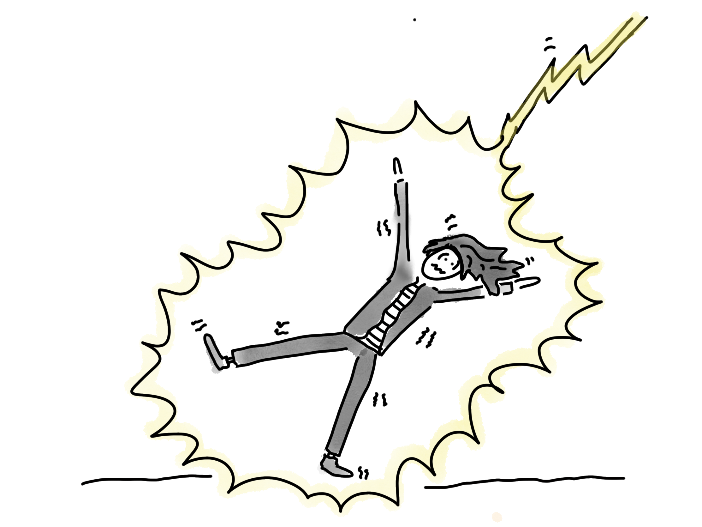
_2021, self portrait. Learning from failure is important. Laughing at failure also helps._

## Observing

Carol Dweck [observed](https://www.youtube.com/watch?v=hiiEeMN7vbQ) that part of a growth mindset is seeking out 
people who do the thing you're trying to do better than you can do, so you can learn by example.
(In contrast, people with a fixed mindset tried to cheer themselves up by looking
for people who were even worse.) Some of the improvement in my drawing from just doing the thing, over and over again. 
But I'm also trying to be a bit Sherlock-Holmesy and observe, rather than just seeing. 
When I see a drawing 
I like, I study it. What about it do I like? What techniques did they use? 
Could I ~~steal~~ use those techniques? 

Sometimes, the answer is 'no'. I'm limited. Anything detailed or life-like or complex is 
beyond me. But even drawings with only a few simple lines can be powerful.
For example, [Charlie Mackesy's](https://www.charliemackesy.com/) pictures only have a few splotches of colour and squiggles but they're 
so evocative. (I haven't embedded any of his pictures to respect his copyright, but do 
go have a browse of his [site](https://www.charliemackesy.com/).)

## Education

I assumed drawing was an innate talent, but it can be taught. 
Here are some of the resources I've been learning from:
- My colleague Jocelyne Dittmer wrote a great [guide to sketch-noting for non-drawers](https://medium.com/@jocelynedittmer_5269/visual-thinking-sketching-ec64f19cf70). Because the visual thinking skills are similar, it's also useful for slide illustration.
- 'How to draw' videos for kids are about the right level for me. I started to watch them because I had young children, but now I watch them on my own. My favourite is [Art For Kids hub](https://www.youtube.com/hashtag/artforkidshub).

One of the 
things on my todo list is to explore other drawing tutorials. Red Hat do regular Days of Learning, 
so perhaps I'll take my next one for drawing instruction. I might even 
be confident enough to work through lessons aimed at adults.

## Experiment

Experimentation is a key part of continuous improvement. 
Over the years, I've tried many different styles of drawing – with shading, flat, monochrome, white backround, black background, 
bold lines, fine lines ...

For my [Kubecon keynote](https://hollycummins.com/how-to-love-kubernetes-and-not-wreck-the-planet-keynote-continuous-lifecycle-online/) 
I tried icon-shaped people instead of stick figures:  

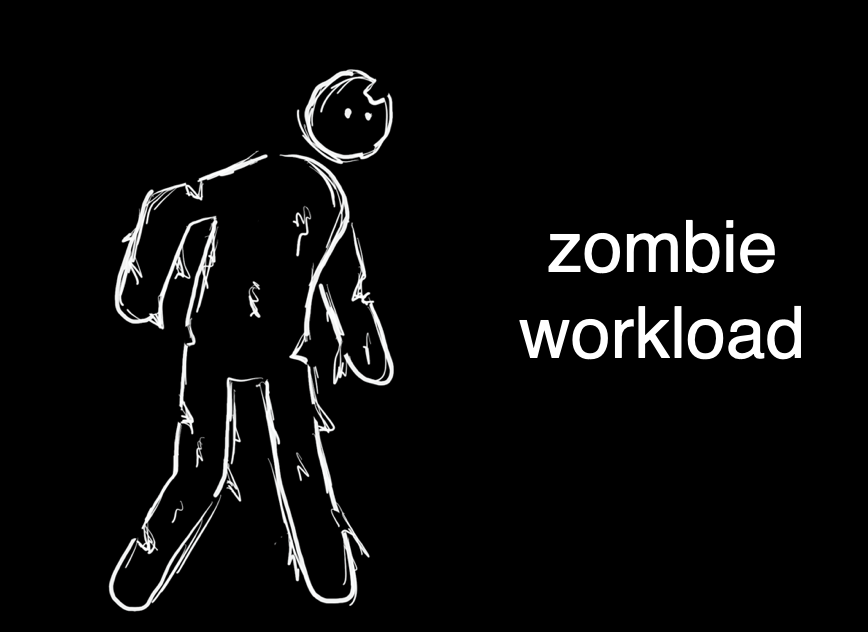
_2020, a zombie with an icon-like body shape_

I used loose sketching instead of thick lines:

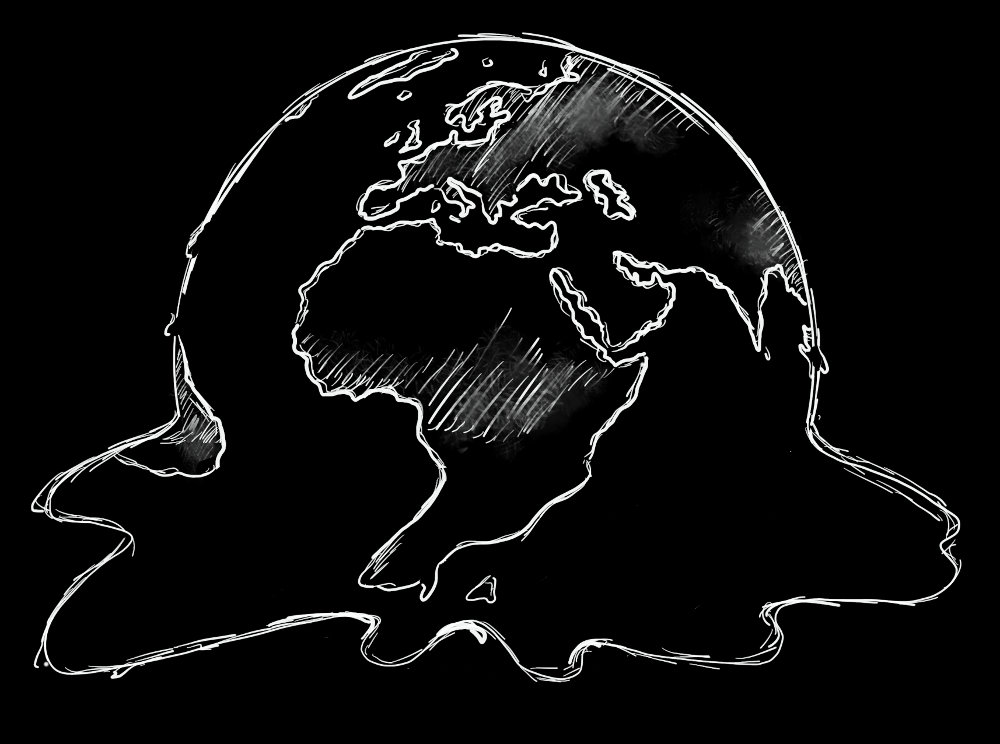
_2020, a melting planet_

Some of my visual experiments haven't even involved drawing – for example, I like how slides come out if 
I just use some super-sized icons from the [noun project](https://thenounproject.com/). 

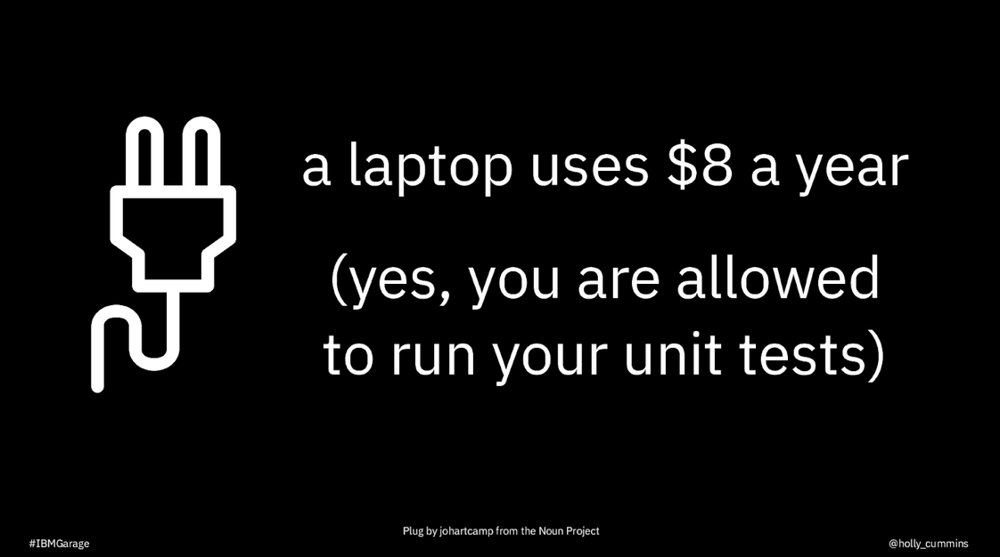
_2019, a huge icon in place of hand-drawing_

Even after all my practice, there are some things I just can't draw. 
Rather than going all the way 
back to just-photos, I've had good experiences with a [hybrid style](https://hollycummins.com/cloud-chaos-and-microservices-mayhem-jfuture/). 
I think it's more expressive than either photos of drawings alone.

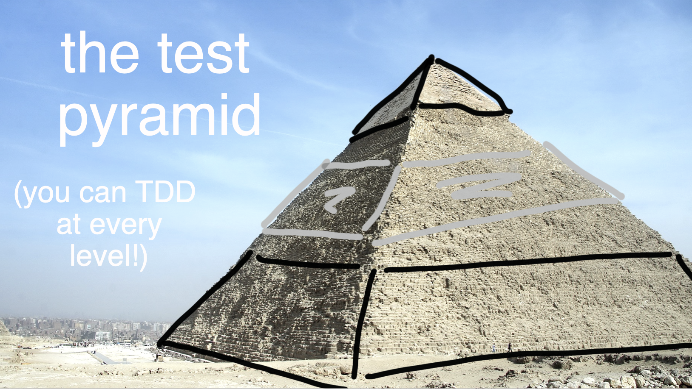
_2020, annotation animations on top of a photo_

The tension between the two media gives the slides an extra energy, I think.    

_2020, a hybrid illustration_

Hybrid works well with icons and photos, too.

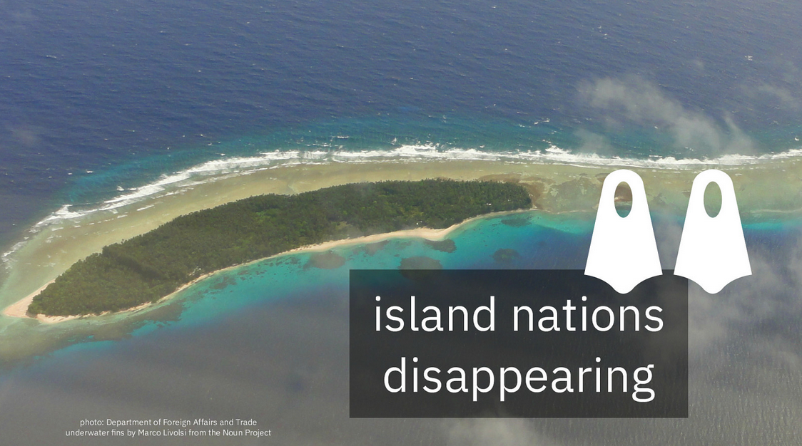

Not every experiment is a success. I had to abandon a new style of stick 
figures halfway through drawing a presentation because they were all turning out improbably phallic.
"NSFW presentation through incompetence" is a milestone I hope to avoid.

# The mechanics 

People sometimes ask me about my drawing process, so here are some details. 
I started out drawing on paper, with sharpies, and then using a scanner to digitise them. 
It worked, but it was labour-intensive, and I could only do it at home. No last minute revisions to the slides for me. 
Not that I would ever leave a presentation to the last minute. Obviously. 

 
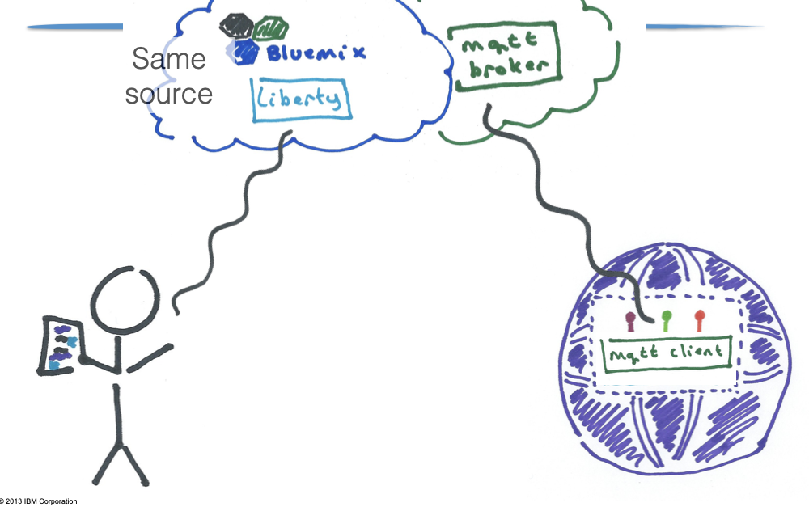
_An example drawing done with Sharpie on paper, 2015_
 
Eventually 
phone cameras got good enough I could use them instead of a scanner, so that made the process a bit more portable, 
but it was still slow. 
I saw Marlena Compton do some amazing sketching using the Paper stylus and an iPad app, 
so I switched to digital. 
(Marlena can even give a talks by live-drawing them, which is something I've never been brave enough to attempt.)
Going digital meant I could trace from photos, and also 
experiment with different brushes and 'pens' beyond just sharpies.

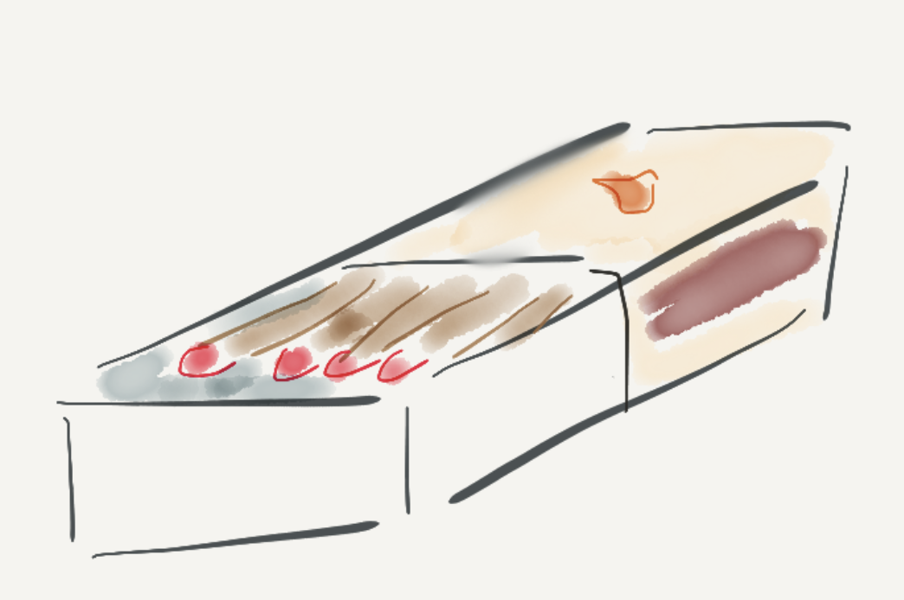
_An drawing using the Paper app and stylus, 2016_

However, the first app I used was more targeted for note-taking, 
so my drawings were disappointingly pixelated on a big screen. 

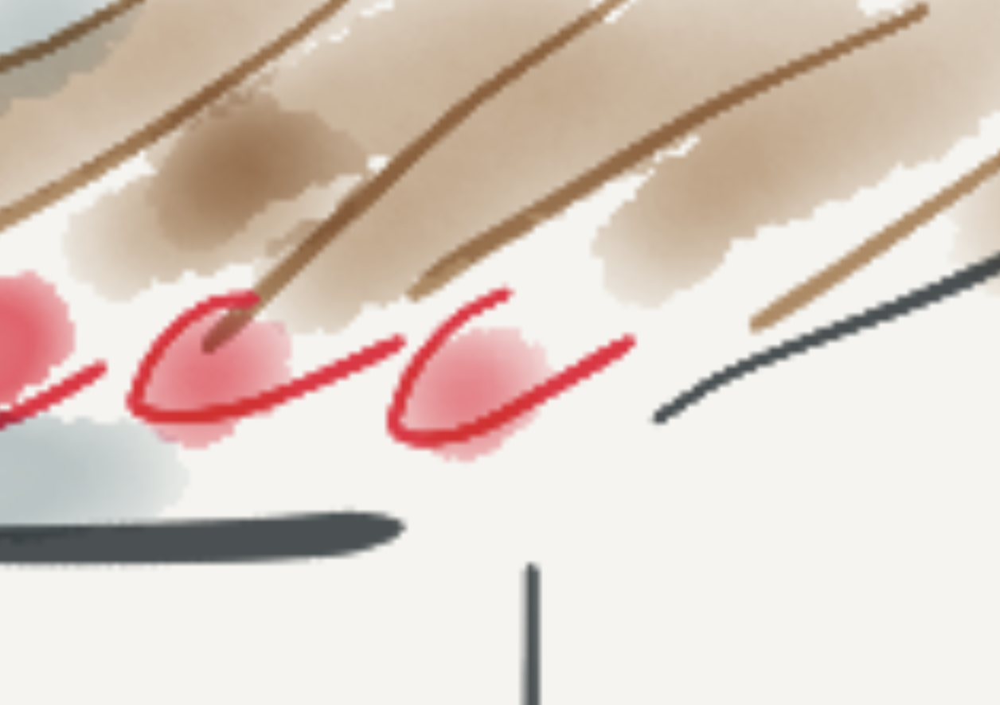
_Look at all those pixels on the diagonal lines, yuck._

When the iPad Pro and Pencil came out, I switched and haven't looked back. 
Even though I only use a fraction of the power of my drawing app, 
I can use layers to undo errors or build up animations, I can shade, I can smudge ... 
I use [Tayasui Sketches Pro](https://tayasui.com/sketches/). 
I like it, but I haven't evaluated it against other apps, 
so take my recommendation with caution.

As an example of what the drawing app can do, 
 in this drawing 
I used stippling to give the feathers some texture.

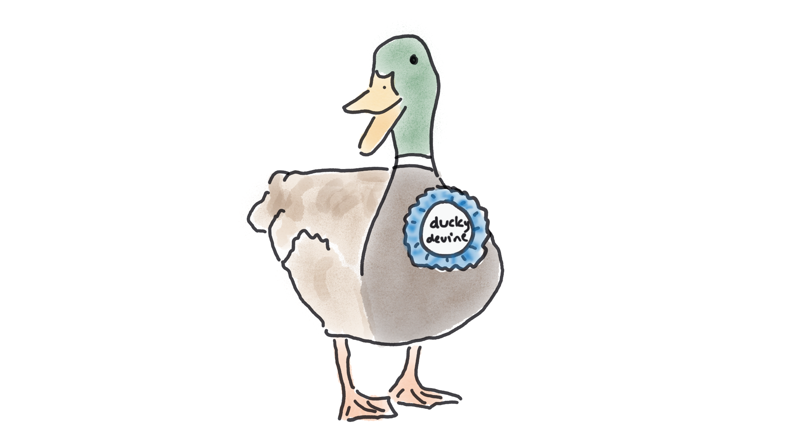
_2021, a duck._

Here I used blending to try and convey depth. 

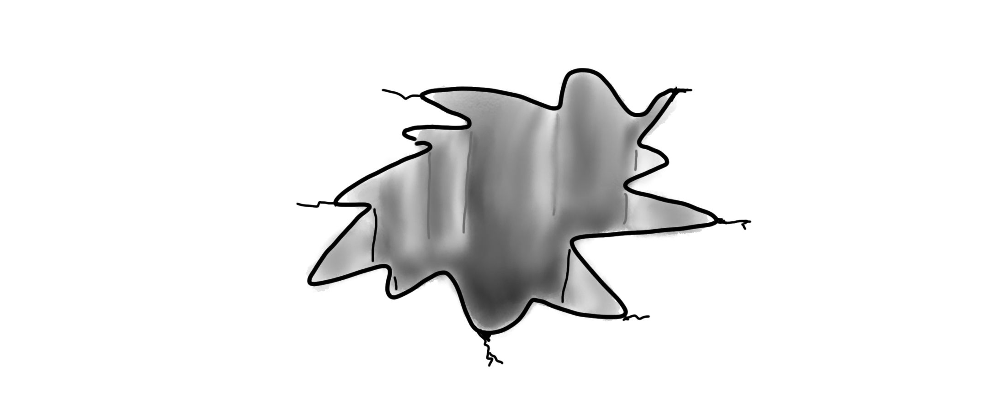
_2021, a hole._

## Tracing

How can I draw complex shapes? I cheat. 
I hate to say 'fake it 'til you make it', but this is basically that. 
I trace. 
If I'm drawing something beyond my skill (a horse, a cat, something with perspective ... 
well, if I'm honest, almost anything), I find a suitable photo to use as a base.
(This is something digital drawing tools make _very_ easy.)
If a single photo isn't enough, I'll patch a few photos together. 
I've also used [setpose](https://setpose.com) for getting people-proportions right. It's a digital version of the poseable mannequins
artists use.

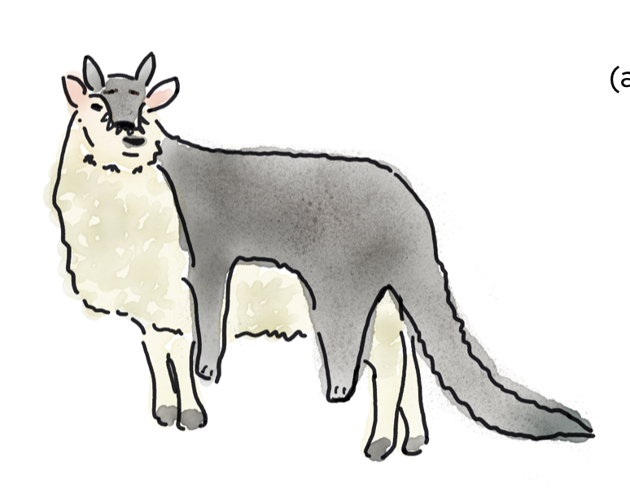
_A traced sheep with a freehand wolf, 2022._

I feel a bit sheepish about this, but who among us hasn't copied and pasted from stack overflow? 
And learned something in the process? Historically, artists were trained by copying old masters.
Many still learn by copying, a practice Austin Kleon defends in _Steal Like An Artist_ 
and [blog posts](https://austinkleon.com/2018/02/08/copying-is-how-we-learn/). 

I'm not sure how many artists trace, but street artist Shepard Fairey famously traced a photo for 
his ['Hope' Obama poster](https://en.wikipedia.org/wiki/Barack_Obama_%22Hope%22_poster). 
(Fairey was then famously [sued by AP](http://news.bbc.co.uk/1/hi/world/americas/7872253.stm), so even when 
tracing, copyright matters.)

I've also been told that working graphic designers trace all the time. 
They're trying to do a job, so they use the tools at hand. I think the same 
holds for me; I'm an engineer, and the reason I give presentations is to communicate complex technical concepts. 
If tracing helps me do that more easily, I'm happy. 
 
