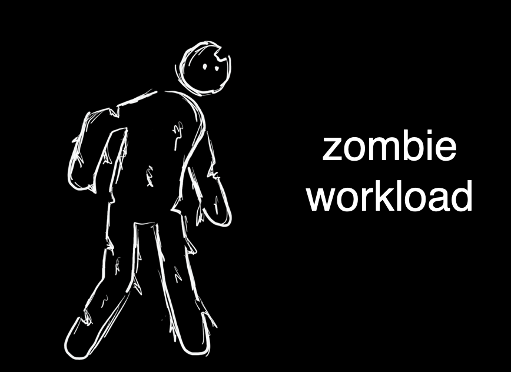
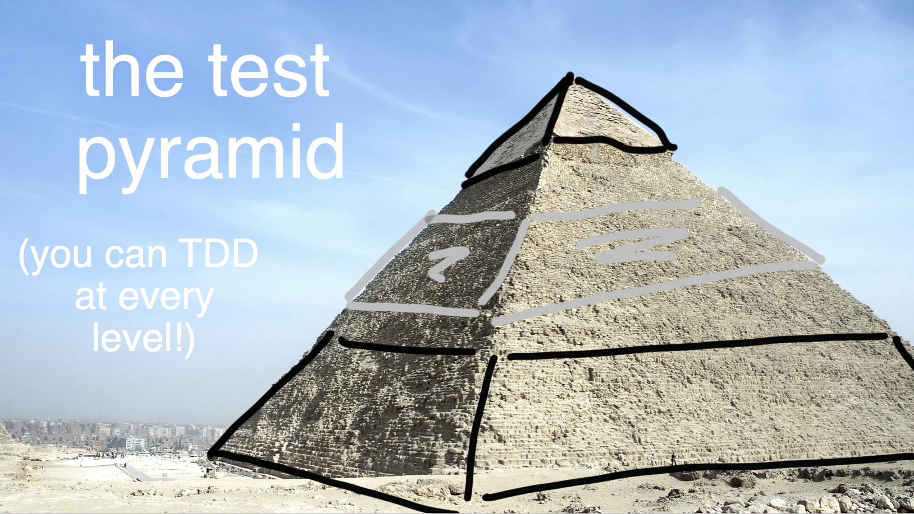
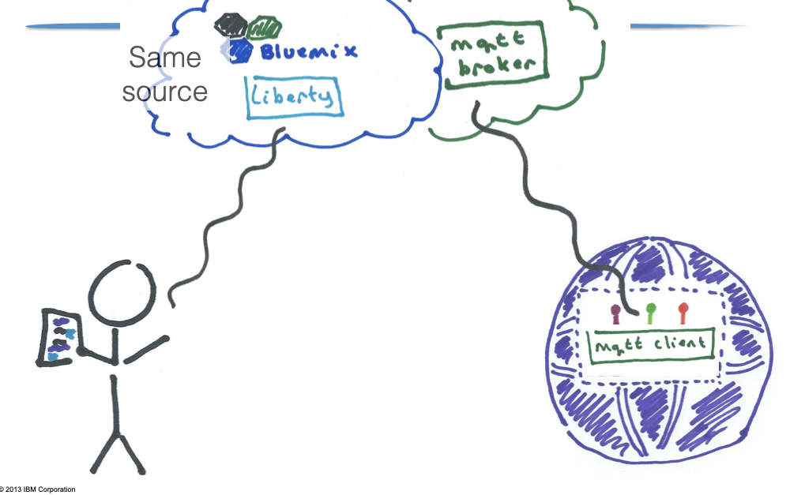

I've never been particularly artistic. As a kid, like all young children, I liked drawing.
At some point, though, probably once I started having art class in school, it became obvious to me _I wasn't very good at it_.
My more talented peers were producing beautiful pictures, and clumsy me was drawing lumpy figures that only barely looked human.
Luckily, I knew the solution. I gave up. 

_An early effort, drawn when I was six and a half. The thing in the air is a (strangely large) bee._

I stopped even trying, because if I wasn't trying, I couldn't fail. I never drew in my spare time, and as soon as art classes weren't compulsory, I dropped them. Instead,
I focussed on the things I knew I was good at (science, math, English ... definitely nothing that required hand-eye coordination).

I didn't even miss the drawing I wasn't doing until a few years ago. I started doing more conference speaking, and I needed _lots of pictures_. 
It's well known that visuals make talks more enjoyable for the audience. 
Well-chosen visuals can actually make talks more effective, too – reinforcing a message
across both visual and verbal channels makes it [sink in more](https://www.shiftelearning.com/blog/bid/350326/studies-confirm-the-power-of-visuals-in-elearning). 
People remember visual messages better than they do verbal-only ones, a phenomenon known as the [picture superiority effect](https://en.wikipedia.org/wiki/Picture_superiority_effect). 
Part of the reason for this is that images seem to be a 'native format' for our brain's memory, just like words ([dual coding theory](https://en.wikipedia.org/wiki/Dual-coding_theory)).

Like many other presenters, I used photographs in my presentations. 
But the right photograph can be hard to find, and [copyright predators](https://doctorow.medium.com/a-bug-in-early-creative-commons-licenses-has-enabled-a-new-breed-of-superpredator-5f6360713299) are an increasing concern.
You're limited in what you can express with existing photos.
I tried [taking my own photographs], but staging photographs is hard work. 
My breaking point came when I spent hours and hours making batches of coloured fresh spaghetti 
and arranging it in different configurations to illustrate classloaders, jars, coupling, testing and services
for a talk on [software modularity](https://noti.st/holly-cummins/iNasA3/everything-i-know-about-software-i-learnt-from-spaghetti-bolognese). I even invested in a light tent. 
The photographs were ... not great. (It turns out that even though pointing a camera and pushing a button is easy, _photography_ is a skill.)

_Homemade spaghetti in a homemade photograph, 2012_

I was also conscious that when I used photos, even if the photos were _good_ photos, my presentations looked exactly like everyone else's.

So ten years ago, I tried drawing my own slides. I was drawing at about the level I had when I gave up on art, in primary school.
Nonetheless, I was impressed at how flexible sketches were for communicating technical ideas:

Even with my clumsy drawings, I was also able to express emotion. And drawings lent themselves to animations which built up a story in a way photos didn't:

Here's what I've learned over seven years of drawing:

## Difference is good

If a presentation looks exactly the same as six other presentations a conference-goer has seen that 
day, it's unlikely to be memorable. If it looks exactly the same as the presentations they were seeing 
five years ago, that's probably worse. There's a lot to be said for palate cleansing, 
interest, and freshness. 

## Competence is over-rated

Most of us naturally avoid doing things we're bad at, especially in public. 
We don't want to be inadequate, and we don't want to be caught out as inadequate. 
But going outside our comfort zone can be good for us, and good for those around us. 
Sometimes the most helpful conference talks are from people learning a topic. 
New joiners to a team are able to spot gaps and bring fresh ideas.

I'm definitely not bringing anything to the world of art, but tech people 
seem to enjoy looking at my drawings. Well, most of the time. 
Sometimes people just end up confused. I was pleased with a drawing I did 
for [a Javaland keynote](cloudy-with-a-chance-of-meatballs-cloud-surprises-for-the-java-developer-keynote-javaland/)of someone
cuddling a cloud, so I put it in my email signature. I took it out after the
third person asked me why I was sharing a picture of someone holding a large loaf of bread.

It's uncomfortable doing things badly, and most of us try to avoid it. 
But sometimes doing something badly is better than not doing it at all. 
And doing it badly is how we learn, which is how we get better. 

 ## Practice

In the IBM Garage, we used to tell a story about a university pottery class which was divided 
into two groups. Half were asked to produce a single pot, and graded on the quality of that pot. 
The other were graded by pottery weight; the more pots they produced, the higher the grade. 
It's obvious that this is a terrible way of grading work; what's less obvious is 
that the by-weight group ended up producing work of a higher quality. As they cranked 
through the clay, they got better, despite themselves.

How can incentivising quantity create quality? And is it even true? Austin Kleon 
[looked into](https://austinkleon.com/2020/12/10/quantity-leads-to-quality-the-origin-of-a-parable/) the story.
It turns out to be mostly-true, but the original medium was photography. 
No matter what the form, the underlying – verifiable – lesson is that the more we do something, 
the better we get.

Amy Iskioff Newell wrote a wonderful blog exploting how taking 33,000 selfies in the pandemic
[grew her photography skills](https://www.amywriteswords.com/p/6-i-took-33000-selfies?s=r):

> "You can get better at anything if you practice a lot, even if you don’t have much of a plan for how to get better, even if you don’t set any goals, take any classes, read a single book or watch a single video on even the most basic topics"

Looking at the difference between my 2015 drawings and what I'm doing now, I can 
see how much practice has helped.  

_Burger, 2021. I have more confidence with reflection and shading._

## Observing

Some of the improvement in my drawing from just doing the thing, over and over again. 
But part of it has come from being open to outside inputs. When I see a drawing 
I like, I study it. What about it do I like? What techniques did they use? 
Could I use those techniques? 

Sometimes, the answer is 'no'. I'm limited. Anything detailed or life-like or complex is 
beyond me. But even drawings with only a few simple lines can be powerful.
For example, [Charlie Mackesy's](https://www.charliemackesy.com/) pictures only have a few splotches of colour and squiggles but they're 
so evocative. (I haven't embedded any of his pictures to respect his copyright, but do 
go have a browse of his [site](https://www.charliemackesy.com/).)

## Education

I assumed drawing was an innate talent, but it can be taught.
I've learned a lot about drawing from watching 'how to draw' videos with my young kids 
(they're about the right level!).
My favourite is [Art For Kids hub](https://www.youtube.com/hashtag/artforkidshub).

There are lots of resources out there, and one of the 
things on my todo list is to explore them more. Red Hat do regular Days of Learning, 
so perhaps I'll take my next one for drawing instruction. I might even 
be confident enough to work through lessons aimed at adults.

## Experiment

Experimentation is a key part of continuous improvement. 
Over the years, I've tried many different styles of drawing – with shading, flat, monochrome,
bold lines, fine lines ...

For my [Kubecon keynote](https://hollycummins.com/how-to-love-kubernetes-and-not-wreck-the-planet-keynote-continuous-lifecycle-online/) 
I tried icon-shaped people instead of stick figures, and loose sketching.  

Some of my visual experiments haven't even involved drawing – for example, I like how slides come out if 
I just use some super-sized icons from the [noun project](https://thenounproject.com/). 

Even after all my practice, I'm not great at drawing, so there are some things I just can't draw. 
Rather than going all the way 
back to photos, I've had good experiences with a [hybrid style](https://hollycummins.com/cloud-chaos-and-microservices-mayhem-jfuture/). 
I think it's more expressive than either photos of drawings alone.

There's also an energy that comes from the tension between the two media.    

Hybrid works well with icons and photos, too.

Not every experiment is a success. I had to abandon a new style of stick 
figures halfway through a presentation because they were all turning out improbably phallic.
"NSFW presentation through incompetence" is a milestone I hope to avoid!

# The mechanics 

People sometimes ask me about my drawing process, so here are some details. 
I started out drawing on paper, with sharpies, and then using a scanner to digitise them. 
It worked, but it was labour-intensive, and I could only do it at home. Eventually 
phone cameras got good enough I could use them instead of a scanner, so I could edit 
 talks in a hotel room. 
 

_An example drawing done with Sharpie on paper, 2015_
 
I saw Marlena Compton do some amazing sketching using the Paper stylus and an iPad app, 
so I switched to digital. 
(Marlena can even give a talks by live-drawing them, which is something I've never been brave enough to attempt.)
Going digital meant I could trace, and also 
experiment with different brushes and 'pens' beyond just sharpies.

_An drawing using the Paper app and stylus, 2016_

However, the first app I used was more targeted for note-taking, 
so my drawings were disappointingly pixelated on a big screen. 

_Look at all those pixels on the diagonal lines, yuck._

When the iPad Pro and Pencil came out, I switched and haven't looked back. 
Even though I only use a fraction of the power of my drawing app, 
I can use layers for animations, I can shade ... 
I use [Tayasui Sketches Pro](https://tayasui.com/sketches/). 
I like it, but I haven't evaluated it against other apps, 
so take my recommendation with caution.

As an example of what the drawing app can do, 
 in this drawing I had help on the shape of the sheep but added the wolf. 
I was able to use shading and stippling to make the fur on these 
animals a bit more furry.

_A traced sheep with a freehand wolf, 2022._

## Tracing

How can I draw complex shapes? I cheat. 
I hate to say 'fake it 'til you make it', but this is basically that. 
I trace. 
If I'm drawing something beyond my skill (a horse, a cat, something with perspective ... 
well, if I'm honest, almost anything), I find a suitable photo to use as a base.
(This is something digital drawing tools make _very_ easy.)
If a single photo isn't enough, I'll patch a few photos together. 
I've also used [setpose](https://setpose.com) for getting people-proportions right. It's a digital version of the poseable mannequins
artists use.

I feel a bit sheepish about this, but who among us hasn't copied and pasted from stack overflow? 
And learned something in the process? Historically, artists were trained by copying old masters.
Many still learn by copying, a practice Austin Kleon defends in _Steal Like An Artist_ 
and [blog posts](https://austinkleon.com/2018/02/08/copying-is-how-we-learn/). 

I'm not sure how many artists trace, but street artist Shepard Fairey famously traced a photo for 
his ['Hope' Obama poster](https://en.wikipedia.org/wiki/Barack_Obama_%22Hope%22_poster). 
(Fairey was then famously [sued by AP](http://news.bbc.co.uk/1/hi/world/americas/7872253.stm), so even when 
tracing, copyright matters.)

I've also been told that working graphic designers trace all the time. 
They're trying to do a job, so they use the tools at hand. I think the same 
holds for me; I'm an engineer, and the reason I give presentations is to communicate complex technical concepts. 
If tracing helps me do that more easily, I'm happy. 
 
I have found, however, that sketchnoting in meetings is powerful, even if the note-taker (me!) can't draw well. Visual note-taking works especially well for complex concepts or new domains, so it was an ideal technique when potential customers were briefing the IBM Garage on their challenges. It makes people feel like they're _really_ being heard to see their words turned into pictures as they speak. My colleague Jocelyne Dittmer has done an [excellent guide to getting started drawing in public](https://medium.com/@jocelynedittmer_5269/visual-thinking-sketching-ec64f19cf70).

