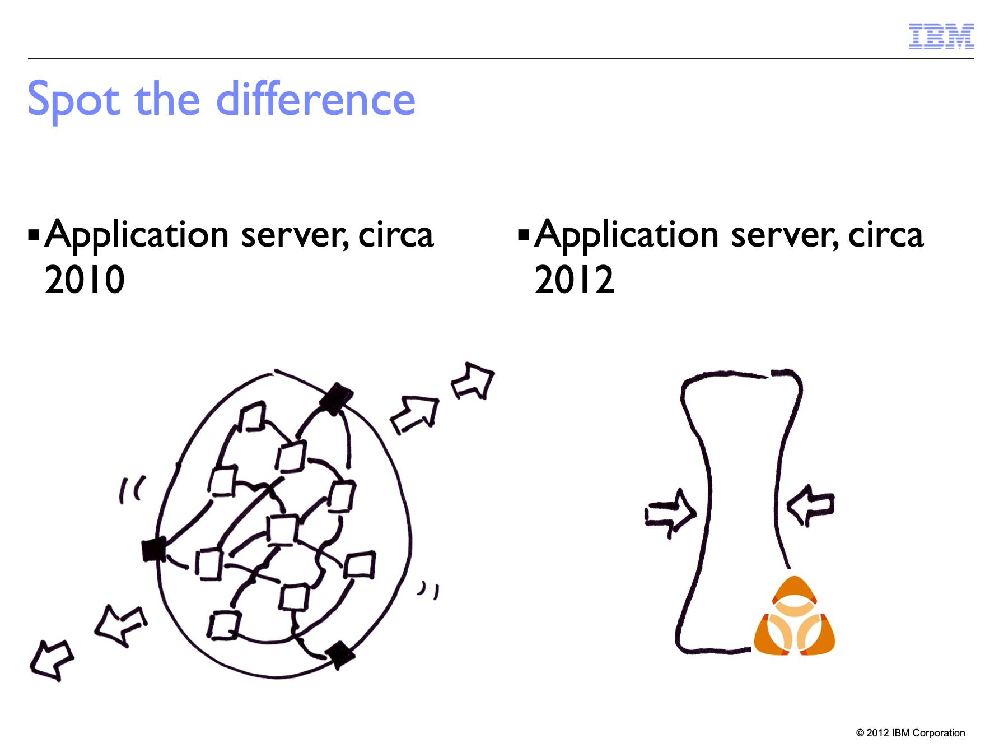

I've never been particularly artistic. As a kid, like all young children, I liked drawing.
At some point, though, probably once I started having art class in school, it became obvious to me _I wasn't very good at it_.
My more talented peers were producing beautiful pictures, and clumsy me was drawing lumpy figures that only barely looked human.
Luckily, I knew the solution. I gave up. I stopped even trying, because if I wasn't trying, I couldn't fail. I never drew in my spare time, and as soon as art classes weren't compulsory, I dropped them. Instead,
I focussed on the things I knew I was good at (science, math, English ... definitely nothing that required hand-eye coordination).

I didn't miss the drawing I wasn't doing until a few years ago. I started doing more conference speaking, and I needed _lots of pictures_. It's well known that visuals
make talks more enjoyable for the audience. Well-chosen visuals can actually make talks more effective, too – reinforcing a message
across both visual and verbal channels makes it [sink in more](https://www.shiftelearning.com/blog/bid/350326/studies-confirm-the-power-of-visuals-in-elearning). People remember visual messages better than they do verbal-only ones, a phenomenon known as the [picture superiority effect](https://en.wikipedia.org/wiki/Picture_superiority_effect). Part of the reason for this images are a 'native format' for our brain's memory, just like words ([dual coding theory](https://en.wikipedia.org/wiki/Dual-coding_theory)).

Like many other presenters, I used photographs in my presentations. But the right photograph can be hard to find, and [copyright predators](https://doctorow.medium.com/a-bug-in-early-creative-commons-licenses-has-enabled-a-new-breed-of-superpredator-5f6360713299) are an increasing concern.
Some concepts couldn't be expressed in stock photos.
I tried [taking my own photographs](https://noti.st/holly-cummins/iNasA3/everything-i-know-about-software-i-learnt-from-spaghetti-bolognese), but the quality wasn't great.
I was also conscious that when I used slides, my presentations looked exactly like everyone else's.

So ten years ago, I tried drawing my own slides. I was drawing at about the level I had when I gave up on art, in primary school.
Nonetheless, I was impressed at how flexible sketches were for communicating technical ideas:

Even with my clumsy drawings, I was also able to express emotion. And drawings lent themselves to animations which built up a story in a way photos didn't:

Here's what I learned:

## Difference is good

experimented with icons [TODO link], different, no drawing needed

## Competence is over-rated

talk about kids, always good, don't know how to fail

Sometimes the best conference talks are from people learning an area - is that relevant?

Katia better than me

Link to Linda rising other research

There are two kinds of incompetence. One is the humble-brag

The other is "no really, this is unrecognisable." I was pleased with a drawing I did of someone
cuddling a cloud, so I put it in my email signature. I took it back out again after the
third person asked me why I had a picture of someone holding a large loaf of bread.

## Tracing

How can I draw complex shapes? I cheat. I hate to say 'fake it 'til you make it', but this is basically that. I trace. If I'm drawing something beyond my skill (a horse, a cat, something with perspective ... well, if I'm honest, almost anything), I find a suitable photo to use as a base.(This is something digital drawing tools make _very_ easy.)
If a single photo isn't enough, I'll patch a few photos together.

Tracing helps me with the basic shapes and proportions, but
setpose

https://twitter.com/holly_cummins/status/1442863851754512386?s=20&t=nSEOpigBx2fix5_f1f6wMA

TODO before and after

Who among us hasn't copied and pasted from stack overflow? And learned something in the process?

Copyright, Obama case

Not found art degree just trying to communicate

## Practice

Amy Iskioff Newell article ()

## Experiment

Experimentation is a key part of continuous improvement. Over the years, I've tried many different styles of drawing. I started out drawing by hand, in Sharpies, and then scanning it in. Marlena Compton introduced me to the (much more efficient) possibilities of drawing on an iPad. Marlena can even give a talks by live-drawing them, which is something I've never been brave enough to attempt.

## Observing

Link to Charlie mackesy

abstracted style with rough edges and few details, so it's hard to get wrong.

Hybrid sometimes photo more expressive

I have found, however, that sketchnoting in meetings is powerful, even if the note-taker (me!) can't draw well. Visual note-taking works especially well for complex concepts or new domains, so it was an ideal technique when potential customers were briefing the IBM Garage on their challenges. It makes people feel like they're _really_ being heard to see their words turned into pictures as they speak. My colleague Jocelyne Dittmer has done an [excellent guide to getting started drawing in public](https://medium.com/@jocelynedittmer_5269/visual-thinking-sketching-ec64f19cf70).
