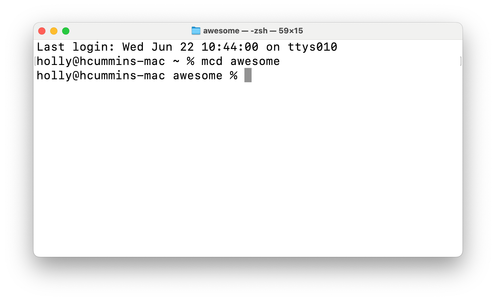

Eight years ago, my MacBook suffered a catastrophic hard drive failure. 


Of course, I was no fool. I had everything backed up to our centralised backup system. 
By horrible coincidence, that system also suffered a catastrophic failure the exact same week. 
I never got a full explanation of what happened but there was something about tapes and RAID arrays corrupting and everyone's backup was lost. 

I was due to speak at JAX London the day after my laptop gave up the ghost, so I had a panicked twenty four hours trying to resuscitate my laptop while trying to recreate my demo while trying to make new slides. 
Luckily, it was the early days of mainstream-cloud, and 
I could just about fish my demo jar from of one cloud server, and an old PDF of my slides from another.
(The demo code was lost forever, though, because it wasn't on any public source control system. 
It's always surprising to me to look back at the recent past, ie 2014, and see how totally different it was from 
the present I take for granted.)

Once the initial crisis passed, it turns out losing everything was kind of liberating. I'd been 
copying crud forward for thirteen year's worth of laptops. 
Once it was gone, I discovered almost none of it was actually necessary.

But there was one thing I missed, and couldn't get back – a one-line bash alias. 
It was little, but it saved me effort every day. 
When I'd pair programmed, my buddies had commented admiringly on how useful it was. 
But 
sometime between when I 
wrote the alias, and when my drive died, I'd lost most of my bash skills. That script haunted me. I kept trying to 
recreate it – I mean, how hard can a one line bash alias be? – but without success. 



Today, I recreated it. I don't know if my implementation is as pure as my original, because I've had to rely on a function.
But that's ok, because it's just as _useful_ as the original. 

What does this Proustian madeleine of shell scripting do? It makes a directory, and then puts you into that directory.
It's such a common pattern, I don't know why it's not part of the core shell commands. (Ok, ok, I do know - the Unix 
philosophy is to write small programs that do exactly one thing well, and can be chained together. Making a 
directory and then changing directory is two things. But still.)

```shell
  holly@mac ~ % mcd awesome
  holly@mac awesome % pwd
  /Users/holly/awesome
  holly@mac awesome %
  ```
  
  

Here's the script, which I now have in my `.zprofile`

```shell
mcd(){
 mkdir $1; cd $1
}
```

I hope this blog and `mcd` will be useful to someone else;
but if nothing else, I'll know where to look for `mcd` next time my hard drive fails.
