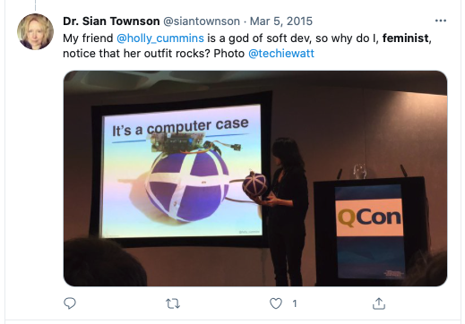
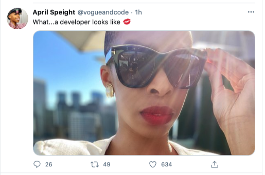
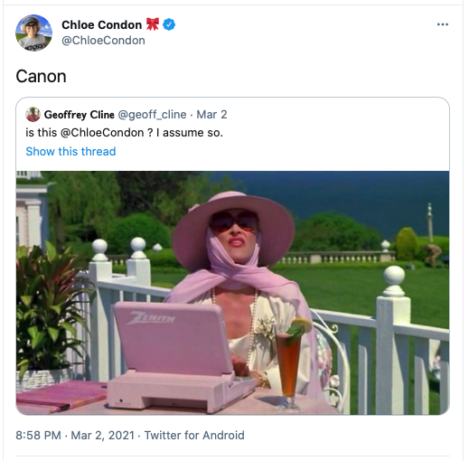
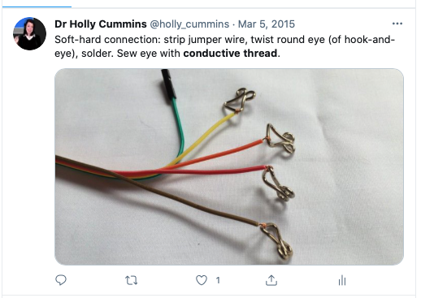
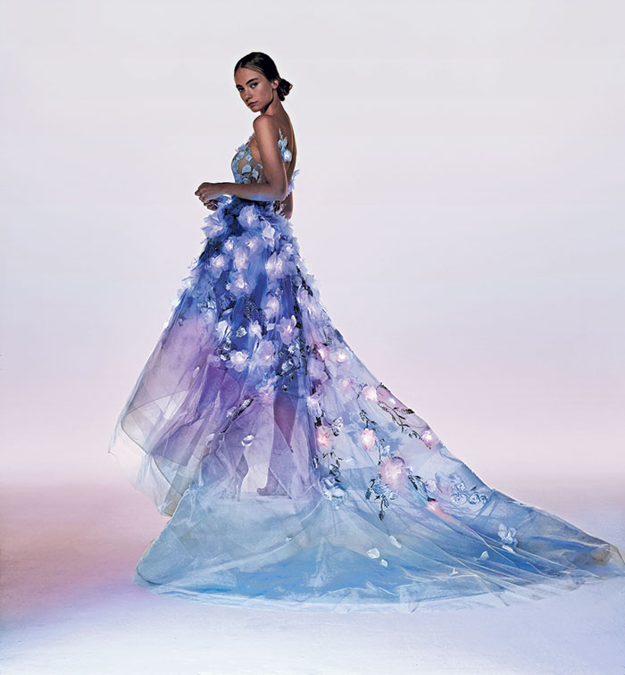
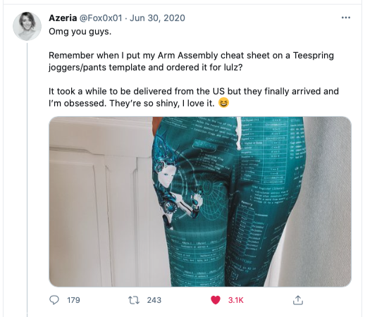
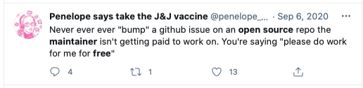
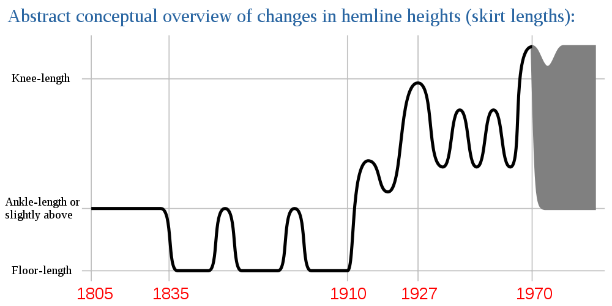
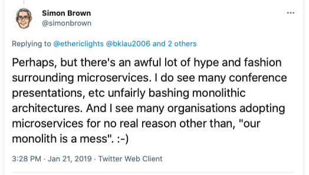

_Photo by Flaunter on Unsplash_

Last night I dreamt that Roger Daltry's wife told me to write about fashion and programming. We were in a small skate-punk shop. It was never made clear how she knew me or why she cared.

By the end of the dream I'd almost written a "why fashion and programming are actually connected" blog, so I woke and made frantic [notes](https://owlcation.com/humanities/Novels-Inspired-by-Dreams) to try and remember it before it [slipped away](https://www.medicalnewstoday.com/articles/326421#Neurons-that-help-the-brain-actively-forget). Although
on the surface they seem pretty distinct, there are actually some interesting links between fashion and programming - or at least, I think so. Let's talk about gender, creativity, labour ethics, climate, and trends - all in the same blog.

## Gender

Fashion is strongly associated with women, and being a woman in tech can be uncomfortable. One of my coping strategies has been to not be excessively girly. Talking about _girl-topics_ like fashion makes me feel vulnerable, so this may be the most personal blog I’ve ever written. (I nearly threw the whole thing away several times because I was so nervous about outing myself as _GIRLY_ and being perceived as vapid).

I love being a woman, and I love working in tech, and I've been lucky that I haven't had too many problems with the combination of the two.
I try keep a strict separation between my work side and my girly side. I keep a set of 'work' clothes' and 'home' clothes. At home I have fun with skirts, sometimes quite short ones, but when I'm at work, I wear loose fitting tops, and always, always, trousers.

Honestly, I don't think anyone's actually fooled. A few years ago
when I had booth duty at a conference, I was the only one on our work slack channel who asked what colour the booth t-shirts would be so I could pack coordinating eyeliner. I just like high heels and makeup too much, so I'm probably not blending in as much as I imagine.

I had pink hair when I interviewed at IBM, and blue hair for many years, which is arguably not blending in at all, but that felt _punky_, not girly.
This is me, just before my interview, doing a quantum computing experiment and being an unwitting-stock-photo for the BBC.

I have such admiration for people like Trisha Gee, who are brave enough to bring their whole [short-skirted self](https://dzone.com/articles/should-you-notice-im-woman) to work, and who [write thoughtfully](<(https://trishagee.github.io/post/st_what_to_wear/)>) about it. Folks like Chloe Condon and April Speight go further and connect their coding and fashion interests in their public persona. Check out April's twitter handle.

For Chloe, very-pink-and-very-technical is part of her brand.

While it may feel easier, women blending in doesn't really help our industry. We should be visible as developers, and women, and hammering the [#ilooklikeadeveloper](https://twitter.com/search?q=%23ilooklikeadeveloper) hashtag, until we change the perception of what a developer looks like.

## Creativity

Gender politics aside, programming and fashion actually have a lot in common. The reason I love both of them is that they're creative. I get annoyed when I'm on a team with designers, and someone calls the designers 'creatives' to distinguish them from the lumpen developers. I'm creating too!

Similarly, sewing
is much more mathematical than is sometimes acknowledged. I sometimes call sewing 'textile engineering' when I'm trying to make a point. I used to sew a lot of my own clothes, before I switched to using the same skills to sew IoT demos that looked like [cuddly versions of product logos](https://github.com/holly-cummins/throwable-application-server). It's a niche hobby, but someone has to do it.

(In case you're wondering, there was definitely some tough engineering in there, and resiliency was an ongoing challenge. I never did get the connections durable enough, or get heat dissipation quite right. It turns out computers don't like being encased in padded balls. Who knew? )

Although it has its own [gender](https://www.edsurge.com/news/2018-06-14-maker-culture-has-a-deeply-unsettling-gender-problem) [problems](https://en.wikipedia.org/wiki/Maker_culture#Gender), I love the vibrant female presence in the maker community, such as [Limor Fried](https://www.forbes.com/profile/limor-fried/?sh=7f03ada24ecc), [Naomi Wu](https://en.wikipedia.org/wiki/Naomi_Wu), and [Rachel Konichiwakitty](https://twitter.com/konichiwakitty). Not all of them are focussed on wearables - [Helen Leigh](https://twitter.com/helenleigh) does amazing things with musical instruments - but clothes do provide an on-ramp to making for many.
One of my IBM colleagues sewed her own wedding dress and made sure to include a generous sprinkling of LEDs, internet connectivity, and other tech gadgetry. Even my employer has got into
the fun and collaborated on a ['dress that thinks'](https://www.ibm.com/watson/stories/ca-en/dress.html) for the Met Gala.

Even if they're not behind the sewing machine,
developers can find joy in uniting their professional and sartorial creativity:

The [Shenova code dress](https://twitter.com/search?q=%40shenovafashion%20code%20dress&src=typed_query) (sadly, no longer available) could be printed with the wearer's [own
source code](https://shenovafashion.com/blogs/shenova-fashion/my-computer-code-dress-custom-orders-featuring-your-own-code), and helped women speakers not-blend-in on [several](https://twitter.com/ShenovaFashion/status/738385207238098945) [conference](https://shenovafashion.com/blogs/blog/123773319-women-in-tech-devon-lindsey-talks-open-source-software-communities-at-react-2016) [stages](https://twitter.com/MarieGMoe/status/691399241504296960).

## Labour ethics

One of the reasons I liked sewing my own clothes, is I knew they were produced under humane conditions, and the worker (me!) was treated well. The garment industry has some of the [lowest pay
in the world](https://www.vox.com/2018/2/27/17016704/living-wage-clothing-factories), and life-threatening accidents are [not uncommon](https://www.ilo.org/global/topics/geip/WCMS_614394/lang--en/index.htm). Programmers, on the other hand, are are well-paid and are extremely unlikely to die at work. Nonetheless, labour exploitation is a concern, even for developers. Particularly with open
source, individuals sometimes work [for free](https://www.ashedryden.com/blog/the-ethics-of-unpaid-labor-and-the-oss-community) for the [benefit of profit-making corporations](https://www.wired.com/story/altruism-open-source-fuels-web-businesses-love-to-exploit-it/).

Even when there's a clear compensation system in place, tech workers are increasingly making it known that there is room for improvement in the conditions of their employment. Although the pay is good, it's not always fairly distributed to [women](https://www.uk.mercer.com/our-thinking/the-gender-pay-gap-in-uk-tech-sector.html) and [minority ethnic groups](https://www.techrepublic.com/article/men-still-earn-more-than-women-whites-earn-twice-as-much-as-black-and-hispanic-colleagues/). There have been troubling problems with how [sexual harassment cases are handled](https://www.nytimes.com/2018/11/01/technology/google-walkout-sexual-harassment.html), and employee dismay over [ethically dubious contracts](https://www.washingtonpost.com/business/2019/07/12/no-tech-ice-protesters-demand-amazon-cut-ties-with-federal-immigration-enforcement/). As a result of all this, unionization efforts are [gaining momentum](https://www.washingtonpost.com/technology/2021/01/26/tech-unions-explainer/) in the tech industry.

## Sustainability

Both the fashion industry and tech industry have come under fire for their environmental impact. If you're keeping track, the tech industry is responsible for around [2% of carbon emissions](https://www.nature.com/articles/d41586-018-06610-y), and the clothes industry [accounts for 10%](https://www.worldbank.org/en/news/feature/2019/09/23/costo-moda-medio-ambiente). Many clothes are used once and then thrown out or forgotten in the back of a closet. This is bad, but it's perhaps better than something like Grimes' software-enabled NFT artwork, which I'm not convinced will actually be _used_ at all. Its main value is its scarcity, as a [collectible](https://www.theverge.com/22310188/nft-explainer-what-is-blockchain-crypto-art-faq). Because
NFT artefacts are dependent on a blockchain to ensure that scarcity, their electricity requirements are queasy-making. The sale of 303 editions of a single Grimes piece is [estimated](https://www.theguardian.com/music/2021/mar/02/grimes-sells-digital-art-collection-non-fungible-tokens) to have produced 70 tonnes of carbon, and used the same amount of electricity as an average EU resident would in 33 years. With both clothes and NFT artefacts, the root problem is a culture which encourages conspicuously wasteful consumption.

## Trends

The sustainability problem is a symptom of a social effect. We want to impress the people around us, whether that's with our clothes, our art, or our work.
One of the best ways to impress others is by showing them things they haven't seen before. This continuous need for novelty drives cyclical tastes, both in [hemlines](https://ritholtz.com/2010/09/the-hemline-index/)
and in software architecture.

_overview_chart_1805-2005.svg>)

Coco Chanel said "Fashion is architecture," although I'm taking her slightly out
of context, since she wasn't thinking of microservices or edge computing.
Many observers have noted that microservices are closely related to SOA, which had been the height of fashion twenty years earlier and then fallen
out of favour. Microservices are so popular they're considered near-compulsory for new software projects, and used in many contexts where they're not appropriate.

There's an even
clearer [cyclical pattern](https://www.information-age.com/edge-computing-technology-cycle-distributed-centralised-123485675/) in the swings from centralised computing (timeshare) to distributed (mini-computers), and then back to centralised (client-server), and then back to distributed (PCs), and then on to centralised (cloud), and then back distributed (edge computing).
Dizzy yet? For a single technology, over a shorter time-period, the Gartner hype cycle shows how things become trendy, and then passé.

In some cases, when a new pattern gains traction, it's because something external changed to enable it (like how [widespread fast network access](https://softwareengineering.stackexchange.com/questions/171008/why-didnt-cloud-computing-offer-appear-earlier/171010) created the right conditions for the cloud, or lightweight containers created the right conditions for microservices). Chanel had a quotation for this, too - she said "Fashion is not something that exists in dresses only. Fashion is in the sky, in the street, fashion has to do with ideas, the way we live, what is happening." Even in clothes, styles were heavily influenced by technological innovations. Lightweight [steel for crinolines](https://www.racked.com/2017/12/7/16717206/cage-crinoline-feminism-class) enabled the huge skirts of the mid-Victorian era, and the discovery that brightly coloured [dye could be extracted from coal tar](https://fashionhistory.fitnyc.edu/aniline-dyes/)
enabled mauve mania, a fashion for bright purple clothes.

_© Victoria and Albert Museum, London._

_So, all of this blog is speaking for me, and not my employer, but since I mention them in this blog, I'll restate - these are my personal opinions._
