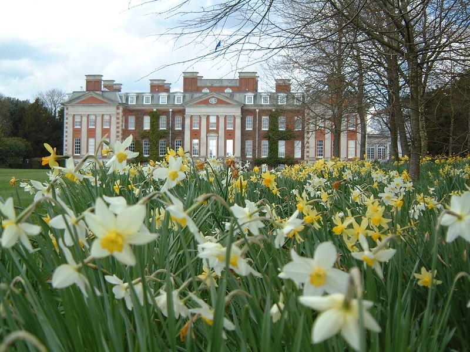
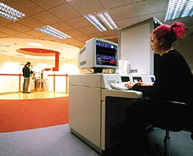
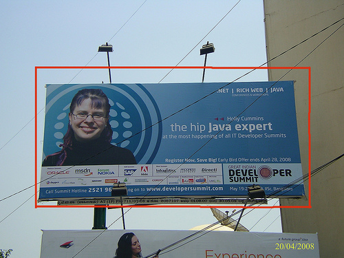
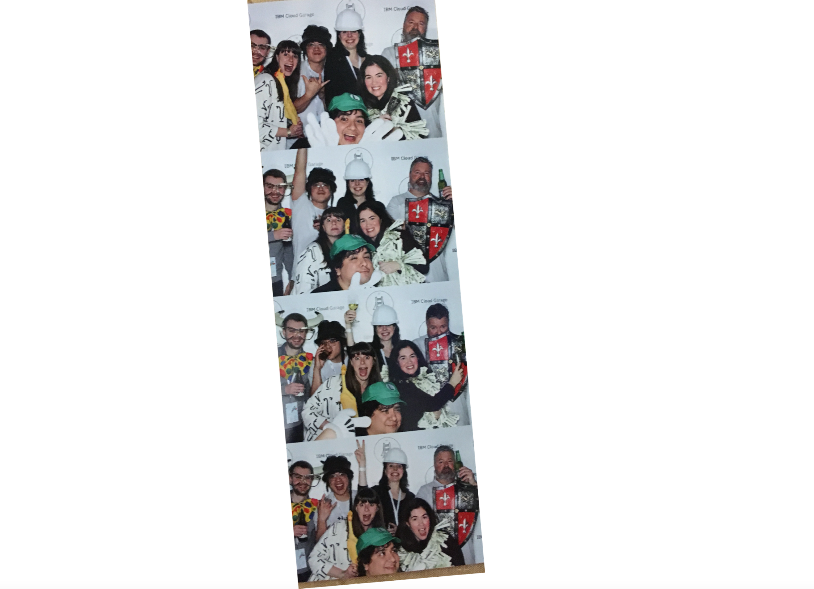

Twenty one years ago I was heading into the Hampshire countryside for a job interview. I was a
little graduate student, exploring possibilities in the world of work. I’d met folks from IBM Research at some academic conferences, and they were working on interesting things, seemed well-fed and happy, and had entertaining stories about [goulash-based work mishaps](https://www.straightdope.com/21343676/has-ibm-discovered-a-way-to-teleport-objects). I didn’t have a computer science degree, but computers seemed fun, and IBM seemed like a good place to do computers. When I arrived at IBM Hursley, the first thing I saw was sheep on the front lawn. I was smitten.

#### The sheep:

_Photo by Sam Carter on Unsplash … and if, like me, you adore sheep, go read [this amazing article about sheep.](https://www.theglobeandmail.com/opinion/article-power-to-the-sheeple-why-being-called-a-sheep-should-really-be-seen-as/)_


#### Me:


_This is me [looking serious](http://pubsapp.acs.org/cen/coverstory/7845/7845scit.html?) and doing important quantum computing research for my doctorate._

I had facial piercings and pink hair, so it's safe to say I didn’t look like most of the other candidates. I didn't mind being different, but I didn’t want to look like I hadn’t made an effort. I wore a wool trouser suit I’d sewn myself, and I smartened up my pink hair with a fresh coat of dye. ‘Coat’ is an accurate word, because non-standard dyes don’t always stick very well. The IBM interview was a two day process, with an overnight stay in between. To my complete horror, in the morning of the second day of the interview I discovered that I’d stained all the pillowcases and towels fuschia. Realistically, IBM HR weren’t going to have difficulty identifying which pink-haired candidate did the damage.

Can you get hired if you trash the hotel room on the interview? Apparently, you can. And thus began my wonderful IBM career.

Pink hair wasn’t very IBM … so I fixed that by dyeing it blue to match the IBM corporate colours.

That photo was taken in this beautiful Hursley building:


As well as the sheep and the grade II listed 18th century mansion, IBM Hursley has a cricket wicket, a baseball diamond, a Japanese fish pond, and a museum. When I joined it also had a tiny in-person-bank and a dry cleaning service, but those have gone the way of the fax machines.

Hursley is gorgeous, and as the largest software development lab in Europe, it's got an amazing tech legacy. The Spitfire was developed in Hursley during the second world war (not by IBM!). CICS, the software that runs almost every cash machine in the world was developed in Hursley. More generally, IBM has been responsible for so many world-changing innovations (bar codes, lasix surgery, electron microscopes, forty years of quantum computing). It combines 'changing the world' with a commitment to integrity and a humane corporate culture. Years ago someone from another large IT company asked me if I had any mentors - I explained that I had several, because senior IBMers are expected to grow those around them by actively mentoring. Mentoring is part of our performance assessments and promotion packages. Over the years, many IBMers have been very generous with their time to help me out. She was surprised, which surprised me. It turned out her company didn’t have any organisational incentives to lift others up. Employees were on their own when it came to growth, and usually found mentors from outside the company.

In contrast, IBM encourages growth and learning. As well as the mentoring, I've had lots of leadership training and coaching. I’ve learned C++, C#, Javascript, Ruby, Python, and TCL, along with UML, XML, TDD, XP. I’ve learned to draw, and written a book. IBM funded me to do an MSc in software engineering. I’ve travelled to five continents. I developed a bit of expertise in Java garbage collection, enough to end up on a billboard in Bangalore:


While we’re on the subject of billboards, I ended up on billboards again ten years later, although with more conventional hair:


If you find a job you love, you’ll never work a day in your life. I’ve made the best friends and had the best times at IBM.


I’m so grateful to IBM for taking a chance and hiring my despite my punk-rock interview destruction, and I’m grateful for all the support and opportunity I’ve received in my time here. It feels super-odd to be turning this in.



So, yeah. IBM: 10/10, would recommend.

(Wait, if IBM is so wonderful, why am I leaving? Well, I know it’s not the done thing to say where one is going in a goodbye message, but … let’s just say I’m not going that far.)
