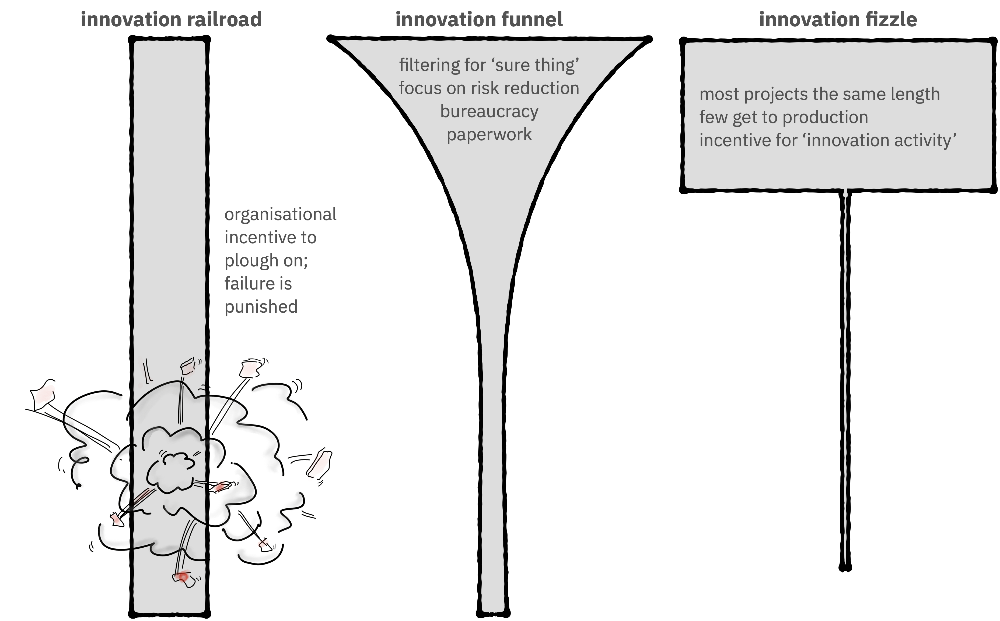
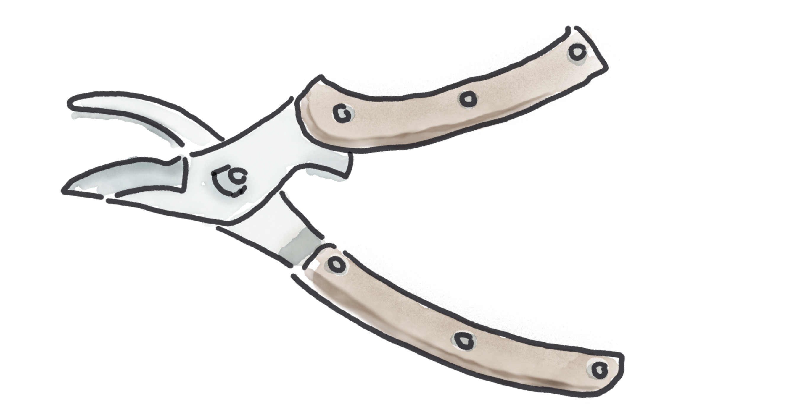

World-changing ideas don't seem normal and sensible when they're introduced. They usally teeter somewhere between 'impossible' and 'idiotic'. When laptops were introduced, the New York Times questioned whether anybody would actually want to use a computer outside of work. They [concluded](https://bigthink.com/technology-innovation/new-york-times-article-from-1985-deemed-the-consumer-laptop-a-failure/) "the microcomputer industry has assumed that everyone would love to have a keyboard grafted on as an extension of their fingers. It just is not so." Even cheeseburgers were [dismissed](https://www.smithsonianmag.com/smart-news/1938-ny-times-wrote-about-weird-new-food-cheeseburger-180955493/) as "a bizarre combination of beef and cheese" when they were introduced. This isn't
because the journalists were stupid, it was because, at the time, portable computers or melted-cheese-on-a-beef-patty genuinely seemed like terrible ideas. I can't even comprehend not liking cheeseburgers, but there we are.

How does an organisation distinguish between _truly_ idiotic ideas, and those which are just uncomfortably new? The standard answer is "build an MVP". Sadly, as a term, MVP no longer [means all that much](https://www.digit.fyi/comment-why-i-never-want-to-build-another-mvp/). In 2022, it seems _everything_ is an MVP. Some of these MVPs are experiments, some are prototypes, and some are just first releases. Some are £12 million "first releases", developed by a waterfall process (true story). Because "MVP" can be used to mean very different things, when we say "MVP", it's important to be explicit about what we're trying to accomplish.

What we _should_ be trying to accomplish depends a lot on the context. ([Cynefin](https://blog.container-solutions.com/cynefin) can be a useful framework here.) In environments of high uncertainty,
sinking £12 million into a first release before getting feedback is an atrocious idea. (I'm assuming there must be some environments where the uncertainty is low enough that spending £12 million before getting feedback is a good idea, although I haven't to confess I haven't encountered any of them myself.)

If uncertainty is high, we should start with an experiment. A _small_ experiment. The focus here
is on learning, not on building or re-use. By definition, when we do an experiment, we don't know what the answer will be. This means there needs to be a strong focus on metrics, and they have to be metrics which guide decisions, and not vanity metrics. An experiment must be designed so that failure is possible, and possibly even desirable. A failed experiment is a _good_ thing, as long as the experiment was small; we learned something quickly and cheaply which will prevent an expensive and slow mistake.

What happens if the results of an experiment aren't what we expected ("failure")? We adjust course. If the results _are_ what we hoped for, we then go on to design a follow-on experiment which pokes at our next risk. Eventually, if we do enough experiments, we will have moved from a situation of high uncertainty to one of moderate uncertainty. At this point, experiments aren't needed any more.

Instead, we should shift our focus from learning to user value. What we're delivering should be a product, something our audience can use, and get a benefit from. That means we need to meet minimum standards for functionality (there has to be enough) and quality (bugs annoy users). "Minimum standard for functionality" doesn't mean a product has to be feature complete. Users will tolerate missing features, especially if they can see that new capabilities are being rolled out regularly, and the product team is responsive to feedback. Here, "regularly" means "every few days" or "every week", not "once a quarter". Often, the reason teams delay releases until they can cram in every feature in the spreadsheet is because they haven't got to grips with continuous deployment. Getting a radically descoped product out into the field will allow development teams to prioritise features more effectively. Often, what we _think_ our users want ends up being pretty different to what they actually want.

You might be surprised how much can be descoped. The founder of Zappos famously descoped "actually having inventory" and "wholesaler relationships" when he started selling shoes. Instead, he would fulfill orders by going out to his local shoe shops and buying shoes. It's not quite the same scale, but my team in the IBM Garage replaced a wholly manual ordering process with a web app ... which sent an email to a seller under the covers. The client wasn't sure if their users would feel comfortable ordering construction supplies online rather than over the phone. It's not sustainable long-term, but that's ok. Delivering a partial app allowed the team to get consumer buy-in and gather user feedback while continuing to build up function.

This type of MVP is known as a wizard of Oz MVP; it looks like a proper product, but under the surface there are smoke and mirrors and gophers pedaling frantically.

This idea of pruning out bad ideas early seems logical, but it's something organisations struggle with.
In many organisational cultures, it's safe to say that "designing for failure" is not encouraged. Teams working on an idea have an incentive to prove that the original idea was great, and the implementation is successful. This means there is little motivation to build in the kinds of experiments and learning which could lead to a project being cancelled. This can cause an "innovation railroad", where projects, once funded, are pushed right through until the end. This doesn't mean the projects succeed, it just means failure is deferred and more resources are consumed before the failure is discovered. The sunk cost fallacy can also contribute to innovation railroads.

Another anti-pattern I see is the innovation fizzle. I heard recently about a government organisation who sent several dozen staff to a two day design thinking workshop. They were energised and creative and came up with pages of great innovation
ideas. And then ... nothing happened. Six months later, there was still nothing. Probably, not all of the ideas should have been built, but _some_ of them should have been explored futher. In an innovation fizzle,
ideas are generated, prototypes are written, annual appraisals are submitted describing all the innovation activity ... but nothing makes it into the hands of real users. Although there is an innovation budget, sometimes a very healthy innovation budget, there doesn't seem to be a meaningful path to production out from the innovation team. This isn't laziness; it can be genuinely hard to push over the hump from "risk-free PoC" to "project living and breathing out in prod where users may get annoyed and security breaches may happen."
In an innovation fizzle, nobody makes a conscious decision not to proceed – it just ... doesn't happen.

Is there a healthy medium between "everything gets shipped no matter what" and "nothing gets shipped?" In principle, yes: the innovation funnel. Ideas are evaluated, the weak ideas fail-out fast, and the strong ideas continue on to production. But even properly funnel-shaped innovation funnels are not perfect. The problems happen in the "evaluate" stage. Often, evaluation boards are [bureaucracy-heavy](https://www.marketingsociety.com/the-library/why-innovation-funnels-dont-work-and-why-rockets-do), requiring teams to spend significant admin effort generating polished proposals. At worst, the process of working through the gates can drain morale and stymie creativity. Evaluation boards want to pick winners, and this
can lead to them favouring safe bets rather than riskier, more innovative, ideas.

The focus of innovation gates should be on gathering real, external, feedback, rather than internal evaluations and paperwork.
In [part 1](https://hollycummins.com/bonkers-beans/) of this blog, I told the story of George Washington Carver.
Although Carver was an enormously successful inventor and educator, he didn't get everything right. When he first started working with farmers in the south, he [printed brochures](https://www.smithsonianmag.com/history/search-george-washington-carvers-true-legacy-180971538/) advising them to buy a second horse so they could run a two-horse plough, allowing them to till the exhausted soil more deeply.
While this undoubtedly would have improved cotton yields, it was
hopelessly impractical advice for tenant farmers on the edge of starvation. Once he worked out the underpinning economic issues, Carver was able to switch tack and focus his educational efforts on composting (free!), swamp muck fertilizer (squelchy, but free!), and crop rotation (sort-of-free).

Getting something out into the field is intuitively more accurate than paper-based feedback. Surprisingly, it can also be less expensive. Unilever launched four Peperami variations concurrently in 2004. In the end three of the variations were cancelled, but this wasn't a failure. Experimenting in the actual market reportedly cost [£1 million less](https://www.slideteam.net/blog/top-10-innovation-funnel-templates) than Uniliver's traditional focus-group method of product evaluation. It also got the winning product, Peperami Firesticks, to market a year earlier than it would have otherwise done.

It's a fact of life that innovation isn't always going to work. Thomas Edison famously said “I have not failed 10,000 times—I've successfully found 10,000 ways that will not work.” Peperami Firesticks were a success, but Peperami Canniballs, Dunkers, and Sarni, launched at the same time, were not. Besides his tone-dead horse suggestions, other notable Carver failures include peanut bread, peanut sausage, peanut coffee, peanut facecream, and peanut nitroglycerine. (They all "worked", in some technical sense, but it turned out no one wanted [peanut coffee](https://www.realsimple.com/food-recipes/shopping-storing/beverages/peanut-coffee) in 1916.)

For innovation to flourish, these setbacks have to be tolerated. In fact, these setbacks have to be positively _encouraged_, as part of maximising learning. Innovation does not work in a culture
of fear. Psychological safety is an essential foundation which allows teams to report failure and iterate continuously. The best part is that the ingredients for successful innovation - psychological safety, continuous delivery, short feedback cycles, and an emphasis on learning - are more generally the ingredients for a successful business. Everyone wins.

